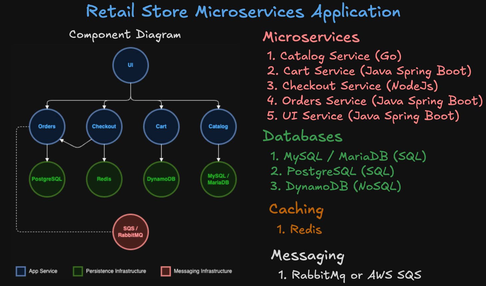
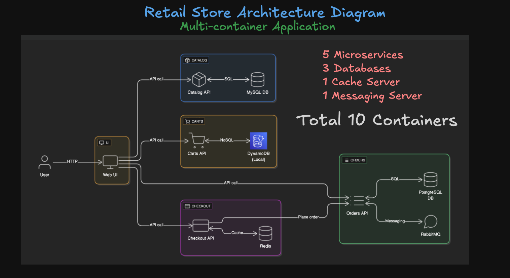

# Retail Store Sample Application 

# 01 - Project: Retail Store Sample App

Welcome to the first section of our **DevOps Real-World Project Implementation on AWS** course!

In this section, we’ll introduce the **Retail Store Sample App** — a real-world, cloud-native microservices application built and maintained by AWS Containers team. We’ll use this app throughout the course for implementing Docker, Kubernetes, CI/CD, monitoring, and more.

---

## Step-01: What You’ll Learn

- Understand a real-world **microservices architecture**
- Explore how **multiple containers** work together as a system
- Set the stage for **Docker Compose**, **Kubernetes**, and **DevOps tooling**

---

## Step-02: Application Overview

This is a **10-container** app made up of:

- **5 Microservices**
  - Catalog (Go)
  - Cart (Java Spring Boot)
  - Checkout (NodeJS)
  - Orders (Java Spring Boot)
  - UI (Java Spring Boot)

- **3 Databases**
  - MySQL / MariaDB
  - PostgreSQL
  - DynamoDB Local (NoSQL)

- **1 Caching Server**
  - Redis

- **1 Messaging Server**
  - RabbitMQ

---

## Step-03: Component Diagram

> High-level view of services and their responsibilities

---

## Step-04: Architecture Diagram

> Shows how services connect, communicate, and depend on each other

---

## Step-05: Why This Project?

This sample app is **perfect for DevOps training** because it includes:

- Multiple programming languages and frameworks
- Realistic service dependencies
- Integration with message queues, caching, and databases
- Containerized workloads ready for Docker, Docker Compose, and Kubernetes
- Production-like complexity in a local/dev-friendly setup

---

## Step-06: Project References

- **Original Project (by AWS Containers Team)**  
  [https://github.com/aws-containers/retail-store-sample-app](https://github.com/aws-containers/retail-store-sample-app)

- **Forked & Baselined Version for This Course**  
  [https://github.com/stacksimplify/retail-store-sample-app-aws](https://github.com/stacksimplify/retail-store-sample-app-aws)

---
 **Note:**
This course is built on a **custom-forked version** of the original AWS project. We’ve:

- **Baselined all services** to specific image versions (for consistency)
- **Simplified some sections** to align better with teaching goals

We’ll be using **this forked version** throughout the course for all demos and explanations.

Please stick to the [Stacksimplify fork](https://github.com/stacksimplify/retail-store-sample-app-aws) to avoid breaking changes or confusion with upstream updates.

---
