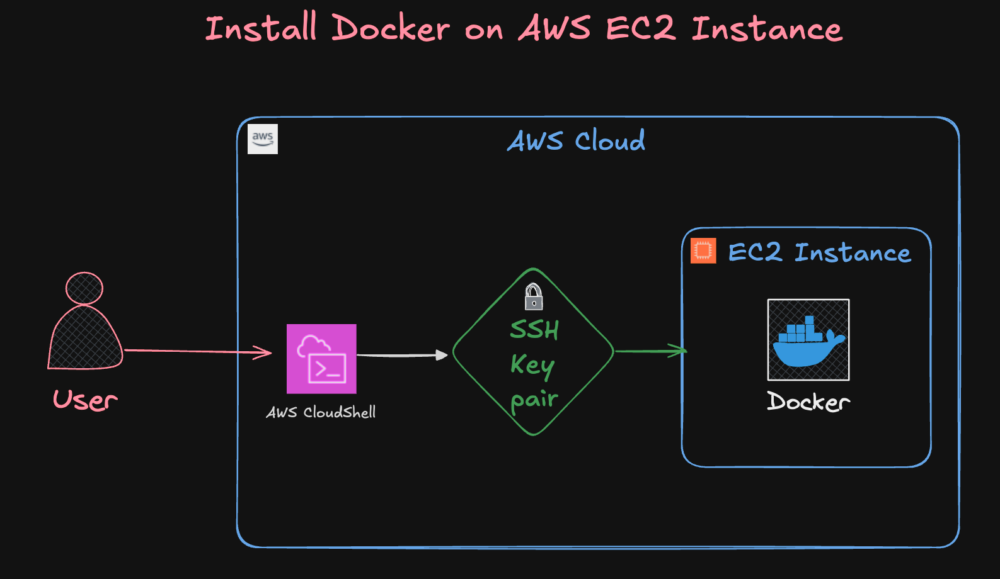
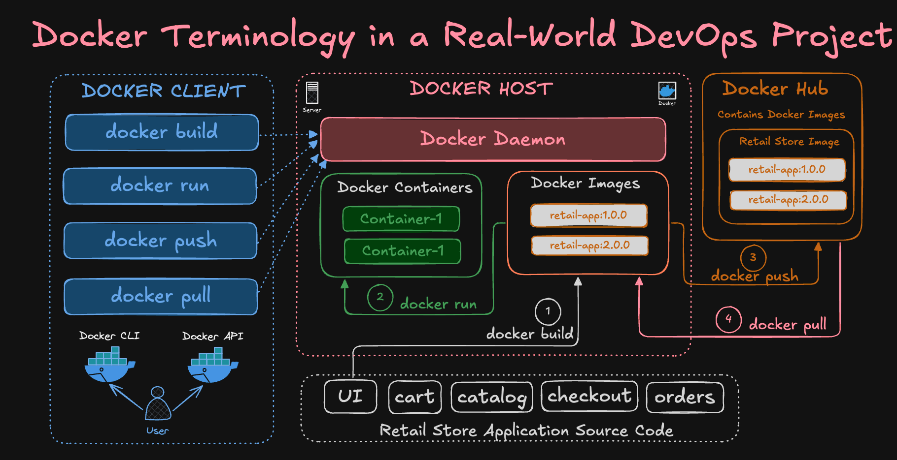

# Create EC2 Instance and Install Docker 

In this demo, we'll launch an AWS EC2 instance using Amazon Linux 2023 and install Docker manually.  
This cloud-based setup will be used to run all Docker CLI and Compose demos — no Docker Desktop needed!

---

## Step-00: Docker Concepts Covered
- Do You Want to Know What Docker Concepts Power 
This Real-World Retail Store Microservices Application?


---

## Step-01: What You’ll Learn

- Launch an EC2 instance on AWS
- Connect via SSH
- Install Docker on Amazon Linux 2023
- Run a test container



---

## Step-02: Prerequisites

- AWS account
- IAM user with EC2 access
- SSH key pair
- Basic terminal knowledge

---

## Step-03: EC2 Instance Configuration

| Setting            | Value                      |
|--------------------|----------------------------|
| AMI                | **Amazon Linux 2023**      |
| Instance Type      | `t3.large`                 |
| Storage            | 30 GB (default is fine)    |
| Key Pair           | Select or create one       |
| Security Group     | Allow **SSH (port 22)**  and ALL TCP or atleast (port 80, 8080, 8080)  |
| Region             | Any (e.g., `us-east-1`)    |

---

## Step-04: Setup Instructions

### 1. Launch EC2 Instance

Use the AWS Console to launch a new EC2 instance with the above settings.

### 2. Connect via SSH
```bash
ssh -i your-key.pem ec2-user@<your-ec2-public-ip>
````

---

### 3. Install Docker on Amazon Linux 2023

```bash
sudo dnf update -y
sudo dnf install docker -y
sudo systemctl enable docker
sudo systemctl start docker
sudo usermod -aG docker ec2-user
```

> **Logout and reconnect** to apply the docker group permissions.

---

### 4. Test Docker

* `docker version` should print both client and server details
* `docker run hello-world` should pull the image and print a welcome message
* `docker images` shows what’s cached locally

```bash
# Check Docker version
docker version

# List Docker images (should be empty initially)
docker images

# Run a test container
docker run hello-world

# List images again (should now include hello-world)
docker images
```


### 5. What Happens in the Background?
When you run:



```bash
docker run hello-world
````
 
Docker performs the following steps behind the scenes:

---

#### Step-by-Step:

1. **Checks Local Image Cache**

   * Docker looks for the `hello-world` image on your EC2 instance.
   * If it's **not found locally**, it automatically pulls it from **Docker Hub**.

2. **Downloads the Image**

   * Docker downloads the image in **layers** (compressed segments).
   * These layers are stored under `/var/lib/docker/`.

3. **Creates a Container**

   * Docker uses the image to create a **new container**.
   * Each container is an isolated environment with its own filesystem, network, and process space.

4. **Runs the Container**

   * The container runs a small program that prints:

     > “Hello from Docker! This message shows that your installation appears to be working correctly.”

5. **Container Exits**

   * Since the program completes immediately, the container stops.
   * You can confirm this with:

```bash
# docker ps command
docker ps -a
```

---

#### Before & After

```bash
# Before running (empty list)
docker images

# Run test container
docker run hello-world

# After running (image now appears)
docker images
docker ps -a
```

---

#### Optional: Clean Up

```bash
# Remove the stopped container
docker rm $(docker ps -aq)

# Remove the image
docker rmi hello-world
```

--- 

## Step-05: Cleanup

To avoid AWS charges:

* Stop or terminate the EC2 instance when not in use

---

