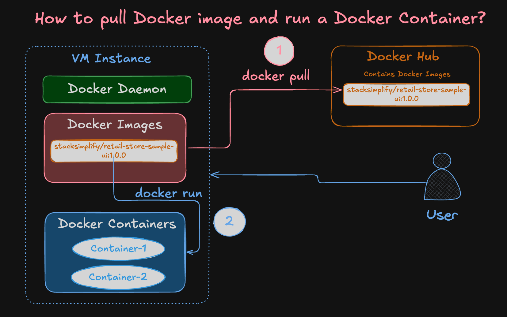
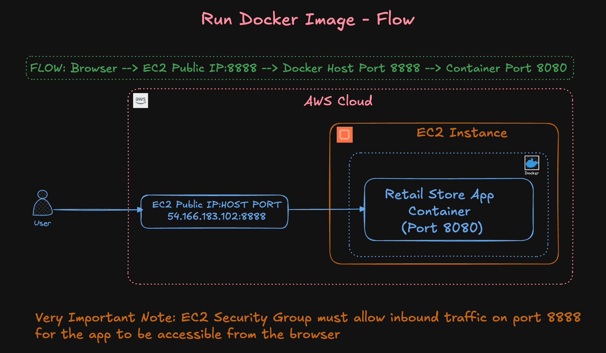

# How to Pull and Run Docker Images from Docker Hub and Run

---

## Docker Concepts Covered
- Do You Want to Know What Docker Concepts Power 
This Real-World Retail Store Microservices Application?


---

## Introduction

In this guide, you will:

1. **Pull Docker images** from Docker Hub.
2. **Run Docker containers** using the pulled images.
3. **Start and stop Docker containers**.
4. **Remove Docker images**.
5. **Important Note:** Docker Hub sign-in is not needed for downloading public images. In this case, the Docker image `stacksimplify/retail-store-sample-ui` is public and does not require authentication.


---

## Step 1: Pull Docker Image from Docker Hub

```bash
# List Docker images (should be empty if none are pulled yet)
docker images

# Pull Docker image from Docker Hub
docker pull stacksimplify/retail-store-sample-ui:1.0.0

# Alternatively, pull from GitHub Packages (no download limits)
docker pull ghcr.io/stacksimplify/retail-store-sample-ui:1.0.0

# List Docker images to confirm the image is pulled
docker images
```

**Important Notes:**

1. **Docker Image Pull Limits:** Docker Hub imposes pull rate limits for anonymous and free users.
2. **Alternative Registry:** To avoid hitting Docker Hub pull limits, you can pull the same Docker image from **GitHub Packages**.
3. **Consistency:** Both images are the same; choose either Docker Hub or GitHub Packages based on your needs.

---

## Step 2: Run the Downloaded Docker Image

- **Copy the Docker image name** from Docker Hub or GitHub Packages.
- **HOST_PORT:** The port number on your host machine where you want to receive traffic (e.g., `8888`).
- **CONTAINER_PORT:** The port number within the container that's listening for connections (e.g., `8080`).

```bash
# Run Docker Container
docker run --name <CONTAINER-NAME> -p <HOST_PORT>:<CONTAINER_PORT> -d <IMAGE_NAME>:<TAG>

# Example using Docker Hub image:
docker run --name myapp1 -p 8888:8080 -d stacksimplify/retail-store-sample-ui:1.0.0

# Or using GitHub Packages image:
docker run --name myapp1 -p 8888:80 -d ghcr.io/stacksimplify/retail-store-sample-ui:1.0.0
```

**Access the Application:**

- Open your browser and navigate to [http://EC2-Instance-Public-IP:8888/](http://<EC2-Instance-Public-IP>:8888/)

### Application Access Flow



---

## Step 3: List Running Docker Containers

```bash
# List only running containers
docker ps

# List all containers (including stopped ones)
docker ps -a

# List only container IDs
docker ps -q
```

---

## Step 4: Connect to Docker Container Terminal

You can connect to the terminal of a running container to inspect or debug it:

```bash
# Connect to the container's terminal
docker exec -it <CONTAINER-NAME> /bin/sh

# Example:
docker exec -it myapp1 /bin/sh

# Inside the container, you can run the following commands:
## Basic OS Info
uname -a                    # Kernel version and system details
cat /etc/os-release         # Check base OS details
whoami                      # See current user (usually 'root')

## File System + App Structure
pwd                         # Current directory (usually /)
ls                          # List files
ls -l /app                  # Check where app.jar is located (if /app is used)

## Java Runtime
java -version               # Verify Java is installed and check version

## Test Application (from inside container - Container port 8080)
curl http://localhost:8080  # Send a request to the app running inside

## Exit container shell
exit                        # Exit from /bin/sh back to host shell
```

**Execute Commands Directly:**

```bash
# List files/folders in the container's root directory
docker exec -it myapp1 ls

# Test if the application is running inside the container
# Sends a request to the app on port 8080 (internal container port)
docker exec -it myapp1 curl http://localhost:8080
```

---

## Step 5: Stop and Start Docker Containers

```bash
# Stop a running container
docker stop <CONTAINER-NAME>

# Example:
docker stop myapp1

# Verify the container has stopped
docker ps

# Test if the application is down
curl http://<EC2-Instance-Public-IP>:8888

# Start the stopped container
docker start <CONTAINER-NAME>

# Example:
docker start myapp1

# Verify the container is running
docker ps

# Test if the application is back up
curl http://<EC2-Instance-Public-IP>:8888
```

---

## Step 6: Remove Docker Containers

```bash
# Stop the container if it's still running
docker stop <CONTAINER-NAME>
docker stop myapp1

# Remove the container
docker rm <CONTAINER-NAME>
docker rm myapp1

# Or stop and remove the container in one command
docker rm -f <CONTAINER-NAME>
docker rm -f myapp1
```

---

## Step 7: Remove Docker Images

```bash
# List Docker images
docker images

# Remove Docker image using Image ID
docker rmi <IMAGE-ID>

# Example:
docker rmi abc12345def6

# Remove Docker image using Image Name and Tag
docker rmi <IMAGE-NAME>:<IMAGE-TAG>

# Example:
docker rmi stacksimplify/retail-store-sample-ui:1.0.0
```

---

## Conclusion

You have successfully learned how to pull Docker images from Docker Hub or GitHub Packages, run containers from those images, interact with running containers, and manage containers and images on your local machine.

**Congratulations!**

---

## Additional Notes

- **Replace Placeholders:** Remember to replace `<CONTAINER-NAME>`, `<HOST_PORT>`, `<CONTAINER_PORT>`, `<IMAGE_NAME>`, and `<TAG>` with your actual values.
- **Docker Hub vs. GitHub Packages:** If you encounter Docker Hub pull rate limits, consider using GitHub Packages (`ghcr.io`) as an alternative.
- **Container Names:** Giving meaningful names to your containers helps in managing them easily.
- **Cleanup:** Regularly remove unused containers and images to free up disk space.

---

## Additional Resources

- [Docker Documentation](https://docs.docker.com/)
- [Docker Hub](https://hub.docker.com/)
- [GitHub Container Registry](https://docs.github.com/en/packages/working-with-a-github-packages-registry/working-with-the-container-registry)
- [Docker CLI Command Reference](https://docs.docker.com/engine/reference/commandline/docker/)

---


**Happy Dockering!**

