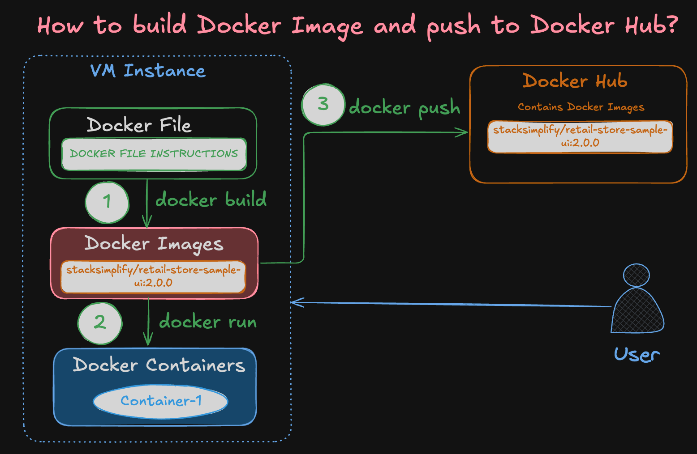

# How to Create and Push Docker Images to Docker Hub: A Step-by-Step Guide

---


## Docker Concepts Covered
- Do You Want to Know What Docker Concepts Power 
This Real-World Retail Store Microservices Application?


---

> **Important Note:** In the commands below, wherever you see `stacksimplify`, replace it with your Docker Hub username.




---

## Step-01: Create Docker Hub Account

- Visit [Docker Hub](https://hub.docker.com/) and sign up for a new account.

> **Note:** Docker Hub sign-in is not required for downloading public images. For example, the Docker image `stacksimplify/mynginx` is a public image.

---

## Step-02: Verify Docker Version and Log In via Command Line

```bash
# Check Docker version
docker version

# Log in to Docker Hub
docker login

# To Logout from Docker Hub (Optional)
docker logout
```

---

## Step-03: Download the code for which Docker Image to be built
```bash
# Create a Folder
mkdir demo-docker-build
cd demo-docker-build

# Download the Application Source
wget https://github.com/aws-containers/retail-store-sample-app/archive/refs/tags/v1.2.4.zip

# Unzip Application Source
unzip v1.2.4.zip

# Make change to file
cd /home/ec2-user/demo-docker-build/retail-store-sample-app-1.2.4/src/ui/src/main/resources/templates
File name: home.html
We are making a change for UI stating V2 at line 

# List to Verify if we are at that file
ls home.html
ls -lrt

# Changes we are doing 
## Before
          The most public <span class="text-primary-400">Secret Shop</span>

## After
          The most public <span class="text-primary-400">Secret Shop - V2 Version</span>          


# Command to Make That Change via Terminal (No Manual Editing)
sed -i 's/Secret Shop<\/span>/Secret Shop - V2 Version<\/span>/' home.html

# Verify It Worked:
grep 'Secret Shop' home.html

```

## Step-04: Review Dockerfile (High-level)
- We will discuss very high-level
- In next demo `03_Docker_Files`, we are going to discuss in detail what is present in the Dockerfile, what are Docker Instructions everything in a detailed way
- For now focus is on Build Docker Image, Push to Docker Hub is the scope of this demo.
```bash
# Change Directory to UI Source folder
cd /home/ec2-user/demo-docker-build/retail-store-sample-app-1.2.4/src/ui
cat Dockerfile
```
### Dockerfile for UI Microservice
```dockerfile
# Build Stage
FROM public.ecr.aws/amazonlinux/amazonlinux:2023 AS build-env

# We tell DNF not to install Recommends and Suggests packages, keeping our
# installed set of packages as minimal as possible.
RUN dnf --setopt=install_weak_deps=False install -q -y \
    maven \
    java-21-amazon-corretto-headless \
    which \
    tar \
    gzip \
    && \
    dnf clean all

VOLUME /tmp
WORKDIR /

COPY .mvn .mvn
COPY mvnw .
COPY pom.xml .

RUN ./mvnw dependency:go-offline -B -q

COPY ./src ./src

RUN ./mvnw -DskipTests package -q && \
    mv /target/ui-0.0.1-SNAPSHOT.jar /app.jar

# Package Stage
FROM public.ecr.aws/amazonlinux/amazonlinux:2023

# We tell DNF not to install Recommends and Suggests packages, which are
# weak dependencies in DNF terminology, thus keeping our installed set of
# packages as minimal as possible.
RUN dnf --setopt=install_weak_deps=False install -q -y \
    java-21-amazon-corretto-headless \
    shadow-utils \
    && \
    dnf clean all

# use curl-full to use "telnet://" scheme
# https://docs.aws.amazon.com/linux/al2023/ug/curl-minimal.html
RUN dnf -q -y swap libcurl-minimal libcurl-full \
    && dnf -q -y swap curl-minimal curl-full

ENV APPUSER=appuser
ENV APPUID=1000
ENV APPGID=1000

RUN useradd \
    --home "/app" \
    --create-home \
    --user-group \
    --uid "$APPUID" \
    "$APPUSER"

ENV JAVA_TOOL_OPTIONS=
ENV SPRING_PROFILES_ACTIVE=prod

WORKDIR /app
USER appuser

COPY ./ATTRIBUTION.md ./LICENSES.md
COPY --chown=appuser:appuser --from=build-env /app.jar .

EXPOSE 8080

ENTRYPOINT ["sh", "-c", "java $JAVA_OPTS -jar /app/app.jar"]
```

---

## Step-05: Build Docker Image and Run It

```bash
# Change to the directory containing your Dockerfile
cd /home/ec2-user/demo-docker-build/retail-store-sample-app-1.2.4/src/ui

# Verify Dockerfile before starting the build
ls -lrt Dockerfile
cat Dockerfile

# Build the Docker image
docker build -t <IMAGE_NAME>:<TAG> .

# Example:
docker build -t retail-store-sample-ui:2.0.0 .

# List Docker images
docker images

# Run the Docker container and verify
docker run --name <CONTAINER-NAME> -p <HOST_PORT>:<CONTAINER_PORT> -d <IMAGE_NAME>:<TAG>

# Example:
docker run --name myapp1-v2 -p 8889:8080 -d retail-store-sample-ui:2.0.0

# Access the application in your browser
http://<EC2-Instance-Public-IP>:8889

## RUN Container: 1.0.0 version on Host port 8888 (TO COMPARE WITH 2.0.0)
# Example using Docker Hub image:
docker run --name myapp1 -p 8888:8080 -d stacksimplify/retail-store-sample-ui:1.0.0

# Or using GitHub Packages image:
docker run --name myapp1 -p 8888:80 -d ghcr.io/stacksimplify/retail-store-sample-ui:1.0.0
```

---

## Step-06: Tag and Push the Docker Image to Docker Hub

```bash
# List Docker images
docker images

# Tag the Docker image
docker tag retail-store-sample-ui:2.0.0 YOUR_DOCKER_USERNAME/mynginx-custom:2.0.0

# Example with 'stacksimplify':
docker tag retail-store-sample-ui:2.0.0 stacksimplify/retail-store-sample-ui:2.0.0

# Push the Docker image to Docker Hub
docker push YOUR_DOCKER_USERNAME/retail-store-sample-ui:2.0.0

# Example with 'stacksimplify':
docker push stacksimplify/retail-store-sample-ui:2.0.0

# IMPORTANT NOTE:
# Replace YOUR_DOCKER_USERNAME with your actual Docker Hub username.
```

---

## Step-07: Verify the Docker Image on Docker Hub

- Log in to Docker Hub and verify the image you have pushed.
- Navigate to your repositories: [Docker Hub Repositories](https://hub.docker.com/repositories).

---

## Conclusion

You've successfully created a Docker image, tagged it, and pushed it to Docker Hub. 

**Congratulations!**

---

## Additional Notes

- **Replace Placeholders:** Remember to replace `<YOUR-DOCKER-USERNAME>`, `<CONTAINER-NAME>`, `<HOST_PORT>`, `<CONTAINER_PORT>`, `<IMAGE_NAME>`, and `<TAG>` with your actual values.
- **Docker Hub Username:** Ensure you are logged in with your Docker Hub account when pushing images.
- **Public vs. Private Repositories:** Docker Hub allows unlimited public repositories for free accounts. Private repositories may require a paid subscription.
- **Cleanup:** To remove unused images and containers, you can use `docker system prune`, but be cautious as this will remove all unused data.

---

## Additional Resources

- [Docker Documentation](https://docs.docker.com/)
- [Docker Hub Quickstart](https://docs.docker.com/docker-hub/)
- [Best Practices for Writing Dockerfiles](https://docs.docker.com/develop/develop-images/dockerfile_best-practices/)

---
