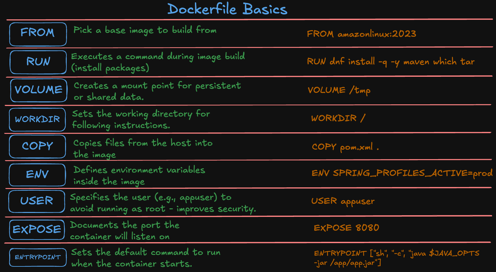
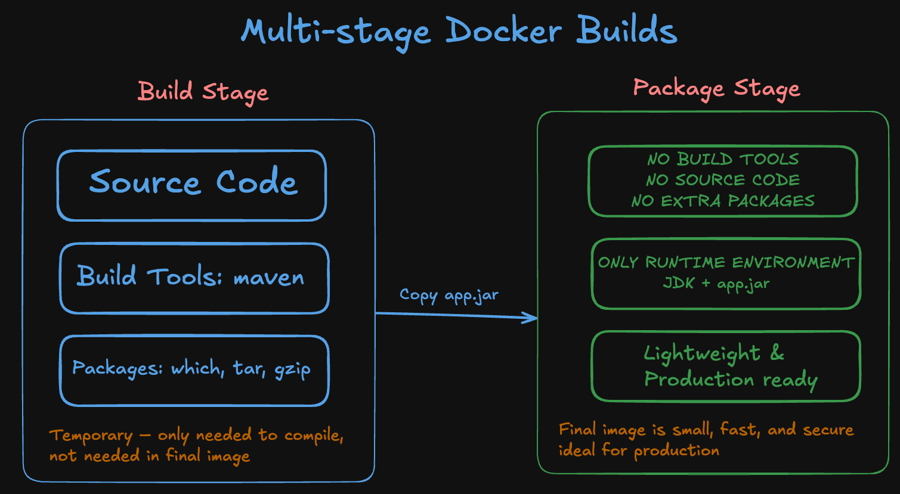
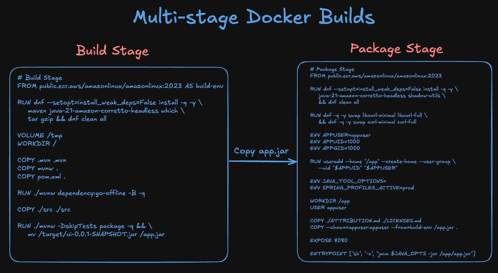

# Dockerfile – Build & Package Java Microservice (Spring Boot)

## Docker Concepts Covered
- Do You Want to Know What Docker Concepts Power 
This Real-World Retail Store Microservices Application?


## Step-01: What You’ll Learn
In this demo, you’ll build a **production-grade Docker image** for a Java-based Spring Boot microservice using **multi-stage builds** and best practices tailored for AWS environments.

You’ll learn how to:

* ✅ Write a multi-stage `Dockerfile` using **Amazon Linux 2023** as the base image
* ✅ Build and package a Java (Spring Boot) app using **Maven**
* ✅ Secure your container by creating a **non-root user**
* ✅ Use `.dockerignore` to keep the image clean and fast to build
* ✅ Understand Docker **layer caching** and how to structure builds efficiently
* ✅ Validate your image using `docker exec` and inspect the container contents
* ✅ Rebuild from scratch using `--no-cache`
* ✅ Clean up all Docker build artifacts and system clutter
* ✅ Grasp the **“why” behind multi-stage builds** for smaller, safer, and faster images

This is the **most complete and realistic Dockerfile example** in the course — designed to prepare you for real-world DevOps pipelines.



---
## Step-02: Multi-stage Dockerfile

### Step-02-01: Multi-stage Docker Builds - Dockerfile Breakdown


---

### Step-02-02: Multi-stage Docker Builds - Dockerfile Instructions 



---

### Step-02-03: Build Stage

```dockerfile
# Build Stage
FROM public.ecr.aws/amazonlinux/amazonlinux:2023 AS build-env

# We tell DNF not to install Recommends and Suggests packages, keeping our
# installed set of packages as minimal as possible.
RUN dnf --setopt=install_weak_deps=False install -q -y \
    maven \
    java-21-amazon-corretto-headless \
    which \
    tar \
    gzip \
    && \
    dnf clean all

VOLUME /tmp
WORKDIR /

COPY .mvn .mvn
COPY mvnw .
COPY pom.xml .

RUN ./mvnw dependency:go-offline -B -q

COPY ./src ./src

RUN ./mvnw -DskipTests package -q && \
    mv /target/ui-0.0.1-SNAPSHOT.jar /app.jar
```

> Compiles the Java code and builds the JAR file

---

### Step-02-04: Package Stage

```dockerfile

# Package Stage
FROM public.ecr.aws/amazonlinux/amazonlinux:2023

# We tell DNF not to install Recommends and Suggests packages, which are
# weak dependencies in DNF terminology, thus keeping our installed set of
# packages as minimal as possible.
RUN dnf --setopt=install_weak_deps=False install -q -y \
    java-21-amazon-corretto-headless \
    shadow-utils \
    && \
    dnf clean all

# use curl-full to use "telnet://" scheme
# https://docs.aws.amazon.com/linux/al2023/ug/curl-minimal.html
RUN dnf -q -y swap libcurl-minimal libcurl-full \
    && dnf -q -y swap curl-minimal curl-full

ENV APPUSER=appuser
ENV APPUID=1000
ENV APPGID=1000

RUN useradd \
    --home "/app" \
    --create-home \
    --user-group \
    --uid "$APPUID" \
    "$APPUSER"

ENV JAVA_TOOL_OPTIONS=
ENV SPRING_PROFILES_ACTIVE=prod

WORKDIR /app
USER appuser

COPY ./ATTRIBUTION.md ./LICENSES.md
COPY --chown=appuser:appuser --from=build-env /app.jar .

EXPOSE 8080

ENTRYPOINT ["sh", "-c", "java $JAVA_OPTS -jar /app/app.jar"]
```

> ✅ Runs the app securely with minimal footprint and proper user permissions

---

## Step-03:  `.dockerignore` – Clean Build Context

The `.dockerignore` file ensures that large or unnecessary files don’t get sent to Docker during image builds:

```
.dockerignore
├── Dockerfile
├── docker-compose.yml
├── target/
├── .idea/
├── scripts/
└── chart/
```

This avoids:

* Accidentally copying source code, build artifacts, or configs
* Slower build context uploads
* Larger image layers

---

## Step-04: Build the Docker Image

Run this command from the root of the project:

```bash
# Change to Directory
cd retail-store-sample-app-1.2.4/src/ui 

# Verify if Dockerfile exists
ls Dockerfile
cat Dockerfile

# Build Docker Image
docker build -t retail-ui:9.0.0 .
```

> Tag your image as needed (`retail-ui` is just an example)

---

## Step-05: Run the Container

```bash
docker run -d --name retail-ui -p 8080:8080 retail-ui:9.0.0
```

---

## Step-06: Verify It's Running

```bash
docker ps
http://<EC2-Instance-Public-Ip>:8080/actuator/health
http://<EC2-Instance-Public-Ip>:8080/topology
```

> You should see `"status":"UP"` from the Spring Boot app

---


## Step-07: Validation 
### Step-07-01: Multi-Stage Build Success

When you build the image, Docker clearly shows that it's using a **multi-stage build**:

```bash
docker build -t retail-ui:9.0.0 .
```

Example output (shortened for clarity):

```text
 => [build-env 2/9] RUN dnf ... maven ...                   ✅ Build stage (with Maven)
 => [stage-1 2/7] RUN dnf ... java-21 ...                  ✅ Runtime stage (minimal)
 => [stage-1 7/7] COPY --from=build-env /app.jar .         ✅ Copying only JAR from build stage
```

Full sample output for reference - IT TOOK 110 seconds

```text
[ec2-user@ip-172-31-91-179 ui]$ docker build -t retail-ui:9.0.0 .
[+] Building 110.1s (19/19) FINISHED                                                                                         docker:default
 => [internal] load build definition from Dockerfile                                                                                   0.0s
 => => transferring dockerfile: 1.69kB                                                                                                 0.0s
 => [internal] load metadata for public.ecr.aws/amazonlinux/amazonlinux:2023                                                           0.4s
 => [internal] load .dockerignore                                                                                                      0.0s
 => => transferring context: 180B                                                                                                      0.0s
 => [internal] load build context                                                                                                      0.2s
 => => transferring context: 5.02MB                                                                                                    0.2s
 => [build-env 1/9] FROM public.ecr.aws/amazonlinux/amazonlinux:2023@sha256:4308d53aeabb6df156feb75ff6fd7cef02f0fede70478c81d7a723667  5.3s
 => => resolve public.ecr.aws/amazonlinux/amazonlinux:2023@sha256:4308d53aeabb6df156feb75ff6fd7cef02f0fede70478c81d7a7236678cddd98     0.0s
 => => sha256:4308d53aeabb6df156feb75ff6fd7cef02f0fede70478c81d7a7236678cddd98 770B / 770B                                             0.0s
 => => sha256:02ab4eb0f2a4e9f40ed045e2d1b2602a7d3738d093b81b5594800f4aee0d835d 528B / 528B                                             0.0s
 => => sha256:a0dd29a1b2dc72f0e749685dc8d87e856e37879b0afab390e17d2ab025ed680b 662B / 662B                                             0.0s
 => => sha256:9ae3de3e5fc6c1122d692f6546a745b7ce4f1aa52c0016fa12d785f02607025f 53.84MB / 53.84MB                                       0.5s
 => => extracting sha256:9ae3de3e5fc6c1122d692f6546a745b7ce4f1aa52c0016fa12d785f02607025f                                              4.6s
 => [build-env 2/9] RUN dnf --setopt=install_weak_deps=False install -q -y     maven     java-21-amazon-corretto-headless     which   44.9s
 => [stage-1 2/7] RUN dnf --setopt=install_weak_deps=False install -q -y     java-21-amazon-corretto-headless     shadow-utils     &  35.0s
 => [stage-1 3/7] RUN dnf -q -y swap libcurl-minimal libcurl-full     && dnf -q -y swap curl-minimal curl-full                        21.5s 
 => [build-env 3/9] COPY .mvn .mvn                                                                                                     0.1s 
 => [build-env 4/9] COPY mvnw .                                                                                                        0.1s 
 => [build-env 5/9] COPY pom.xml .                                                                                                     0.0s 
 => [build-env 6/9] RUN ./mvnw dependency:go-offline -B -q                                                                            35.6s 
 => [stage-1 4/7] RUN useradd     --home "/app"     --create-home     --user-group     --uid "1000"     "appuser"                      0.8s 
 => [stage-1 5/7] WORKDIR /app                                                                                                         0.1s 
 => [stage-1 6/7] COPY ./ATTRIBUTION.md ./LICENSES.md                                                                                  0.0s 
 => [build-env 7/9] COPY ./src ./src                                                                                                   0.1s 
 => [build-env 8/9] RUN ./mvnw -DskipTests package -q &&     mv /target/ui-0.0.1-SNAPSHOT.jar /app.jar                                20.6s
 => [stage-1 7/7] COPY --chown=appuser:appuser --from=build-env /app.jar .                                                             0.0s
 => exporting to image                                                                                                                 2.1s
 => => exporting layers                                                                                                                2.1s
 => => writing image sha256:6b898a0747d0f282e85c8e5638d2144768d65e1708b7d2fa744c2cb3cfefa17b                                           0.0s
 => => naming to docker.io/library/retail-ui:9.0.0                                                                                     0.0s
[ec2-user@ip-172-31-91-179 ui]$ 
```

### Step-07-02: Key Observations:

* `build-env` installs tools like Maven and compiles the app.
* `stage-1` is clean — it only installs runtime dependencies and copies the JAR.
* The final image **does NOT include source code or Maven**, keeping it **secure and lightweight**.

---

### Step-07-03: Inspect Final Image

You can confirm that Maven or source files don’t exist in the final image:

```bash
# List Docker containers
docker ps

# Connect to Docker Container
docker exec -it retail-ui sh

# Inside the container
which mvn          # → should return "sh: which: command not found"
ls /src            # → should say "No such file or directory"
```

This shows your final image is production-optimized.

---

## Step-08: Cleanup

```bash
docker stop retail-ui
docker rm retail-ui
docker rmi retail-ui:9.0.0
```

---

## Step-08: Docker Layer Caching (Build Optimization)

Docker builds images in **layers**, and each instruction (`RUN`, `COPY`, `ENV`, etc.) becomes a separate layer.

When you re-run:

```bash
docker build -t retail-ui:9.0.0 .
```

Docker **skips redundant steps** by reusing cached layers — as seen in your log:

```text
=> CACHED [build-env 2/9] RUN dnf install ...
=> CACHED [build-env 3/9] COPY .mvn .mvn
=> CACHED [build-env 8/9] RUN ./mvnw package ...
=> CACHED [stage-1 7/7] COPY --from=build-env /app.jar .
```

### Full sample for reference
- It took 0.3 seconds to build 
```text
[ec2-user@ip-172-31-91-179 ui]$ docker build -t retail-ui:9.0.0 .
[+] Building 0.3s (19/19) FINISHED                                                                                           docker:default
 => [internal] load build definition from Dockerfile                                                                                   0.0s
 => => transferring dockerfile: 1.69kB                                                                                                 0.0s
 => [internal] load metadata for public.ecr.aws/amazonlinux/amazonlinux:2023                                                           0.2s
 => [internal] load .dockerignore                                                                                                      0.0s
 => => transferring context: 180B                                                                                                      0.0s
 => [internal] load build context                                                                                                      0.0s
 => => transferring context: 34.20kB                                                                                                   0.0s
 => [build-env 1/9] FROM public.ecr.aws/amazonlinux/amazonlinux:2023@sha256:4308d53aeabb6df156feb75ff6fd7cef02f0fede70478c81d7a723667  0.0s
 => CACHED [stage-1 2/7] RUN dnf --setopt=install_weak_deps=False install -q -y     java-21-amazon-corretto-headless     shadow-utils  0.0s
 => CACHED [stage-1 3/7] RUN dnf -q -y swap libcurl-minimal libcurl-full     && dnf -q -y swap curl-minimal curl-full                  0.0s
 => CACHED [stage-1 4/7] RUN useradd     --home "/app"     --create-home     --user-group     --uid "1000"     "appuser"               0.0s
 => CACHED [stage-1 5/7] WORKDIR /app                                                                                                  0.0s
 => CACHED [stage-1 6/7] COPY ./ATTRIBUTION.md ./LICENSES.md                                                                           0.0s
 => CACHED [build-env 2/9] RUN dnf --setopt=install_weak_deps=False install -q -y     maven     java-21-amazon-corretto-headless       0.0s
 => CACHED [build-env 3/9] COPY .mvn .mvn                                                                                              0.0s
 => CACHED [build-env 4/9] COPY mvnw .                                                                                                 0.0s
 => CACHED [build-env 5/9] COPY pom.xml .                                                                                              0.0s
 => CACHED [build-env 6/9] RUN ./mvnw dependency:go-offline -B -q                                                                      0.0s
 => CACHED [build-env 7/9] COPY ./src ./src                                                                                            0.0s
 => CACHED [build-env 8/9] RUN ./mvnw -DskipTests package -q &&     mv /target/ui-0.0.1-SNAPSHOT.jar /app.jar                          0.0s
 => CACHED [stage-1 7/7] COPY --chown=appuser:appuser --from=build-env /app.jar .                                                      0.0s
 => exporting to image                                                                                                                 0.0s
 => => exporting layers                                                                                                                0.0s
 => => writing image sha256:f7926260b96add6e5db99a0c0555af4c429e64dfaba7d8e1d6e4c855e018f5aa                                           0.0s
 => => naming to docker.io/library/retail-ui:9.0.0                                                                                     0.0s
[ec2-user@ip-172-31-91-179 ui]$ 
```

---

## Step-09:  Why Caching Matters

| Benefit                 | Description                                     |
| ----------------------- | ----------------------------------------------- |
| Faster builds         | Only changed layers are rebuilt                 |
| Quicker dev feedback | Recompile only what changes (e.g., source code) |
| Smaller image pushes | Only new layers are pushed to the registry      |
| Clean structure       | Enforces logical, cacheable Dockerfile layout   |

---

## Step-09: Clean Up (if needed)

If you want to rebuild from scratch and ignore cache:

```bash
docker build --no-cache -t retail-ui:10.0.0 .
```


### Sample Output Reference
```text
[ec2-user@ip-172-31-91-179 ui]$ docker build --no-cache -t retail-ui:10.0.0 .
[+] Building 101.1s (19/19) FINISHED                                                                                         docker:default
 => [internal] load build definition from Dockerfile                                                                                   0.0s
 => => transferring dockerfile: 1.69kB                                                                                                 0.0s
 => [internal] load metadata for public.ecr.aws/amazonlinux/amazonlinux:2023                                                           0.2s
 => [internal] load .dockerignore                                                                                                      0.0s
 => => transferring context: 180B                                                                                                      0.0s
 => [internal] load build context                                                                                                      0.1s
 => => transferring context: 34.20kB                                                                                                   0.0s
 => CACHED [build-env 1/9] FROM public.ecr.aws/amazonlinux/amazonlinux:2023@sha256:4308d53aeabb6df156feb75ff6fd7cef02f0fede70478c81d7  0.0s
 => [stage-1 2/7] RUN dnf --setopt=install_weak_deps=False install -q -y     java-21-amazon-corretto-headless     shadow-utils     &  34.0s
 => [build-env 2/9] RUN dnf --setopt=install_weak_deps=False install -q -y     maven     java-21-amazon-corretto-headless     which   42.3s
 => [stage-1 3/7] RUN dnf -q -y swap libcurl-minimal libcurl-full     && dnf -q -y swap curl-minimal curl-full                        20.2s 
 => [build-env 3/9] COPY .mvn .mvn                                                                                                     0.1s 
 => [build-env 4/9] COPY mvnw .                                                                                                        0.0s 
 => [build-env 5/9] COPY pom.xml .                                                                                                     0.0s 
 => [build-env 6/9] RUN ./mvnw dependency:go-offline -B -q                                                                            33.2s 
 => [stage-1 4/7] RUN useradd     --home "/app"     --create-home     --user-group     --uid "1000"     "appuser"                      0.6s 
 => [stage-1 5/7] WORKDIR /app                                                                                                         0.1s 
 => [stage-1 6/7] COPY ./ATTRIBUTION.md ./LICENSES.md                                                                                  0.1s 
 => [build-env 7/9] COPY ./src ./src                                                                                                   0.1s 
 => [build-env 8/9] RUN ./mvnw -DskipTests package -q &&     mv /target/ui-0.0.1-SNAPSHOT.jar /app.jar                                21.2s 
 => [stage-1 7/7] COPY --chown=appuser:appuser --from=build-env /app.jar .                                                             0.1s 
 => exporting to image                                                                                                                 2.8s
 => => exporting layers                                                                                                                2.8s
 => => writing image sha256:ec768c3fda979f0aabe8f22a5c4d35019ed0fe8d95a5788ac6054a41f9ee0a0c                                           0.0s
 => => naming to docker.io/library/retail-ui:10.0.0                                                                                    0.0s
[ec2-user@ip-172-31-91-179 ui]$ 
```

--- 

## Step-10: Bonus: Why Multi-Stage Builds?
* Keeps final image small (runtime-only)
* No Maven or `src/` files in production image
* Faster and safer deploys

---

## Step-11: Remove All Build Cache**

```bash
docker builder prune
```

> Prompts for confirmation. Add `-f` to skip prompt:

```bash
docker builder prune -f
```

---

## Step-12: Remove ALL Build Cache (including unused images and layers)

```bash
docker builder prune --all
```

> Add `-f` to confirm without prompt:

```bash
docker builder prune --all -f
```

This will clear **all cache layers**, including those from old builds or untagged images.

---

## Step-13: Clean Everything Unused (Stopped containers, volumes, networks, cache, images)**

```bash
docker system prune
```

> To clean **everything including volumes**:

```bash
docker system prune --volumes
```

Add `-f` for full cleanup with no prompt:

```bash
# List Images
docker images

# Full Clean-Up (DISASTER OPTION)
docker system prune -a --volumes -f

# List Images
docker images
```

**Important Note:**  🔥🔥🔥🔥🔥🔥🔥 Be Careful: 🔥🔥🔥🔥🔥🔥🔥🔥

These commands will **remove unused containers/images**, so only run them when you're sure it's safe.

---


