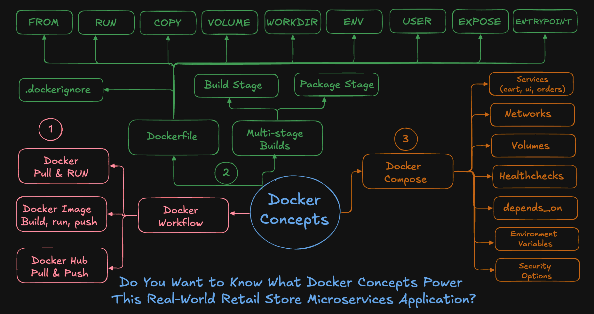
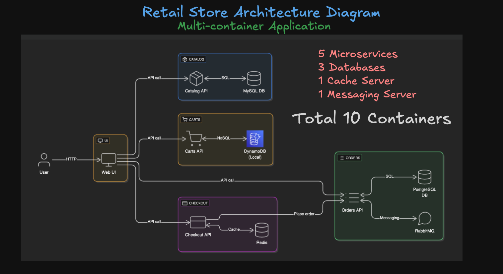
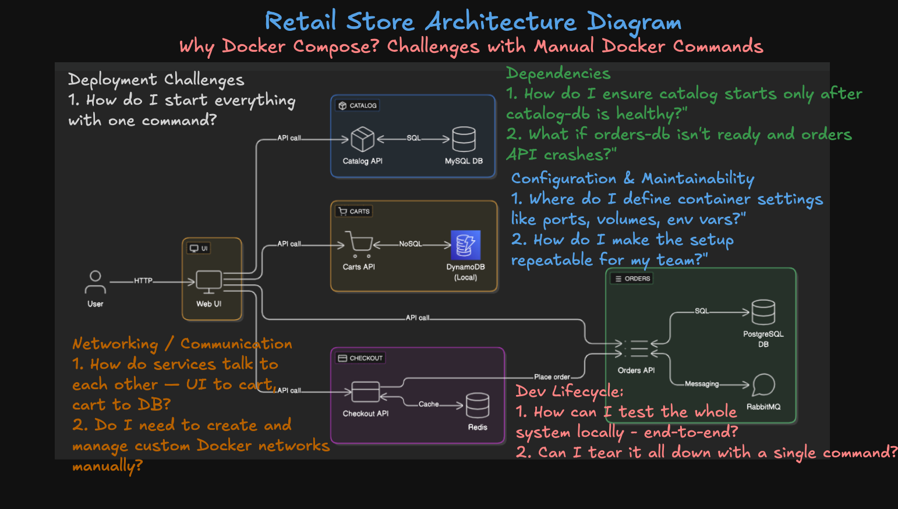
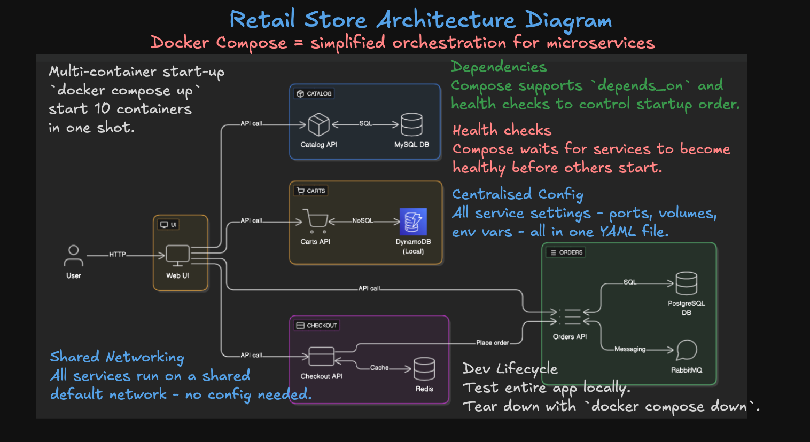

# Docker Compose - Retail Store Sample App

This demo shows how to run a complete microservices-based retail application using **Docker Compose**.

We’ll use `docker-compose.yaml` to define 10 interdependent services including databases, APIs, messaging, and a UI and manage them all with just a few commands.

---

## Docker Concepts Covered
- Do You Want to Know What Docker Concepts Power 
This Real-World Retail Store Microservices Application?




---

## Step-01: What is Docker Compose?
Docker Compose is a tool for:
- Defining **multi-container apps** in a single YAML file
- Managing **networks, volumes, dependencies**
- Running all services with **`docker compose up`**
- Testing, tearing down, and rebuilding environments **easily**

### Docker Compose File Review
- [Retail Store Application - Docker Compose File](https://github.com/aws-containers/retail-store-sample-app/releases/download/v1.3.0/docker-compose.yaml)
- [Retail Store Application - Docker Compose File - Local Copy](./docker-compose.yaml)

### Retail Store Application - Architecture Overview


### Problems Without Docker Compose


### How Docker Compose Solves It?



---

## Step-02: Install Docker Compose (if not available)

```bash
# Create the CLI plugin directory
sudo mkdir -p /usr/local/lib/docker/cli-plugins

# Download the latest Docker Compose v2 binary (always pulls the newest release)
wget https://github.com/docker/compose/releases/latest/download/docker-compose-linux-x86_64 -O docker-compose

# Make it executable
chmod +x docker-compose

# Move it to the CLI plugins directory
sudo mv docker-compose /usr/local/lib/docker/cli-plugins/docker-compose

# Verify install
docker compose version
````

---

## Step-03: Services Used in This Project

| S.No | Application    | Image                                                            |
| ---- | -------------- | ---------------------------------------------------------------- |
| 1    | cart           | public.ecr.aws/aws-containers/retail-store-sample-cart:1.3.0     |
| 2    | carts-db       | amazon/dynamodb-local:1.20.0                                     |
| 3    | catalog        | public.ecr.aws/aws-containers/retail-store-sample-catalog:1.3.0  |
| 4    | catalog-db     | mariadb:10.9                                                     |
| 5    | checkout       | public.ecr.aws/aws-containers/retail-store-sample-checkout:1.3.0 |
| 6    | checkout-redis | redis:6.0-alpine                                                 |
| 7    | orders         | public.ecr.aws/aws-containers/retail-store-sample-orders:1.3.0   |
| 8    | orders-db      | postgres:16.1                                                    |
| 9    | rabbitmq       | rabbitmq:3-management                                            |
| 10   | ui             | public.ecr.aws/aws-containers/retail-store-sample-ui:1.3.0       |

---

## Step-04: Compose Up / Down / Logs

```bash
# Create Directory
mkdir demo-compose
cd demo-compose

# Download the Docker Compose file
wget https://github.com/aws-containers/retail-store-sample-app/releases/download/v1.3.0/docker-compose.yaml

# Set environment variable
export DB_PASSWORD='mydbkalyan101'

# Start all services
## Important Note:  if your file name is docker-compose.yaml dont need to specify -f with file
docker compose -f docker-compose.yaml up
docker compose up 

# OR start in detached mode (background)
docker compose -f docker-compose.yaml up -d
docker compose up -d

# Stop all services (gracefully) (NOT NEEDED NOW - JUST FOR REFERENCE)
docker compose down
```

---

## Step-05: Test the Application

Once services are running, open the UI:

```
http://<EC2-Instance-Public-IP>:8888
http://<EC2-Instance-Public-IP>:8888/topology
```

---

## Step-06: Useful Docker Compose Commands

### List Running Services

```bash
# List Services 
docker compose ps

# Also verify Docker images it downloaed
docker images
```

### Stop / Start a Single Service

```bash
# Stop a Service
docker compose stop orders

# Verify if service is stopped
docker compose ps
docker compose ps -a

# Start a Service
docker compose start orders
```

### Restart a Service

```bash
# Restart a Service
docker compose restart cart

# Verify if service restarted
docker compose ps
```

---

## Step-07: View Logs

```bash
# Logs for all services
docker compose logs

# Logs for a specific service
docker compose logs checkout

# Follow logs
docker compose logs -f checkout
```

---

## Step-08: Run Commands Inside a Container

```bash
# Connect to a Container
docker compose exec ui sh

# Commands to run in container
ls
id
uname -m
uname -n
env
cat /etc/hostname
cat /etc/os-release 
cat /etc/os-release | sed -n '1,6p' 
curl http://localhost:8080
curl http://localhost:8080/topology
curl http://localhost:8080/actuator/health
exit
```

---

## Step-09: Docker Compose Stats
Display a live stream of container(s) resource usage statistics

```bash
# Stats 
docker compose stats

# Specific Containers
docker compose stats ui
```

---

## Step-10: Display the running process in a container
```bash
# Display the running process of all service containers
docker compose top

# Specific containers
docker compose top ui
docker compose top checkout
```

---

## Step-11: UI App: Make changes to Docker Compose and Deploy
### Step-11-01: UI Service -  Documentation Review
- [Reference: UI App Documentation](https://github.com/aws-containers/retail-store-sample-app/tree/main/src/ui)
- Primarily review the [section: Configuration](https://github.com/aws-containers/retail-store-sample-app/tree/main/src/ui#configuration)
- We are going to update the `RETAIL_UI_THEME` to `green`

### Step-11-02: Environment Varibles: Verify UI Service Container before changes
```bash
# Connect to UI Container 
docker compose exec ui sh

# Verify Environment Variables in UI Container
env | grep RETAIL

# Exit from UI Container
exit
```

### Step-11-03: UI Service - Add RETAIL_UI_THEME to green
- Review the last item in `environment`
```yaml
# Upate Docker Compose UI Service
    environment:
      - JAVA_OPTS=-XX:MaxRAMPercentage=75.0 -Djava.security.egd=file:/dev/urandom
      - SERVER_TOMCAT_ACCESSLOG_ENABLED=true
      - RETAIL_UI_ENDPOINTS_CATALOG=http://catalog:8080
      - RETAIL_UI_ENDPOINTS_CARTS=http://carts:8080
      - RETAIL_UI_ENDPOINTS_ORDERS=http://orders:8080
      - RETAIL_UI_ENDPOINTS_CHECKOUT=http://checkout:8080
      - RETAIL_UI_THEME=green
```

### Step-11-04: Force recreate UI Container
```bash
# Stop All Services
docker compose up -d --force-recreate ui

[or]

# Stop All Services
docker compose down 

# Start All Services
docker compose up -d
```

### Step-11-05: Environment Varibles: Verify UI Service Container after changes
```bash
# Connect to UI Container 
docker compose exec ui sh

# Verify Environment Variables in UI Container
env | grep RETAIL

## SAMPLE OUTPUT ###
[ec2-user@ip-172-31-25-77 demo-compose]$ docker compose exec ui sh
sh-5.2$ env | grep RETAIL
RETAIL_UI_ENDPOINTS_CARTS=http://carts:8080
RETAIL_UI_ENDPOINTS_CHECKOUT=http://checkout:8080
RETAIL_UI_THEME=green
RETAIL_UI_ENDPOINTS_ORDERS=http://orders:8080
RETAIL_UI_ENDPOINTS_CATALOG=http://catalog:8080
sh-5.2$  

# Exit from UI Container
exit
```

### Step-11-06: Access Application and Verify
```bash
# Access Application
http://<EC2-Public-IP>:8888

# Observation:
We should see green color screens on App
```

### Step-11-07: Assignment
- Please do the same steps for `RETAIL_UI_THEME=orange`

---

## Step-12: Clean Up Docker Resources (Optional)

```bash
# Stop and remove containers, networks
docker compose down

# List Docker Containers
docker ps
docker ps -a

# List Docker Images
docker images

# Prune all unused Docker objects (careful!)
docker system prune -a --volumes -f

# List Docker Images
docker images
```

---


## Additional Reference
Retail Store Sample App GitHub:
- [https://github.com/aws-containers/retail-store-sample-app](https://github.com/aws-containers/retail-store-sample-app)

