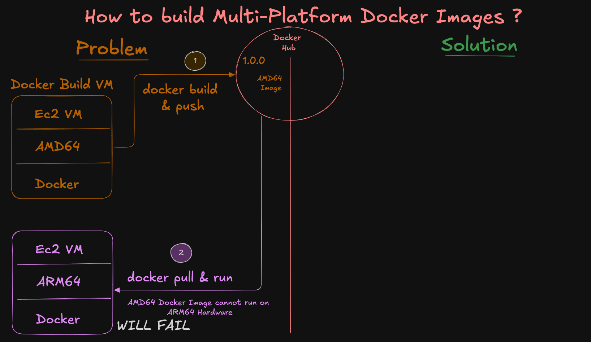
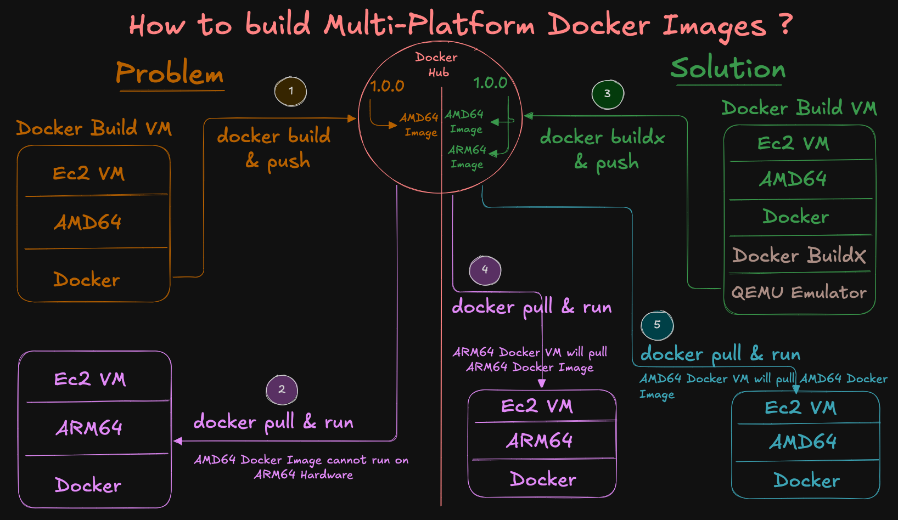

# Multi-Arch Docker Buildx on Amazon Linux (EC2 amd64) → **Push to Docker Hub**

Create and push a **single tag** that contains **AMD64 + ARM64** images for your **Retail Store UI** microservice, using **Buildx + QEMU** on an **x86\_64 (amd64)** EC2 with **Amazon Linux VM**—and publish to **Docker Hub**.

---

## Step-01: What you’ll do

1. Host sanity check
2. Install Docker Engine and enable Buildx
3. Install **binfmt/QEMU** for cross-arch builds
4. Create a **containerized Buildx builder** (multi-arch)
5. Log in to **Docker Hub**
6. Build & push a **multi-platform** manifest (`linux/amd64,linux/arm64`)
7. Verify manifest and run containers
8. Access the app in your browser on ports **8888**

### Problem: How to build Multi-Platform Docker Images?
- 

### Solution: How to build Multi-Platform Docker Images?
- 

---

## Step-02: Host sanity check

```bash
cat /etc/os-release | sed -n '1,6p'     # Amazon Linux 
uname -m                                 # expect: x86_64
```

---

## Step-03: Install Docker Engine (on Amazon Linux) (if not installed)

```bash
# Install Docker Engine
sudo dnf update -y
sudo dnf install docker -y
sudo systemctl enable docker
sudo systemctl start docker
sudo usermod -aG docker ec2-user
docker --version

# Exit and Relogin
exit and relogin

# Run Test container
docker run hello-world
```

---

## Step-04: Ensure Buildx/BuildKit is available

```bash
export DOCKER_BUILDKIT=1
docker buildx version
```

---

## Step-05: Install binfmt/QEMU emulators (cross-arch)

```bash
# Reinstall QEMU binfmt handlers
docker run --privileged --rm tonistiigi/binfmt --install all

# OR explicitly for arm64 + amd64
docker run --privileged --rm tonistiigi/binfmt --install arm64,amd64
```

> If the host reboots and cross-arch stops working, re-run the `docker run --privileged --rm tonistiigi/binfmt --install all` command.

---

## Step-06: Create a **containerized** Buildx builder (multi-arch capable)

```bash
# Create a new multiarch builder that uses BuildKit in a container
docker buildx create --name multiarch --driver docker-container --use

# Bootstrap to detect all supported platforms
docker buildx inspect --bootstrap

# List Buildx Builders
docker buildx ls

```

> Ideally you should now see both `linux/amd64` and `linux/arm64` in **Platforms**.
> On Amazon Linux, linux/arm64 might not appear in the builder list. 
> That’s expected behavior on Amazon Linux. 
> Don’t worry, the multi-arch build still works fine. 
> Always confirm using imagetools inspect after pushing.

---

## Step-07: Docker Hub login & variables

```bash
# ---- CONFIG (edit these) ----
export DOCKERHUB_USER="your-dockerhub-username"     # CHANGE
export DH_REPO="retail-ui-multiarch"             # repo name under your namespace
export TAG="1.0.0"                                  # image tag


# UPDATED TO MY ENVIRONMENT
export DOCKERHUB_USER="stacksimplify"     # CHANGE
export DH_REPO="retail-ui-multiarch"             # repo name under your namespace
export TAG="1.0.0"                                  # image tag

# ---- DERIVED ----
export IMAGE="${DOCKERHUB_USER}/${DH_REPO}:${TAG}"
echo $IMAGE

# Login to Docker Hub (will prompt for password or PAT)
docker login -u "${DOCKERHUB_USER}"
```

---

## Step-08: Use **your** Dockerfile (Retail Store UI)
```bash
# Create a Folder
mkdir demo-multiarch
cd demo-multiarch

# Download the Application Source
wget https://github.com/aws-containers/retail-store-sample-app/archive/refs/tags/v1.3.0.zip

# Unzip Application Source
unzip v1.3.0.zip

# Change Directory to UI Source folder
cd retail-store-sample-app-1.3.0/src/ui
cat Dockerfile
```

---

## Step-09: Build & push **multi-platform** image (AMD64 + ARM64)
- The first build can take a long time (in your case, ~37 minutes / 2236 seconds).
- This is mainly because the ARM64 build on an x86 host uses QEMU or binfmt emulation, which is 5–10× slower than native amd64.
- Don’t worry — Buildx caches layers. Subsequent builds (with no code or minor code changes) will be much faster.
```bash
DOCKER_BUILDKIT=1 docker buildx build \
  --platform linux/amd64,linux/arm64 \
  -t "${IMAGE}" \
  --push .
```

> This produces **one tag** (`1.0.0`) with a **manifest list** containing both architectures.
> ARM64 build may take longer (5–10× slower) on x86 hosts because it uses QEMU emulation. Be patient it might take 15 to 20 minutes for these builds to complete

### Sample Output
```log
[ec2-user@ip-172-31-25-77 ui]$ DOCKER_BUILDKIT=1 docker buildx build \
>   --platform linux/amd64,linux/arm64 \
>   -t "${IMAGE}" \
>   --push .
[+] Building 2236.4s (35/35) FINISHED                                                           docker-container:multiarch
 => [internal] load build definition from Dockerfile                                                                  0.0s
 => => transferring dockerfile: 1.69kB                                                                                0.0s
 => [linux/arm64 internal] load metadata for public.ecr.aws/amazonlinux/amazonlinux:2023                              0.3s
 => [linux/amd64 internal] load metadata for public.ecr.aws/amazonlinux/amazonlinux:2023                              0.4s
 => [internal] load .dockerignore                                                                                     0.0s
 => => transferring context: 180B                                                                                     0.0s
 => [internal] load build context                                                                                     0.8s
 => => transferring context: 5.02MB                                                                                   0.7s
 => [linux/arm64 build-env 1/9] FROM public.ecr.aws/amazonlinux/amazonlinux:2023@sha256:097c3f2de85902a408c41b85c837  4.9s
 => => resolve public.ecr.aws/amazonlinux/amazonlinux:2023@sha256:097c3f2de85902a408c41b85c837bc112483dd90400d471a9a  0.0s
 => => sha256:202438f011bd656c28426fbd92ff7e7030b77e67ebafd3bec95dbce9626db73c 52.90MB / 52.90MB                      0.6s
 => => extracting sha256:202438f011bd656c28426fbd92ff7e7030b77e67ebafd3bec95dbce9626db73c                             4.3s
 => [linux/amd64 build-env 1/9] FROM public.ecr.aws/amazonlinux/amazonlinux:2023@sha256:097c3f2de85902a408c41b85c837  4.5s
 => => resolve public.ecr.aws/amazonlinux/amazonlinux:2023@sha256:097c3f2de85902a408c41b85c837bc112483dd90400d471a9a  0.0s
 => => sha256:b6baa302384dc877580d7e1080dcca1ed66d9d3b38afc9fcc29c360239e3e362 54.01MB / 54.01MB                      0.7s
 => => extracting sha256:b6baa302384dc877580d7e1080dcca1ed66d9d3b38afc9fcc29c360239e3e362                             3.7s
 => [linux/amd64 stage-1 2/7] RUN dnf --setopt=install_weak_deps=False install -q -y     java-21-amazon-corretto-he  62.6s
 => [linux/amd64 build-env 2/9] RUN dnf --setopt=install_weak_deps=False install -q -y     maven     java-21-amazon  81.9s
 => [linux/arm64 stage-1 2/7] RUN dnf --setopt=install_weak_deps=False install -q -y     java-21-amazon-corretto-  1166.2s
 => [linux/arm64 build-env 2/9] RUN dnf --setopt=install_weak_deps=False install -q -y     maven     java-21-amaz  1272.6s
 => [linux/amd64 stage-1 3/7] RUN dnf -q -y swap libcurl-minimal libcurl-full     && dnf -q -y swap curl-minimal cu  42.2s 
 => [linux/amd64 build-env 3/9] COPY .mvn .mvn                                                                        0.1s 
 => [linux/amd64 build-env 4/9] COPY mvnw .                                                                           0.0s 
 => [linux/amd64 build-env 5/9] COPY pom.xml .                                                                        0.0s 
 => [linux/amd64 build-env 6/9] RUN ./mvnw dependency:go-offline -B -q                                               64.4s
 => [linux/amd64 stage-1 4/7] RUN useradd     --home "/app"     --create-home     --user-group     --uid "1000"       0.3s
 => [linux/amd64 stage-1 5/7] WORKDIR /app                                                                            0.1s
 => [linux/amd64 stage-1 6/7] COPY ./ATTRIBUTION.md ./LICENSES.md                                                     0.0s
 => [linux/amd64 build-env 7/9] COPY ./src ./src                                                                      0.3s
 => [linux/amd64 build-env 8/9] RUN ./mvnw -DskipTests package -q &&     mv /target/ui-0.0.1-SNAPSHOT.jar /app.jar   57.7s
 => [linux/amd64 stage-1 7/7] COPY --chown=appuser:appuser --from=build-env /app.jar .                                0.1s
 => [linux/arm64 stage-1 3/7] RUN dnf -q -y swap libcurl-minimal libcurl-full     && dnf -q -y swap curl-minimal c  894.3s
 => [linux/arm64 build-env 3/9] COPY .mvn .mvn                                                                        0.1s
 => [linux/arm64 build-env 4/9] COPY mvnw .                                                                           0.0s
 => [linux/arm64 build-env 5/9] COPY pom.xml .                                                                        0.0s
 => [linux/arm64 build-env 6/9] RUN ./mvnw dependency:go-offline -B -q                                              425.6s
 => [linux/arm64 build-env 7/9] COPY ./src ./src                                                                      0.2s
 => [linux/arm64 build-env 8/9] RUN ./mvnw -DskipTests package -q &&     mv /target/ui-0.0.1-SNAPSHOT.jar /app.jar  490.4s
 => [linux/arm64 stage-1 4/7] RUN useradd     --home "/app"     --create-home     --user-group     --uid "1000"       0.7s
 => [linux/arm64 stage-1 5/7] WORKDIR /app                                                                            0.1s
 => [linux/arm64 stage-1 6/7] COPY ./ATTRIBUTION.md ./LICENSES.md                                                     0.0s
 => [linux/arm64 stage-1 7/7] COPY --chown=appuser:appuser --from=build-env /app.jar .                                0.1s
 => exporting to image                                                                                               41.4s
 => => exporting layers                                                                                              28.8s
 => => exporting manifest sha256:233d61a0523304ba09810752aab3e5ccae41d89e7e64ddae8f837372d3394c2c                     0.0s
 => => exporting config sha256:403cf1bd84264bdfaf4ec8bf6a289c07a0001a3db8dc0f87ddc9afeede6fce9e                       0.0s
 => => exporting attestation manifest sha256:0d6f5f9f2a0535458ace33d563a52792ffa07d91e8185a23020eb75791b5663a         0.0s
 => => exporting manifest sha256:80174d4acd00c830cb72fd73fef03c0cb8c77ed792880f1445d7185b3e8850e3                     0.0s
 => => exporting config sha256:34530b054ef5b3910d78e3318cefdfdf0c06e5e80667b2fd93f8d953b148774a                       0.0s
 => => exporting attestation manifest sha256:fda512fa90bf002b2950456ebfe388bd7cc3f3237f145a1d5c659f72aa1dea27         0.0s
 => => exporting manifest list sha256:34e17eace20cb27378d30e2356f3a4d950d546cfd09c5539f824048a28478eff                0.0s
 => => pushing layers                                                                                                 9.0s
 => => pushing manifest for docker.io/stacksimplify/retail-ui-multiarch8:1.0.0@sha256:34e17eace20cb27378d30e2356f3a4  3.4s
 => [auth] stacksimplify/retail-ui-multiarch8:pull,push token for registry-1.docker.io                                0.0s
[ec2-user@ip-172-31-25-77 ui]$ 
```
---

## Step-10: Verify the pushed manifest

```bash
docker buildx imagetools inspect "${IMAGE}"
# Look for entries for linux/amd64 and linux/arm64
```
### Sample Output for reference
```log
[ec2-user@ip-172-31-25-77 ui]$ docker buildx imagetools inspect "${IMAGE}"
Name:      docker.io/stacksimplify/retail-ui-multiarch9:1.0.0
MediaType: application/vnd.oci.image.index.v1+json
Digest:    sha256:d7f28eccf342d0ad13f46821a227f910a8a1c5fe86338fc584b41cd36198ef5d
           
Manifests: 
  Name:        docker.io/stacksimplify/retail-ui-multiarch9:1.0.0@sha256:7aed6a0bc07f323d9dc930c5af784fea9dba10b68ff19a3a55b2897f72fada85
  MediaType:   application/vnd.oci.image.manifest.v1+json
  Platform:    linux/amd64
               
  Name:        docker.io/stacksimplify/retail-ui-multiarch9:1.0.0@sha256:1214c0244cc554b5ad5ff0ab01e4cc022f6b91aaf6b2245930fc070df03f2e9b
  MediaType:   application/vnd.oci.image.manifest.v1+json
  Platform:    linux/arm64
               
  Name:        docker.io/stacksimplify/retail-ui-multiarch9:1.0.0@sha256:f278dda8e281e3a8438f7eaf74a3b5f85b096d4f7437c89d5032d292f57383f9
  MediaType:   application/vnd.oci.image.manifest.v1+json
  Platform:    unknown/unknown
  Annotations: 
    vnd.docker.reference.digest: sha256:7aed6a0bc07f323d9dc930c5af784fea9dba10b68ff19a3a55b2897f72fada85
    vnd.docker.reference.type:   attestation-manifest
               
  Name:        docker.io/stacksimplify/retail-ui-multiarch9:1.0.0@sha256:4ee99ab5b36ccd664b8a7b0ebbf85ff19dd70901c39c91fcdac4ec29740ae236
  MediaType:   application/vnd.oci.image.manifest.v1+json
  Platform:    unknown/unknown
  Annotations: 
    vnd.docker.reference.digest: sha256:1214c0244cc554b5ad5ff0ab01e4cc022f6b91aaf6b2245930fc070df03f2e9b
    vnd.docker.reference.type:   attestation-manifest
[ec2-user@ip-172-31-25-77 ui]$ 
```

---

## Step-11: AMD64: Run and test the containers
```bash
# List Docker Containers
docker ps

# Run Docker Container using new Docker Image 
docker run --name myapp1-amd64 -p 8888:8080 -d ${IMAGE}

# List Docker Images
docker images

# List Docker Containers
docker ps

# Access in browser
http://<EC2-Public-IP>:8888
```


---


## Step-12: ARM64: Create ARM64 VM and Run and test the containers

### Step-12-01: Create Docker VM with Amazon Linux ARM64 Platform
1. Create a VM with Amazon Linux ARM64 Platform
2. Host Sanity check
```bash
cat /etc/os-release | sed -n '1,6p'     # Amazon Linux 
uname -m                                 # expect: aarch64
```
3. Install Docker in that VM
```bash
# Install Docker
sudo dnf update -y
sudo dnf install docker -y
sudo systemctl enable docker
sudo systemctl start docker
sudo usermod -aG docker ec2-user
docker --version

# Exit and Relogin to VM
exit and relogin

# Run a sample Docker Container
docker run hello-world
```

### Step-12-02: Run and test the containers
```bash
# List Docker Containers
docker ps

# Run Docker Container using new Docker Image 
docker run --name myapp1-arm64 -p 8889:8080 -d ${IMAGE}

# List Docker Images
docker images

# List Docker Containers
docker ps

# Access in browser
http://<EC2-Public-IP>:8889
```

---
