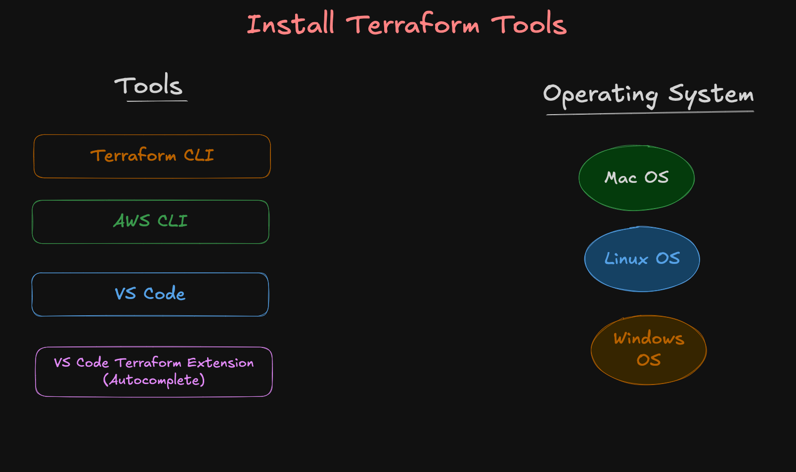

# Install Terraform Tools

## Step-01: Introduction
- Install and Configure
  - Terraform CLI
  - AWS CLI
  - VS Code
  - VS Code Terraform Extension




## Step-02: Mac OS: Install Terraform Tools (Local Desktop)
### Step-02-01: Mac OS: Install VSCode
- [Download VSCode](https://code.visualstudio.com/)

### Step-02-02: Install VSCode extension "HashiCorp Terraform"
- Go to VSCode -> Extensions
- Search for `HashiCorp Terraform`
- Install the Extension
- [Link to HashiCorp Terraform Extension](https://marketplace.visualstudio.com/items?itemName=HashiCorp.terraform)


### Step-02-03: MacOS - Install Terraform CLI and configure (OPTIONAL)
```bash
# MacOS - Install Terraform
brew tap hashicorp/tap
brew install hashicorp/tap/terraform
terraform version
```
### Step-02-04: MacOS - Install and Configure AWS CLI 
- [Install AWS CLI](https://docs.aws.amazon.com/cli/latest/userguide/getting-started-install.html)
```bash
# Generate AWS Access Keys
Go to AWS Console -> IAM -> Users -> xxxxxx -> Security Credentials -> Create access key

# Configure AWS Credentials
aws configure

## Sample Output
[ec2-user@ip-172-31-91-179 terraform]$ aws configure 
AWS Access Key ID [None]: ABCDEFGHIJKLMNY
AWS Secret Access Key [None]: Xy78fz3uuuyyttZ5kkksa0788a
Default region name [None]: us-east-1
Default output format [None]: json
[ec2-user@ip-172-31-91-179 terraform]$ 
```

## Step-03: WindowsOS: Terraform & AWS CLI Install

### Step-03-01: Windows OS: Install VSCode
- [Download VSCode](https://code.visualstudio.com/)

### Step-03-02: Windows OS: Install VSCode extension "HashiCorp Terraform"
- Go to VSCode -> Extensions
- Search for `HashiCorp Terraform`
- Install the Extension
- [Link to HashiCorp Terraform Extension](https://marketplace.visualstudio.com/items?itemName=HashiCorp.terraform)

### Step-03-03: Windows OS: Install Terraform CLI
- [Download Terraform](https://developer.hashicorp.com/terraform/install)
- Unzip the package
- Create new folder `terraform-bins`
- Copy the `terraform.exe` to a `terraform-bins`
- Set PATH in windows 

### Step-03-04: Windows OS: Install and Configure AWS CLI
- [Install AWS CLI](https://docs.aws.amazon.com/cli/latest/userguide/getting-started-install.html)
```bash
# Generate AWS Access Keys
Go to AWS Console -> IAM -> Users -> xxxxxx -> Security Credentials -> Create access key

# Configure AWS Credentials
aws configure

## Sample Output
[ec2-user@ip-172-31-91-179 terraform]$ aws configure 
AWS Access Key ID [None]: ABCDEFGHIJKLMNY
AWS Secret Access Key [None]: Xy78fz3uuuyyttZ5kkksa0788a
Default region name [None]: us-east-1
Default output format [None]: json
[ec2-user@ip-172-31-91-179 terraform]$ 
```

## Step-04: Configure Amazon Linux EC2 Instance (build-vm)
- VS Code and VS Code Terraform externsion not applicable to build-vm
- We need to install them on our local desktop

### Step-04-01: Install Terraform CLI 
```bash
# Add HashiCorp Repo
sudo dnf install -y dnf-plugins-core
sudo dnf config-manager --add-repo https://rpm.releases.hashicorp.com/AmazonLinux/hashicorp.repo

# Install Terraform
sudo dnf install -y terraform

# Verify Installation
terraform -version

# To upgrade Terraform CLI in future
sudo dnf upgrade terraform
```

### Step-04-02: Install AWS CLI and configure
```bash
# Verify AWS CLI version
aws --version

# AWS CLI Install (IF NOT INSTALLTED)
sudo dnf install -y awscli
``` 

### Step-04-03: Configure AWS Credentials for Terraform to interact with AWS Cloud
- [Terraform Authentication and Configuration](https://registry.terraform.io/providers/hashicorp/aws/latest/docs#authentication-and-configuration)
#### Generate AWS Access Key
- Go to AWS Console → IAM
- Navigate to: Users → Your IAM Username → Security credentials
- Click “Create access key”
- Select Command Line Interface (CLI) option (or programmatic access)
- Save:
  - Access Key ID
  - Secret Access Key

#### Configure AWS Credentials  
```bash
# Configure AWS Credentials
aws configure

## Sample Output
[ec2-user@ip-172-31-91-179 terraform]$ aws configure 
AWS Access Key ID [None]: ABCDEFGHIJKLMNY
AWS Secret Access Key [None]: Xy78fz3uuuyyttZ5kkksa0788a
Default region name [None]: us-east-1
Default output format [None]: json
[ec2-user@ip-172-31-91-179 terraform]$ 
```

