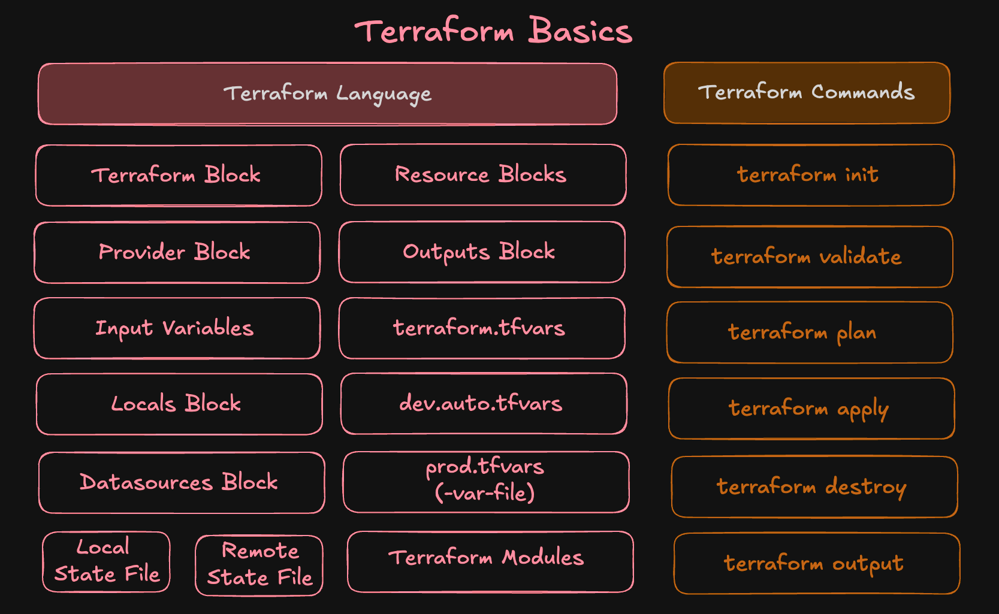

# Terraform Warm-up Demo – S3 Bucket

This is our **first Terraform project**.
We’ll create an **S3 Bucket** on AWS with a **random suffix** to keep the name globally unique.

---

## Step-01: Terraform Concepts Covered

* **Terraform Block**
* **Provider Block**
* **Resource Block**
* **Random Resource**
* **Output Block**
* Basic Terraform Commands: `init`, `validate`, `plan`, `apply`, `destroy`

--- 



--- 


---

## Step-02: Project Structure

| File             | Description                                     |
| ---------------- | ----------------------------------------------- |
| `c1-versions.tf` | Defines Terraform and AWS provider requirements |
| `c2-s3bucket.tf` | Contains Random String + S3 Bucket resources    |
| `c3-outputs.tf`  | Declares output values                          |

---

## Step-03: Terraform Manifests

### c1-versions.tf

```hcl
terraform {
  required_version = ">= 1.0.0"
  required_providers {
    aws = {
      source  = "hashicorp/aws"
      version = ">= 6.0"
    }
    random = {
      source  = "hashicorp/random"
      version = "~> 3.0"
    }    
  }
}

provider "aws" {
  region = "us-east-1"
}
```

---

### c2-s3bucket.tf

```hcl
# Resouruce Block: Random String
resource "random_string" "suffix" {
  length  = 6
  upper   = false
  special = false
}

# Resource Block: AWS S3 Bucket
resource "aws_s3_bucket" "demo_bucket" {
  bucket = "devopsdemo-${random_string.suffix.result}"  # must be globally unique
  tags = {
    Name        = "DevOps Demo Bucket"
    Environment = "Dev"
  }  
}
```

---

### c3-outputs.tf

```hcl
# Output Block
output "s3_bucket_name" {
  value = aws_s3_bucket.demo_bucket.bucket
}
```

---

## Step-04: Terraform Commands

```bash
# Initialize Terraform (downloads provider plugins)
terraform init

# Validate configuration
terraform validate

# See execution plan
terraform plan

# Create resources
terraform apply -auto-approve

# Check Output
# You should see the bucket name like:
# s3_bucket_name = devopsdemo-ab12cd

# Verify in AWS Console or using CLI
aws s3 ls | grep devopsdemo

# Destroy resources
terraform destroy -auto-approve
```

---

✅ That’s it! You just created and destroyed your **first AWS resource with Terraform** 

---
