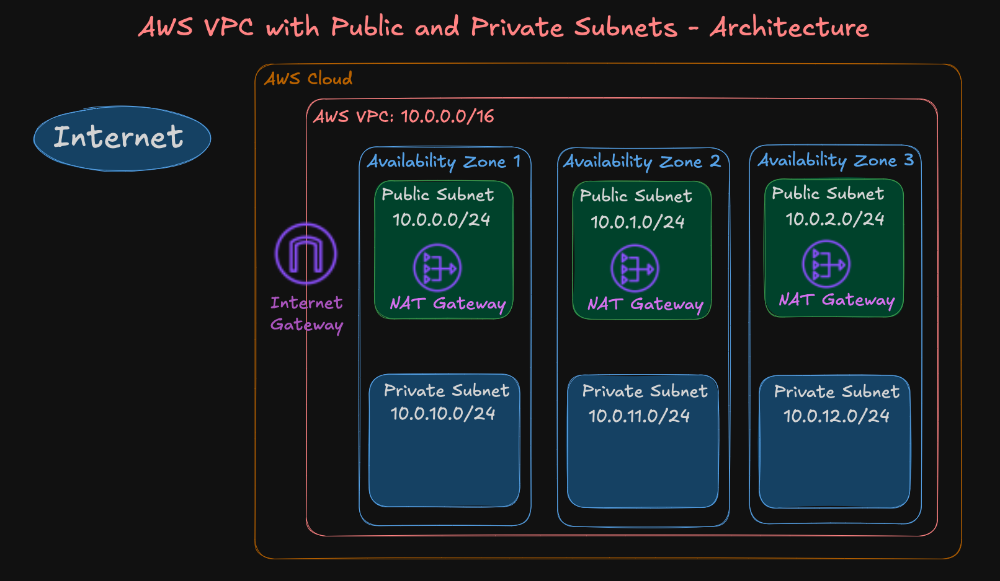
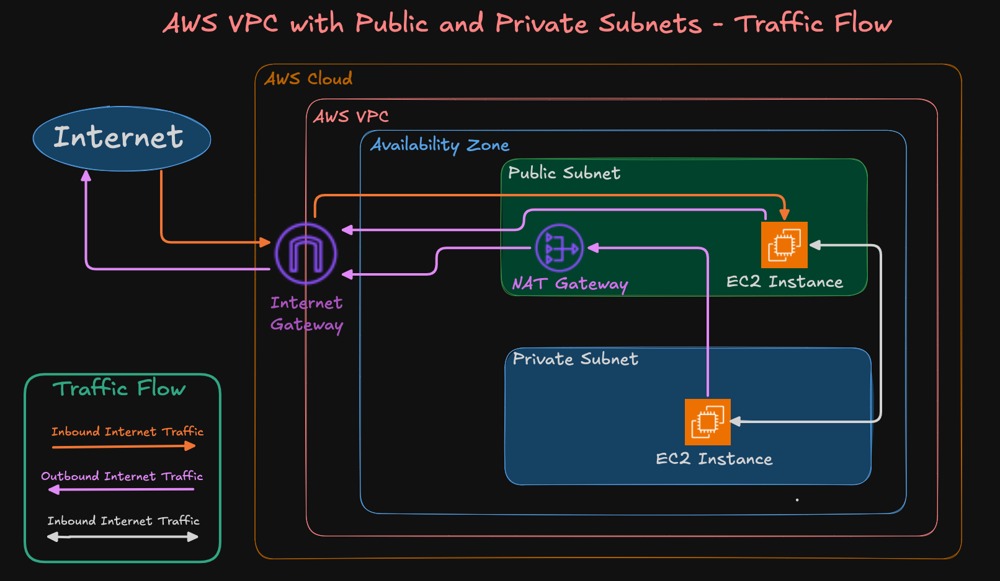
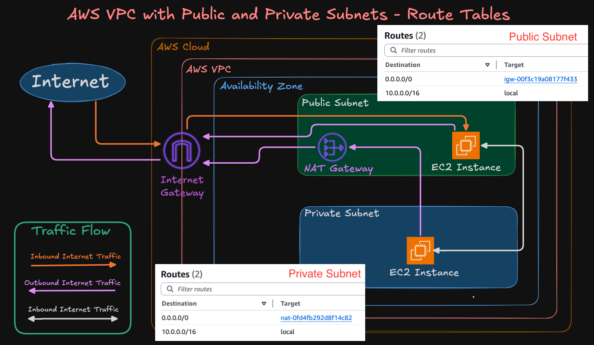
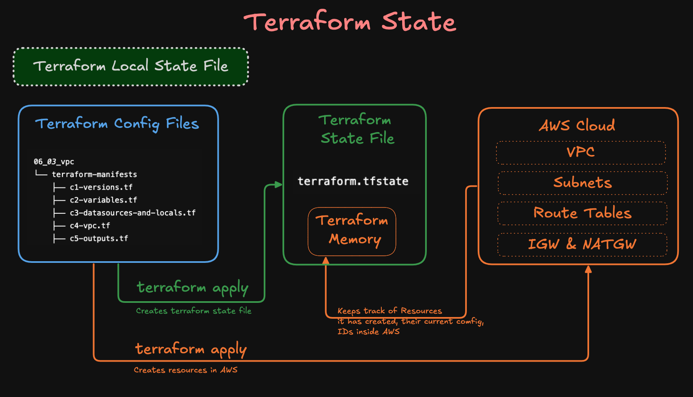

# VPC Project using Terraform

This project demonstrates the core Terraform concepts by provisioning a **Virtual Private Cloud (VPC)** on AWS. 

---

## Step-01: Terraform Concepts Covered
We’ll learn how to create a VPC using Terraform step by step while understanding core language constructs.

- Terraform Block
- Provider Block
- Input Variables
- Local Values
- Data Sources
- Resource Blocks
- Outputs
- State files (local)
- Basic Terraform commands: `init`, `validate`, `plan`, `apply`, `destroy`

--- 
### AWS VPC Architecture



--- 

### AWS VPC Traffic Flow


---

### AWS VPC - Public and Private Subnet Routes



---

## Step-02: Project Structure

| File | Description |
|------|-------------|
| `c1-versions.tf` | Defines required Terraform version and AWS provider block |
| `c2-variables.tf` | Declares input variables used throughout the config |
| `c3-datasources-and-locals.tf` | Contains AWS region data source and local values |
| `c4-vpc.tf` | Main resource block that provisions the AWS VPC and subnets |
| `c5-outputs.tf` | Defines output values like VPC ID, subnet IDs, etc. |

---

## Step-03: `c1-versions.tf` – Terraform & Provider Block
### Terraform Block
* Locks Terraform version and AWS provider.
```hcl
terraform {
  required_version = ">= 1.0.0"
  required_providers {
    aws = {
      source  = "hashicorp/aws"
      version = ">= 6.0"
    }
  }
}
```
### Providers Block
* Configures AWS region via variable (`var.aws_region`).
```hcl
provider "aws" {
  region = var.aws_region
}
```
---

## Step-04: `c2-variables.tf` – Input Variables
Defines configurable parameters like:

* `aws_region`
* VPC CIDRs
* Subnet CIDRs
* Environment tags

This makes the code reusable across different environments.

---

## Step-05: `c3-datasources-and-locals.tf` – Data Sources & Locals

* Uses `data "aws_region"` to fetch current AWS region details.
* Uses `locals` block to create dynamic names and reuse logic (like resource naming conventions).

---

## Step-06: `c4-vpc.tf` – VPC Resource Block

Creates:

* VPC
* Internet Gateway
* Route Table
* Public Subnets
* Route Table and 
* Route Table Associations

Each resource is tagged using input variables and locals.

---

## Step-07: `c5-outputs.tf` – Output Values

Displays key outputs after `terraform apply`, such as:

* VPC ID
* Public subnet IDs
* AWS region used

This helps in referencing outputs in other Terraform modules or debugging.

---

## Step-08: Terraform Commands (Basics)

| Command              | Purpose                      |
| -------------------- | ---------------------------- |
| `terraform init`     | Initialize working directory |
| `terraform validate` | Validate configuration files |
| `terraform plan`     | Show execution plan          |
| `terraform apply`    | Apply the configuration      |
| `terraform destroy`  | Tear down all infrastructure |
| `terraform output`  | Show outputs defined |

```bash
# Change Directory
cd terraform-manifests

# Terraform Initialize
terraform init 

# Terraform Validate
terraform validate

# Terraform Plan
terraform plan

# Terraform Apply
terraform apply -auto-approve
```
---

## Step-09: Verify VPC Resources created
- Go to AWS Console -> VPC
- VPC
- Subnets
- NAT Gateway
- INTERNET Gateway
- Route Tables

---

## Step-10: State Management
This project uses **local state file** (`terraform.tfstate`), stored in the working directory.

```bash
# Change Directory
cd terraform-manifests

# List Files
ls -lrt
Observation: You will find the file `terraform.tfstate`

# Review terraform.tfstate
cat terraform.tfstate
```
## Step-11: Inspect State with `terraform show`
- **Purpose:** The terraform show command lets you inspect the Terraform state in a human-readable or machine-readable format.
- This is especially useful for:
  - Verifying what resources exist after an apply
  - Debugging issues by checking real resource attributes
  - Reviewing values stored in the state file
  - Comparing values between runs
```bash
# Terraform show command
terraform show
```
- **What `terraform show` Doesn't Do**
- It doesn't show future changes — use terraform plan for that.
- It doesn't modify infrastructure or state.

---

## Step-12: Terraform State Command (List Only)
In this step, we’ll explore how to **view which resources are currently being tracked** in your Terraform state file.

### Why Is This Important?
After you run `terraform apply`, Terraform stores metadata about every resource it creates in a **state file** (`terraform.tfstate`). To **see a summary of what’s being managed**, you can use the `terraform state list` command.

### Command: `terraform state list`
```bash
terraform state list
```

This will output a list like:

```
aws_vpc.main
aws_subnet.public[0]
aws_subnet.public[1]
aws_internet_gateway.main
```

Each line represents a resource tracked by Terraform.

### When is this useful?

* Quickly confirm all resources created
* Helps debug or verify module outputs
* Understand how Terraform names internal references (e.g., `aws_subnet.public[0]`)

---

### ⚠️⚠️⚠️ Note:

> In this course, we’re **only focusing on listing state**.
> Terraform has other advanced state commands (like `state show`, `rm`, `mv`, `pull`, etc.), but those are **used in complex refactoring scenarios** and are out of scope for now.

---

## Step-13: Clean-Up 
Let’s **clean up the current infrastructure** created by this project.

### Destroy Resources Using Terraform

```bash
# Navigate to the VPC project directory
cd 05_02_vpc/terraform-manifests

# Destroy all resources created by this project
terraform destroy -auto-approve
```

> ⚠️ This command will delete all AWS resources provisioned by this configuration — including the VPC, subnets, route tables, and more.

---