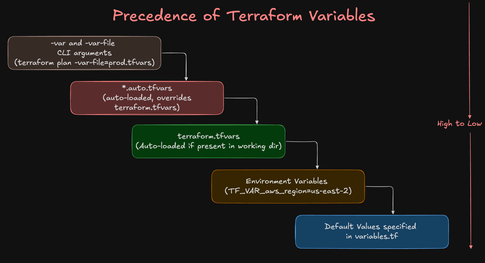

# Terraform tfvar files

## Step-01: Introduction
1. In this section, we will learn how Terraform handles **variable values** from different sources and how **override precedence** works.  
2. Terraform variables can be defined in multiple ways 
  - defaults, 
  - environment variables, 
  - tfvars files, or 
  - directly via CLI arguments.  
3. Understanding the precedence order helps us build **flexible, reusable, and environment-specific** infrastructure code.



---

## Step-02: Default Values from c2-variables.tf
```bash
# Terraform Initialize
terraform init

# Terraform Validate
terraform validate

# Terraform Plan
terraform plan
```
### Observation:
- Default values defined in `c2-variables.tf` are used for any variables that don’t have values from higher-precedence sources.


## Step-03: Environment Variables (TF_VAR_variable_name)
```bash
# Set environment variables (same shell where you will run Terraform)
export TF_VAR_environment_name="predev"
export TF_VAR_aws_region="us-east-2"

# Verify if env variable is set
echo $TF_VAR_environment_name, $TF_VAR_aws_region
env | grep TF_

# Terraform Plan
terraform plan
```

### Observation:
- `environment_name` and `aws_region` values are overridden by environment variables (TF_VAR_*), replacing the defaults defined in c2-variables.tf.
- These env vars will continue to apply unless a higher-precedence source (like terraform.tfvars, *.auto.tfvars, or CLI -var/-var-file) overrides them.


## Step-04: Understand terraform.tfvars
- The `terraform.tfvars` file is where we define input variable values for our Terraform configuration.
- Instead of hardcoding values directly inside `.tf files`, we keep them here making our setup reusable, flexible, and environment-specific.
- The `terraform.tfvars` file is automatically loaded by Terraform if present in the working directory.
- It overrides defaults defined in `variables.tf`
- `terraform.tfvars` can be overridden by:
  - `*.auto.tfvars` files
  - CLI arguments (-var, -var-file)
- **terraform.tfvars:** 

### Run terraform commands to review the plan output
```bash
# Terraform Plan
terraform plan
```

- **Observations**
- All variable values are automatically picked from `terraform.tfvars`
- This ensures the same Terraform code can be reused across multiple environments (dev, test, prod) by just changing the `.tfvars` file.  
- We will talk about more tfvar files like `dev.auto.tfvars`, `prod.tfvars` in next step
- Keeps the codebase clean and DRY (Don’t Repeat Yourself).

---

## Step-05: Understand dev.auto.tfvars
- **Files:** `*.auto.tfvars` and `*.auto.tfvars.json` files
- Automatically loaded by Terraform (no need to specify).
- **Example:** dev.auto.tfvars will be picked up automatically.
- Any file ending in `*.auto.tfvars` or `*.auto.tfvars.json` is automatically loaded by Terraform, no -var-file flag needed.
- If multiple `.auto.tfvars` exist, they are loaded in alphabetical order.
- `*.auto.tfvars` files override values from:
  - variables.tf defaults
  - terraform.tfvars
- Still lower in precedence than:
  - CLI arguments (-var, -var-file)
- **dev.auto.tfvars:** 

### Run terraform commands to review the plan output
```bash
# Terraform Plan
terraform plan
```


---

## Step-06: Understand -var-file argument
```bash
# Terraform Plan with prod environment variables
terraform plan -var-file=prod.tfvars
```
### Observation
1. Values from `prod.tfvars` override:
  - Defaults in `variables.tf`
  - Values from `environment variables (TF_VAR_*)`
  - `terraform.tfvars` and `*.auto.tfvars` files
2. `-var-file` is one of the highest-precedence sources, second only to `-var` defined directly on the command line.
3. This approach makes it easy to maintain separate configs per environment while reusing the same Terraform codebase.

## Step-07: Understand -var argument
```bash
# Terraform Plan with inline variable override
terraform plan -var="aws_region=us-east-2"
```
### Observation
1. The value for `aws_region` is taken directly from the CLI argument.
2. `-var` has the highest precedence in Terraform, so it overrides:
  - Defaults in `variables.tf`
  - Environment variables (TF_VAR_*)
  - `terraform.tfvars` and `*.auto.tfvars`
  - Any `-var-file` values
3. Best for **ad-hoc overrides**. For consistency across environments, prefer tfvars files.

## Step-08: Additional Tests for Practice purpose
### Case 1: -var-file first, then -var
```bash
terraform plan -var-file=prod.tfvars -var="aws_region=us-east-2"
```
#### Observation:
- `aws_region` will be overridden by `-var` (because CLI args are processed in order, and -var comes last here).


### Case 2: -var first, then -var-file
```bash
terraform plan -var="aws_region=us-east-2" -var-file=prod.tfvars
```
#### Observation:
- `aws_region` will be overridden by values in `prod.tfvars` (because `-var-file` is evaluated after your inline `-var`).


## Terraform Variable Precedence

When the same variable is defined in multiple places, Terraform uses the following **precedence order (lowest → highest)**.  
The **last/highest** source wins.

| Precedence | Source                          | Auto-Loaded? | Example Usage                                                                 | Notes |
|-----------:|---------------------------------|--------------|-------------------------------------------------------------------------------|-------|
| **5 (Highest)** | **CLI `-var`**                  | No           | `terraform plan -var="aws_region=eu-west-1"`                                  | Wins over everything else. Great for ad-hoc overrides. |
| **5 (Highest)** | **CLI `-var-file`**              | No           | `terraform plan -var-file=prod.tfvars`                                        | Same tier as `-var`. When mixing `-var` & `-var-file`, **the last one on the command line wins**. |
| **4**         | `*.auto.tfvars` / `*.auto.tfvars.json` | **Yes**      | `dev.auto.tfvars`, `qa.auto.tfvars`                                           | Auto-loaded in **alphabetical order**; later files override earlier ones. |
| **3**         | `terraform.tfvars` / `.json`        | **Yes**      | `terraform.tfvars`                                                            | Auto-loaded if present in the working dir. |
| **2**         | Env vars `TF_VAR_<name>`            | No           | `export TF_VAR_aws_region=ap-south-1`                                         | Must be in the **same shell session** running Terraform. Overridden by tfvars files and CLI args. |
| **1 (Lowest)**| Defaults in `variable` blocks       | N/A          | `variable "aws_region" { default = "us-east-1" }`                             | Fallback only. Used when no higher source supplies a value. |

---

