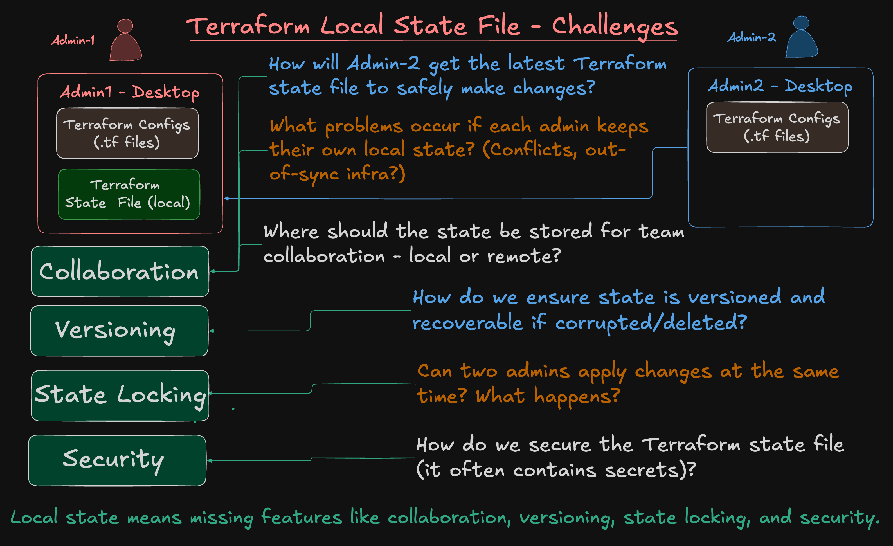
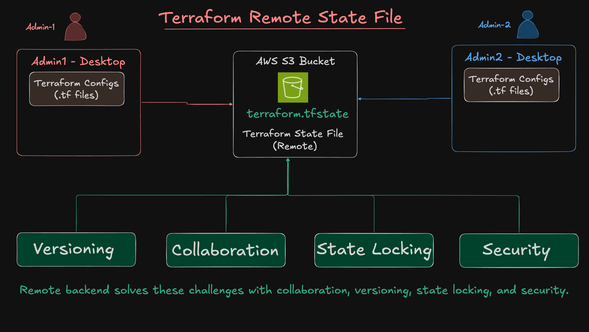

# Terraform Remote Backend 

## Step-01: Introduction
* A **backend** in Terraform defines **where state is stored** and **how operations (plan/apply) are executed**.
* By default, Terraform uses a **local backend** (`terraform.tfstate` on your machine).
* A **remote backend** (e.g., S3) moves the state file out of your laptop and provides:

  * 🔐 **Security** (encrypted storage)
  * 🤝 **Collaboration** (shared state across teams)
  * 🧾 **Versioning** (S3 object versioning allows rollbacks)
  * 🔒 **State locking** (with DynamoDB table, or via S3 use_lockfile = true)
  * ☁️ **Centralization** (essential for CI/CD and remote runs)

--- 

### Terraform Local State File Challenges


---

### Terraform Remote State File Features



---


## Step-02: Create AWS S3 bucket for Remote Backend
- You can create S3 bucket using Terraform
- **Project:** `06_05_remote_backend_s3bucket/terraform-manifests`
- Review Files
  - c1-versions.tf
  - c2-variables.tf
  - c3-s3bucket.tf
  - c4-outputs.tf
```bash
# Change Directory
cd 06_05_remote_backend_s3bucket/terraform-manifests

# Terraform Initialize
terraform init 

# Terraform Validate
terraform validate

# Terraform Plan
terraform plan

# Terraform Apply
terraform apply -auto-approve

# Make a note of the S3 bucket name
Example: tfstate-dev-us-east-1-jpjtof
```  
---

## Step-03: Enable Remote Backend in `06_06_vpc_with_remote_backend/terraform-manifests`

In this step, we will configure **Terraform to use the remote backend (S3)** for storing the state file instead of using local storage.

### Actions

* Open the file:
  `06_06_vpc_with_remote_backend/terraform-manifests/c1-versions.tf`

* Locate the backend block and **uncomment it** as shown below:

```hcl
# Remote backend configuration
terraform {
  required_version = ">= 1.0.0"
  required_providers {
    aws = {
      source  = "hashicorp/aws"
      version = ">= 6.0"
    }
  }
# Remote Backend 
  backend "s3" {
    bucket         = "tfstate-dev-us-east-1-jpjtof" # <-- Replace with your actual bucket name
    key            = "vpc/dev/terraform.tfstate"
    region         = "us-east-1"
    encrypt        = true
    use_lockfile = true
  }   
}

```

> Make sure to replace the `bucket` value with the actual name of the S3 bucket you created in terraform project `06_05_remote_backend_s3bucket`.

---

### Why This Matters

Uncommenting this block tells Terraform to:

* Store the state file in S3
* Use the specified key (file path) to organize it
* Use a lockfile-based mechanism (`use_lockfile = true`) to avoid race conditions

---

## Step-04: Execute Terraform Commnands
```bash
# Change Directroy 
cd 06_06_vpc_with_remote_backend/terraform-manifests

# Terraform Initialize
terraform init

# Terraform Validate
terraform validate

# Terraform Plan
terraform plan

# Terraform Apply
terraform apply -auto-approve

```

Terraform will detect that:

* A **remote backend is now configured**, and
* Terraform State file `terraform.tfstate` file created in AWS S3 bucket


## Step-05: Verify Terraform is Using the Remote Backend

It's important to **verify** that Terraform is now storing state in the **S3 bucket** and not locally.

### Check in the AWS S3 Console

1. Go to the **S3 bucket** you used (e.g., `tfstate-dev-us-east-1-xxxxx`)
2. Navigate to the specified path (e.g., `vpc/dev/terraform.tfstate`)
3. Confirm the state file exists

---
### Best Practices

* Enable **bucket versioning** for rollback.
* Apply **IAM restrictions** to protect state.
* Always use **locking** (lockfile).
* Never commit `.tfstate` files to Git.

---

## Step-06: Clean-Up – Prepare for Reusable Module Conversion
In the next demo, we’ll **convert this VPC Terraform configuration into a reusable module**, allowing it to be called from other projects or environments.

Before we do that, let’s **clean up the current infrastructure** created by this project.

### Destroy Resources Using Terraform

```bash
# Navigate to the VPC project directory
cd 06_06_vpc_with_remote_backend/terraform-manifests

# Destroy all resources created by this project
terraform destroy -auto-approve
```
---