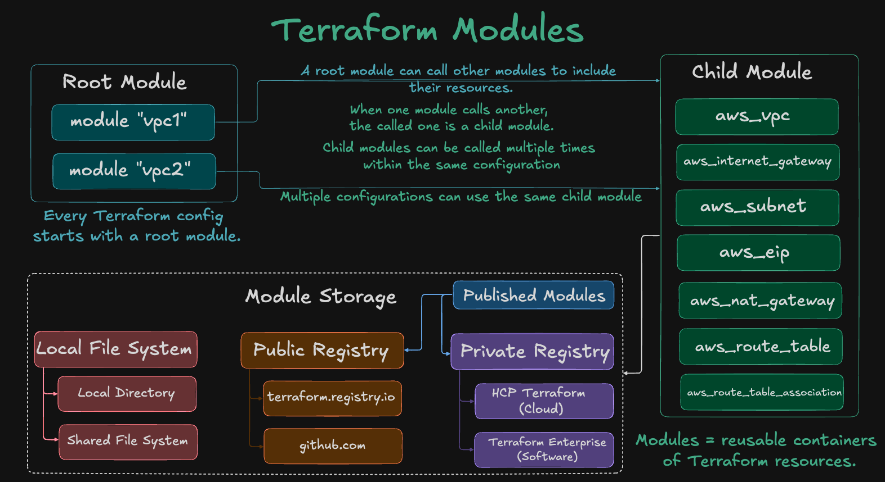
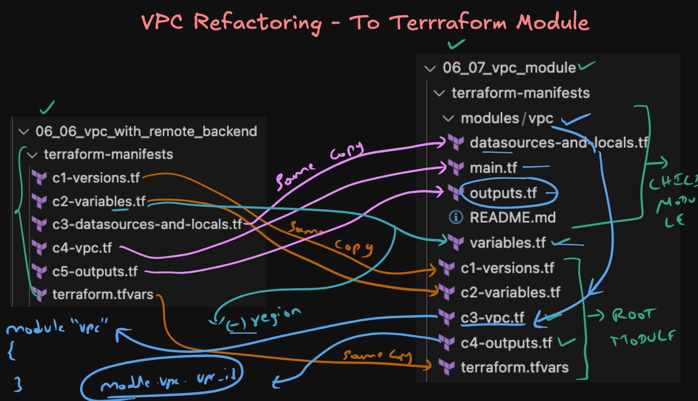

# Terraform Modules - Convert VPC Terraform Resources to a re-usable Terraform Module

This project demonstrates how to convert a basic VPC configuration into a **reusable Terraform module** for better maintainability and reusability across environments.



---

## Step-01: Project Structure

```
06\_07\_vpc\_module/
└── terraform-manifests/
├── modules/
│   └── vpc/
│       ├── datasources-and-locals.tf
│       ├── main.tf
│       ├── outputs.tf
│       ├── variables.tf
│       └── README.md
├── c1-versions.tf
├── c2-variables.tf
├── c3-vpc.tf
├── c4-outputs.tf
├── terraform.tfvars
└── README.md
```

---

## Step-02: VPC Refactoring: From Flat to Modular (06_06 → 06_07)




| 06_06_vpc_with_remote_backend                  | 06_07_vpc_module                                          | Purpose / Transformation Description                              |
|-----------------------------------------------|-----------------------------------------------------------|-------------------------------------------------------------------|
| `c1-versions.tf`                               | `c1-versions.tf`                                          | Same — Provider & required Terraform versions                     |
| `c2-variables.tf`                              | `c2-variables.tf`                                         | Same — Root-level variables passed to the module                  |
| `c3-datasources-and-locals.tf`                | `modules/vpc/datasources-and-locals.tf`                   | Moved to module — Subnet CIDRs and AZ lookup logic                |
| `c4-vpc.tf`                                    | `modules/vpc/main.tf`                                     | Split into reusable VPC logic inside the module                   |
| `c5-outputs.tf`                                | `modules/vpc/outputs.tf` and `c4-outputs.tf`              | Split — Module exports and root-level passthrough                 |
| `terraform.tfvars`                             | `terraform.tfvars`                                        | Same — environment-specific values for root module                |
| `c2-variables.tf`                             | `modules/vpc/variables.tf`                                | Same - Declares module-level input variables `aws_region` removed at module-level                       |
| *(not applicable)*                             | `modules/vpc/README.md`                                   | NEW — Documentation for the reusable VPC module                   |
| *(not applicable)*                             | `c3-vpc.tf` (root)                                        | NEW — Instantiates `module "vpc"` and passes inputs               |


---

## Step-03: Module Files Breakdown

| File                             | Purpose |
|----------------------------------|---------|
| `modules/vpc/main.tf`            | Core VPC resource definitions |
| `modules/vpc/variables.tf`       | Inputs required by the VPC module |
| `modules/vpc/outputs.tf`         | Outputs exported by the module |
| `modules/vpc/datasources-and-locals.tf` | Contains `data` blocks and `locals` |
| `modules/vpc/README.md`          | (Optional) Add usage documentation for the module |

---

## Step-04: How to Use?

From the `terraform-manifests/` folder:

```bash
# Initialize Terraform
terraform init

# Validate configuration
terraform validate

# Plan execution
terraform plan

# Apply changes
terraform apply
````

---

## Benefits of Modularization

* **Reusability**: Same VPC module can be used across environments (dev, test, prod).
* **Isolation**: VPC logic is isolated from the rest of the infrastructure.
* **Consistency**: Centralized config leads to fewer errors and better collaboration.
* **Scalability**: Easy to extend module with more resources or logic.

---


**Author**: Kalyan Reddy Daida
**Course**: DevOps Real-world Project Implementation on AWS Cloud

