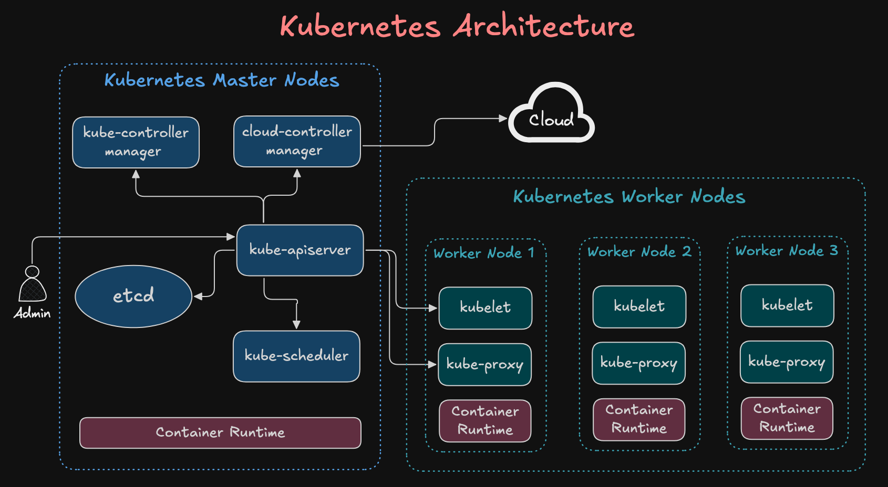
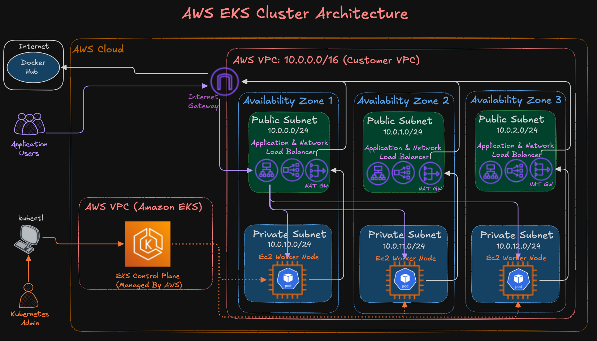
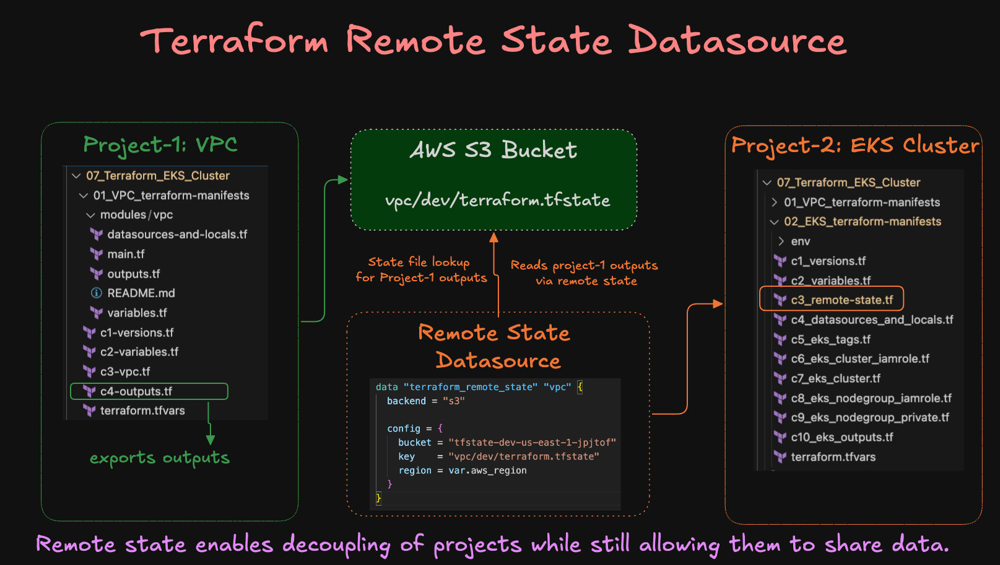

# AWS EKS Cluster Creation with Terraform

This project provisions a **production-ready Amazon EKS cluster** using Terraform.  
We build the cluster step by step, covering IAM roles, networking, node groups, and outputs.

---

## Kubernetes Architecture


---

## AWS EKS Cluster Architecture


---

## Terraform Remote State Datasource for VPC and EKS Cluster Terraform Projects 
- Sharing data across Terraform projects


---

## Step-01: Project Structure

| File | Description |
|------|-------------|
| `c1_versions.tf` | Required Terraform + AWS provider versions |
| `c2_variables.tf` | Input variables (region, cluster name, etc.) |
| `c3_remote-state.tf` | Remote backend for Terraform state (S3 + DynamoDB) |
| `c4_datasources_and_locals.tf` | AWS data sources and local values |
| `c5_eks_tags.tf` | Common tags for resources |
| `c6_eks_cluster_iamrole.tf` | IAM role for EKS control plane |
| `c7_eks_cluster.tf` | EKS cluster resource definition |
| `c8_eks_nodegroup_iamrole.tf` | IAM role for EKS worker node groups |
| `c9_eks_nodegroup_private.tf` | Private node group configuration |
| `c10_eks_outputs.tf` | Useful Terraform outputs (kubeconfig, cluster details) |

---

## Step-02: Steps to Provision

```bash
# Terraform Initialize
terraform init

# Terraform Validate
terraform validate

# Terraform Plan
terraform plan

# Terraform Apply
terraform apply -auto-approve
```

---

## Step-03: Configure kubectl cli to access EKS cluster
```bash
# EKS kubeconfig
aws eks update-kubeconfig --name <cluster_name> --region <aws_region>

# List Kubernetes Nodes
kubectl get nodes

# List Kubernetes Pods 
kubectl get pods -n kube-system
```

## Step-04: Browse EKS Cluster features on AWS Console
- Go to AWS Console -> EKS
- Review Tabs
  - Overview
  - Resources
  - Compute
  - Networking
  - Add-ons
  - Access
  - Observability
  - Update history
  - Tags

---
