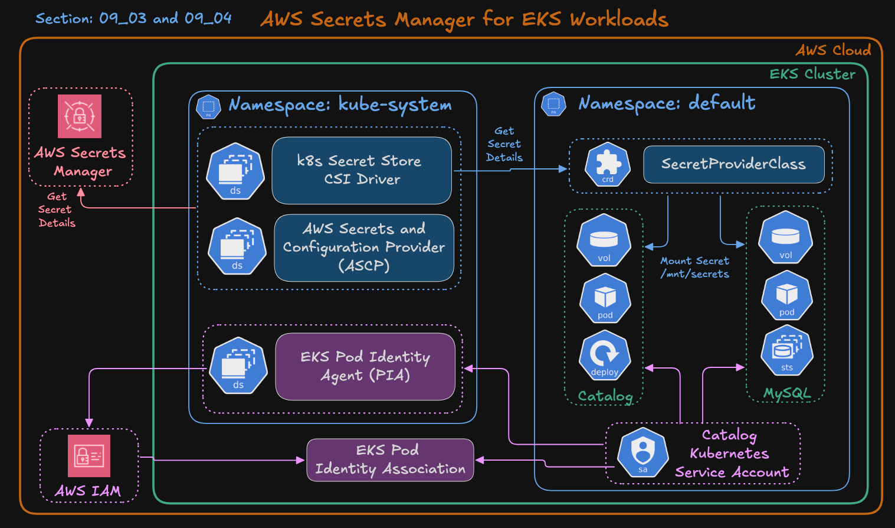

# Section 09-03: Install AWS Secrets and Configuration Provider (ASCP) for Amazon EKS

In simple terms, this section prepares your EKS cluster to securely fetch secrets from AWS Secrets Manager using Pod Identity.

In this section, we’ll install the **Secrets Store CSI Driver** and the **AWS Secrets and Configuration Provider (ASCP)** on our EKS cluster.
This setup enables Kubernetes Pods to securely retrieve secrets from **AWS Secrets Manager** and **AWS Systems Manager Parameter Store**,
using **EKS Pod Identity** for authentication without storing any credentials inside the cluster.

---

## **Learning Objectives**

By the end of this lesson, you will:

* Understand how the **Secrets Store CSI Driver** works inside EKS.
* Install both the **CSI Driver** and the **AWS Secrets Provider (ASCP)**.
* Verify that both components are running as **DaemonSets** in the `kube-system` namespace.
* Prepare your cluster for mounting AWS Secrets directly into Pods (used in the next section 09-04).

---

## Architecture Diagram


---

## Architecture Overview

```
+------------------------------------+
| AWS Secrets Manager                |
| Secret: catalog-db-secret          |
| {                                  |
|   "MYSQL_USER":"catalog",          |
|   "MYSQL_PASSWORD":"MyS3cr3tPwd"   |
| }                                  |
+----------------+-------------------+
                 |
                 | (via EKS Pod Identity)
                 v
+-------------------------------------------+
| Amazon EKS Cluster                        |
|  - Pod Identity Agent                     |
|  - k8s CSI Driver and ASCP                |
|  - catalog-mysql-sa (ServiceAccount)      |
|  - SecretProviderClass: catalog-db-secrets|
|                                           |
|  /mnt/secrets-store/MYSQL_USER            |
|  /mnt/secrets-store/MYSQL_PASSWORD        |
+-------------------------------------------+
```

---

## **Step-01: Verify Prerequisites**

Before installing ASCP, confirm the following:

✅ EKS Cluster version **1.24 or later** (required for Pod Identity)
✅ You are using **EC2 node groups** (Fargate not supported)
✅ **Helm v3+** and **kubectl** are installed locally
✅ **EKS Pod Identity Agent add-on** is already installed
✅ You are connected to the cluster:

```bash
kubectl get nodes
```

---

## **Step-02: Install Helm CLI and Add Helm Repositories**

---


---


---
### Step-02-01: Install Helm CLI
- [Helm CLI Install](https://helm.sh/docs/intro/install/)
```bash
# Install Helm CLI
brew install helm

# Get helm version
helm version
```
### Step-02-02: Add Helm Repositories
Add both the Kubernetes CSI Driver and AWS Secrets Provider repositories.
```bash
# Add Helm Repositories
helm repo add secrets-store-csi-driver https://kubernetes-sigs.github.io/secrets-store-csi-driver/charts
helm repo add aws-secrets-manager https://aws.github.io/secrets-store-csi-driver-provider-aws
helm repo update

# List Helm Repos
helm repo list
```

Expected:

```
NAME                    URL
secrets-store-csi-driver https://kubernetes-sigs.github.io/secrets-store-csi-driver/charts
aws-secrets-manager      https://aws.github.io/secrets-store-csi-driver-provider-aws
```

---

## **Step-03: Install the Secrets Store CSI Driver**

Install the core driver that enables Kubernetes to mount external secrets.

```bash
# Install the Secrets Store CSI Driver in the kube-system namespace:
helm install csi-secrets-store \
  secrets-store-csi-driver/secrets-store-csi-driver \
  --namespace kube-system

# List all Helm releases across namespaces:
helm list --all-namespaces

# List releases only in the kube-system namespace:
helm list -n kube-system

# Verify installation status, pods, and resources created by the release:
helm status csi-secrets-store -n kube-system


# Verify pods:
kubectl get pods -n kube-system -l app=secrets-store-csi-driver
```

✅ Example:

```
NAME                                               READY   STATUS    RESTARTS   AGE
csi-secrets-store-secrets-store-csi-driver-gvdnm   3/3     Running   0          30s
csi-secrets-store-secrets-store-csi-driver-lzqnf   3/3     Running   0          30s
csi-secrets-store-secrets-store-csi-driver-rhjwv   3/3     Running   0          30s
```

At this point, the **CSI driver** is installed and working.

---

## **Step-04: Install the AWS Secrets and Configuration Provider (ASCP)**

Next, install the AWS-specific provider that connects the CSI driver to AWS Secrets Manager and Parameter Store.

This component is called **AWS Secrets and Configuration Provider (ASCP).**

### Why `--set secrets-store-csi-driver.install=false`?

The AWS Provider Helm chart includes the CSI driver as a dependency by default.
Since we already installed it in Step-03, we must disable that dependency to prevent Helm ownership conflicts.

---

### Step-04-01: Install the AWS Provider

```bash
# Install the AWS Secrets Manager CSI Driver Provider in the kube-system namespace.
helm install secrets-provider-aws \
  aws-secrets-manager/secrets-store-csi-driver-provider-aws \
  --namespace kube-system \
  --set secrets-store-csi-driver.install=false

# List installed Helm Releases
helm list -n kube-system

# Inspect the AWS provider Helm release:
helm status secrets-provider-aws -n kube-system
```

✅ This command installs only the **AWS provider (ASCP)** components and reuses the CSI driver already installed.

---

### Step-04-02: Optional Flags

| Flag                                                            | Purpose                                 |
| --------------------------------------------------------------- | --------------------------------------- |
| `--set useFipsEndpoint=true`                                    | Use AWS FIPS endpoint (for compliance). |
| `--set-json 'k8sThrottlingParams={"qps": "20", "burst": "40"}'` | Tune API rate limits.                   |
| `--set podIdentityHttpTimeout=500ms`                            | Adjust Pod Identity connection timeout. |

---

### Step-04-03: Verify Installation

After ~30 seconds, check that all pods are running:

```bash
# CSI driver pods
kubectl get pods -n kube-system -l app=secrets-store-csi-driver

# AWS provider (ASCP) pods
kubectl get pods -n kube-system -l app=secrets-store-csi-driver-provider-aws
```

✅ Example output:

```
NAME                                               READY   STATUS    RESTARTS   AGE
csi-secrets-store-secrets-store-csi-driver-gvdnm   3/3     Running   0          1m
csi-secrets-store-secrets-store-csi-driver-lzqnf   3/3     Running   0          1m
csi-secrets-store-secrets-store-csi-driver-rhjwv   3/3     Running   0          1m

NAME                                                                  READY   STATUS    RESTARTS   AGE
secrets-provider-aws-secrets-store-csi-driver-provider-awsjjlgq       1/1     Running   0          1m
secrets-provider-aws-secrets-store-csi-driver-provider-awsmg5m6       1/1     Running   0          1m
secrets-provider-aws-secrets-store-csi-driver-provider-awstdhf8       1/1     Running   0          1m
```

---

### Step-04-04: Verify DaemonSets

```bash
kubectl get daemonset -n kube-system | grep secrets-store
```

Expected:

```
csi-secrets-store-secrets-store-csi-driver
secrets-provider-aws-secrets-store-csi-driver-provider-aws
```

---

### Step-04-05: Troubleshooting

If you don’t see the AWS provider pods (`csi-secrets-store-provider-aws`):

```bash
kubectl describe daemonset secrets-provider-aws-secrets-store-csi-driver-provider-aws -n kube-system
kubectl logs -n kube-system -l app=secrets-store-csi-driver-provider-aws
```

---

### Step-04-06: **Optional: List All Resources Created by the AWS Provider**

You can inspect all the resources managed by the Helm release:

```bash
kubectl get all,sa,cm,ds,deploy,pod -n kube-system -l "app.kubernetes.io/instance=secrets-provider-aws"
```

✅ Example output:

```
NAME                                                                  READY   STATUS    RESTARTS   AGE
pod/secrets-provider-aws-secrets-store-csi-driver-provider-awsjjlgq   1/1     Running   0          2m
pod/secrets-provider-aws-secrets-store-csi-driver-provider-awsmg5m6   1/1     Running   0          2m
pod/secrets-provider-aws-secrets-store-csi-driver-provider-awstdhf8   1/1     Running   0          2m

NAME                                                                        DESIRED   CURRENT   READY   AGE
daemonset.apps/secrets-provider-aws-secrets-store-csi-driver-provider-aws   3         3         3       2m

NAME                                                                        SECRETS   AGE
serviceaccount/secrets-provider-aws-secrets-store-csi-driver-provider-aws   0         2m
```

---

### Step-04-07: **Summary**

| Component                                  | Installed By                                                                     | Namespace   | Purpose                                                      | Status      |
| ------------------------------------------ | -------------------------------------------------------------------------------- | ----------- | ------------------------------------------------------------ | ----------- |
| **Secrets Store CSI Driver**               | `helm install csi-secrets-store`                                                 | kube-system | Mounts external secrets into Pods                            | ✅ Running   |
| **AWS Secrets and Config Provider (ASCP)** | `helm install secrets-provider-aws --set secrets-store-csi-driver.install=false` | kube-system | Connects CSI Driver to AWS Secrets Manager / Parameter Store | ✅ Running   |
| **EKS Pod Identity Agent**                 | `eksctl create addon --name eks-pod-identity-agent`                              | kube-system | Handles IAM authentication for Pods                          | ✅ Installed |

---

## Step-05: Create IAM Role, Policy and EKS Pod Identity Association
Now that the drivers are installed, let’s create IAM resources so Pods can securely assume an AWS role via Pod Identity.

### Step-05-01: Create IAM Policy and Role for Pod Identity (AWS Secrets Manager Access)

In this step, we’ll create a fine-grained **IAM role** and **IAM policy** that allow the **MySQL Pod** inside our EKS cluster to securely access credentials from **AWS Secrets Manager**, using **EKS Pod Identity** for authentication.

---

### Step-05-02: **Learning Objectives**

By the end of this step, you will:

* Export and verify key AWS environment variables.
* Create an IAM policy allowing Pods to read a specific AWS secret.
* Create an IAM role trusted by the **EKS Pod Identity Agent**.
* Attach the policy to the role.
* Associate that IAM role with the **Kubernetes ServiceAccount** (`catalog-mysql-sa`).
* Verify the Pod Identity association.

---

### **Step-05-03: Export Environment Variables**

Before running any commands, export these values so everything works dynamically without edits later.

```bash
# Replace the placeholders below with your actual values
export AWS_REGION="us-east-1"
export EKS_CLUSTER_NAME="retail-dev-eksdemo1"
export AWS_ACCOUNT_ID=$(aws sts get-caller-identity --query Account --output text)

# Confirm values
echo $AWS_REGION
echo $EKS_CLUSTER_NAME
echo $AWS_ACCOUNT_ID
```
---

### **Step-05-04: Create IAM Policy**

This policy grants permission to read one secret — `catalog-db-secret` — from AWS Secrets Manager.

**VERY VERY IMPORTANT NOTE:** We’re scoping access to only one secret (catalog-db-secret*) — least-privilege best practice.

```bash
# Change Directory
cd iam-policy-json-files

# Create Catalog DB Secret Policy JSON file
cat <<EOF > catalog-db-secret-policy.json
{
  "Version": "2012-10-17",
  "Statement": [
    {
      "Effect": "Allow",
      "Action": [
        "secretsmanager:GetSecretValue",
        "secretsmanager:DescribeSecret"
      ],
      "Resource": "arn:aws:secretsmanager:${AWS_REGION}:${AWS_ACCOUNT_ID}:secret:catalog-db-secret*"
    }
  ]
}
EOF

# Verify the values of AWS_REGION and AWS_ACCOUNT_ID
cat catalog-db-secret-policy.json
```

**Create the policy:**

```bash
# Change Directory
cd iam-policy-json-files

# Create IAM Policy
aws iam create-policy \
  --policy-name catalog-db-secret-policy \
  --policy-document file://catalog-db-secret-policy.json
```

---

### **Step-05-05: Create IAM Role for Pod Identity**

Create the trust policy that allows **EKS Pods** to assume this role through the **Pod Identity Agent**.

```bash
# Change Directory
cd iam-policy-json-files

# Create Trust Policy that allows EKS Pods to assume role through Pod Identity Agent
cat <<EOF > trust-policy.json
{
  "Version": "2012-10-17",
  "Statement": [
    {
      "Effect": "Allow",
      "Principal": {
        "Service": "pods.eks.amazonaws.com"
      },
      "Action": [
        "sts:AssumeRole",
        "sts:TagSession"
      ]
    }
  ]
}
EOF
```

Create the IAM role:

```bash
# Create IAM Role
aws iam create-role \
  --role-name catalog-db-secrets-role \
  --assume-role-policy-document file://trust-policy.json
```

Attach the policy to the role:

```bash
# Attach the IAM policy to IAM Role
aws iam attach-role-policy \
  --role-name catalog-db-secrets-role \
  --policy-arn arn:aws:iam::${AWS_ACCOUNT_ID}:policy/catalog-db-secret-policy
```

Verify attachment:

```bash
# List Attached Policies to IAM Role
aws iam list-attached-role-policies --role-name catalog-db-secrets-role
```

✅ Output should show:

```json
{
    "AttachedPolicies": [
        {
            "PolicyName": "catalog-db-secret-policy",
            "PolicyArn": "arn:aws:iam::180789647333:policy/catalog-db-secret-policy"
        }
    ]
}
```

---

### **Step-05-06: Create Pod Identity Association**

- Now we’ll associate this IAM role with the Kubernetes ServiceAccount `catalog-mysql-sa`
so the MySQL StatefulSet can access the secret.
- It’s not an issue if the ServiceAccount doesn’t exist yet — it will be created later with the same name when deploying the StatefulSet.

```bash
# Verify Amazon EKS Pod Identity Agent Installation
aws eks list-addons --cluster-name ${EKS_CLUSTER_NAME}

## Sample Output
{
    "addons": [
        "eks-pod-identity-agent"
    ]
}

# Create Pod Identity Association
aws eks create-pod-identity-association \
  --cluster-name ${EKS_CLUSTER_NAME} \
  --namespace default \
  --service-account catalog-mysql-sa \
  --role-arn arn:aws:iam::${AWS_ACCOUNT_ID}:role/catalog-db-secrets-role
```

---

### **Step-05-07: Verify Pod Identity Association**

List all associations in your cluster:

```bash
# List Pod Identity Associations
aws eks list-pod-identity-associations --cluster-name ${EKS_CLUSTER_NAME}
```


---

### **Step-05-08: Verify in Kubernetes (Optional)**
- Check that your Kubernetes ServiceAccount exists and is ready for binding:

```bash
kubectl get sa catalog-mysql-sa
```

- Note: It’s perfectly fine if this ServiceAccount is not created yet 
it will be created automatically later in next section **09-04** when we deploy the Kubernetes manifests for the Catalog MySQL component.

---

### ✅ Step-05-09: **Summary**

| Resource                     | Purpose                                             | Created Using                             | Verified |
| ---------------------------- | --------------------------------------------------- | ----------------------------------------- | -------- |
| **IAM Policy**               | Allows reading specific secret from Secrets Manager | `aws iam create-policy`                   | ✅        |
| **IAM Role**                 | Trusted by EKS Pod Identity                         | `aws iam create-role`                     | ✅        |
| **Policy Attachment**        | Grants access to Secrets Manager                    | `aws iam attach-role-policy`              | ✅        |
| **Pod Identity Association** | Binds IAM role to ServiceAccount                    | `aws eks create-pod-identity-association` | ✅        |

---

## What Next?
[**Next:** Integrate AWS Secrets Manager with the Catalog microservice in **Section 09-04**](../09_04_AWS_Secrets_Manager_Catalog_Integration/)

-- 


## Additional Reference
- [secrets-store-csi-driver-provider-aws](https://github.com/aws/secrets-store-csi-driver-provider-aws)