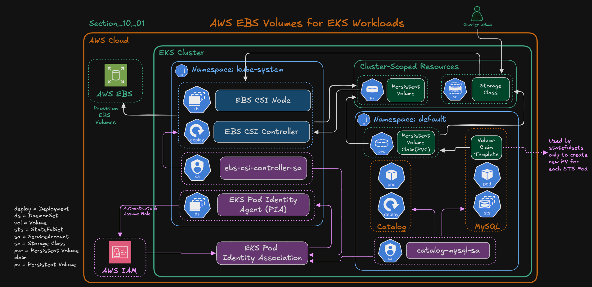

# **Section 10-02: AWS EBS CSI Integration for Catalog Microservice**

## **Learning Objectives**

By the end of this section, you will:

✅ Integrate **Amazon EBS CSI Driver** with the **Catalog MySQL StatefulSet**
✅ Create a **StorageClass** backed by EBS volumes for dynamic provisioning
✅ Replace `emptyDir` with real **persistent storage** for MySQL
✅ Verify data persistence across Pod restarts
✅ Observe **EBS volume lifecycle** from creation to deletion
✅ Understand how **EKS Pod Identity** and **AWS Secrets Manager** integrate with persistent storage

---

### AWS EBS CSI Driver Architecture




---

## **Step 1 – Create StorageClass for Amazon EBS**

File: `02_catalog_k8s_manifests/07_storage_class_ebs.yaml`

```yaml
apiVersion: storage.k8s.io/v1
kind: StorageClass
metadata:
  name: ebs-sc
provisioner: ebs.csi.aws.com
volumeBindingMode: WaitForFirstConsumer
```

**Explanation:**

* `provisioner: ebs.csi.aws.com` → Uses the Amazon EBS CSI Driver
* `volumeBindingMode: WaitForFirstConsumer` → Volume gets created only when the Pod is scheduled
* Default `Delete` policy ensures cleanup of EBS volume when PVC is deleted

---

## **Step 2 – Update MySQL StatefulSet to Use EBS Storage**

File: `02_catalog_k8s_manifests/04_catalog_statefulset_ebs.yaml`

Key updates:

* Added `volumeClaimTemplates` to dynamically create a PVC per Pod
* Linked to `storageClassName: ebs-sc`
* Mounted `/var/lib/mysql` to persistent EBS-backed volume

✅ This replaces `emptyDir` and enables **real persistence** for MySQL data.

```yaml
apiVersion: apps/v1
kind: StatefulSet
metadata:
  name: catalog-mysql
  labels:
    app.kubernetes.io/name: catalog
    app.kubernetes.io/instance: catalog
    app.kubernetes.io/component: mysql
    app.kubernetes.io/owner: retail-store-sample
spec:
  replicas: 1
  serviceName: catalog-mysql
  selector:
    matchLabels:
      app.kubernetes.io/name: catalog
      app.kubernetes.io/instance: catalog
      app.kubernetes.io/component: mysql
      app.kubernetes.io/owner: retail-store-sample
  template:
    metadata:
      labels:
        app.kubernetes.io/name: catalog
        app.kubernetes.io/instance: catalog
        app.kubernetes.io/component: mysql
        app.kubernetes.io/owner: retail-store-sample
    spec:
      serviceAccount: catalog-mysql-sa # Service Account    
      containers:
        - name: mysql
          image: "public.ecr.aws/docker/library/mysql:8.0"
          imagePullPolicy: IfNotPresent
          ports:
            - name: mysql
              containerPort: 3306
              protocol: TCP          
          env:
            - name: MYSQL_ROOT_PASSWORD
              value: my-secret-pw
            - name: MYSQL_DATABASE
              value: catalogdb
          command: ["/bin/bash", "-c"]
          args:
            - |
              export MYSQL_USER=$(cat /mnt/secrets-store/MYSQL_USER);
              export MYSQL_PASSWORD=$(cat /mnt/secrets-store/MYSQL_PASSWORD);
              echo "Loaded secrets from AWS Secrets Manager. Starting MySQL with user=$MYSQL_USER";
              exec docker-entrypoint.sh mysqld          
          volumeMounts:
            - name: data
              mountPath: /var/lib/mysql
            - name: aws-secrets
              mountPath: /mnt/secrets-store
              readOnly: true              
      volumes:
        #- name: data
        #  emptyDir: {}
        - name: aws-secrets
          csi:
            driver: secrets-store.csi.k8s.io
            readOnly: true
            volumeAttributes:
              secretProviderClass: "catalog-db-secrets"          
# Added for provisioning EBS Volumes              
  volumeClaimTemplates:
    - metadata:
        name: data-ebs
      spec:
        accessModes: ["ReadWriteOnce"]
        resources:
          requests:
            storage: 10Gi
        storageClassName: ebs-sc   
```
---

## **Step 3 – Deploy and Verify Resources**

```bash
kubectl apply -f 01_secretproviderclass/
kubectl apply -f 02_catalog_k8s_manifests/
```

Check resources:

```bash
kubectl get sc,pvc,pv,pods
```

**Verify Output:**

* StorageClass `ebs-sc` created
* PVCs bound to dynamically provisioned EBS volumes
* Pod running with `/var/lib/mysql` backed by EBS

---

## **Step 4 – Test Application Connectivity**

```bash
kubectl port-forward svc/catalog-service 7080:8080
```

Access endpoints:

```
http://localhost:7080/health
http://localhost:7080/catalog/products
```

✅ Confirms Catalog app connects to MySQL using EBS-backed storage.

---

## **Step 5 – Verify Database Persistence**

Run temporary MySQL client:

```bash
kubectl run mysql-client --rm -it \
  --image=mysql:8.0 \
  --restart=Never \
  -- mysql -h catalog-mysql -u mydbadmin -p

# Database Password
Database Password: kalyandb101  
```

Inside MySQL:

```sql
SHOW DATABASES;
USE catalogdb;
SHOW TABLES;
SELECT COUNT(*) FROM products;
```

✅ Data loads successfully from EBS-backed storage.

---

## **Step 6 – Delete Pod and Verify Data Persistence**

```bash
kubectl delete pod catalog-mysql-0
kubectl get pods -w
```

After recreation:

* Pod auto re-attaches same EBS volume
* All MySQL data remains intact

✅ Confirms true **persistent storage behavior**.

---

## **Step 7 – Validate EBS Volume Lifecycle**

### Delete Kubernetes resources

```bash
kubectl delete -f 02_catalog_k8s_manifests/
kubectl delete -f 01_secretproviderclass/
```

### Check PVC & PV

```bash
kubectl get pvc
kubectl get pv
```

EBS volume remains **until PVC is deleted**.

### Delete PVC manually

```bash
kubectl delete pvc data-catalog-mysql-0
```

Then verify using AWS CLI:

```bash
aws ec2 describe-volumes \
  --filters "Name=size,Values=10" \
  --query "Volumes[*].{ID:VolumeId,State:State,Size:Size}" \
  --output table
```

✅ Volume disappears → EBS cleanup confirmed.

---

## **Final Summary – EBS CSI Persistent Storage**

| Component                   | Description                         | Verification Command                   |
| --------------------------- | ----------------------------------- | -------------------------------------- |
| **EBS CSI Driver**          | Installed in EKS                    | `kubectl get pods -n kube-system`      |
| **StorageClass (`ebs-sc`)** | Dynamic provisioning of EBS volumes | `kubectl get sc`                       |
| **StatefulSet**             | Uses `volumeClaimTemplate`          | `kubectl describe sts catalog-mysql`   |
| **PVC / PV**                | Automatically created per Pod       | `kubectl get pvc,pv`                   |
| **Pod Identity**            | Secure AWS Secrets access           | `kubectl describe pod catalog-mysql-0` |
| **Persistence Test**        | Pod deletion → Data intact          | `SELECT COUNT(*) FROM products;`       |
| **Cleanup**                 | PVC/PV deletion → EBS removed       | `aws ec2 describe-volumes`             |

✅ **Result:**
MySQL StatefulSet now runs with **durable, fault-tolerant Amazon EBS storage** — fully integrated with **EKS Pod Identity** and **AWS Secrets Manager**, achieving a **production-grade persistent data layer** for your Catalog microservice.

---
