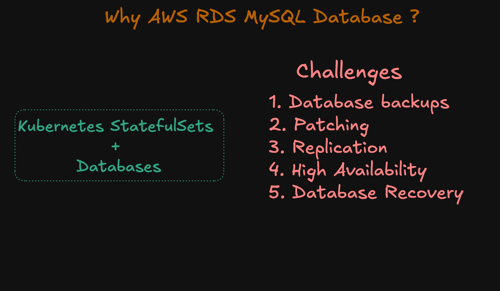
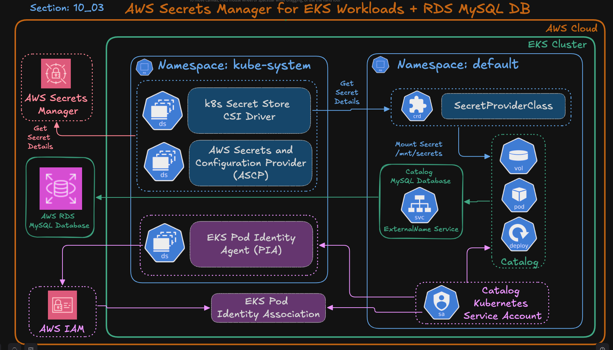
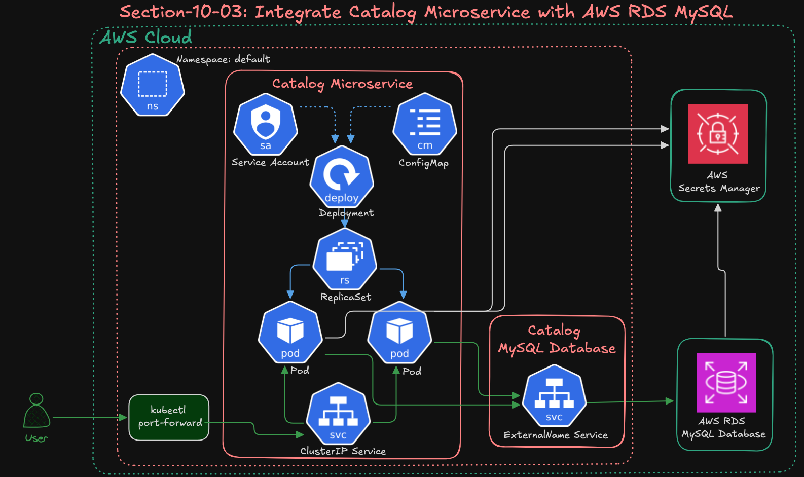

# 10-03: Amazon RDS MySQL Database Integration with Catalog Microservice

In this section, we will integrate our **Catalog microservice** with an **Amazon RDS MySQL database** instead of the in-cluster MySQL StatefulSet used in previous demos.

---

## Step-01: Learning Objectives

By the end of this section, you will be able to:

1. Understand how to connect a Kubernetes application to a managed **RDS MySQL database**.
2. Replace in-cluster MySQL StatefulSet with a **private RDS endpoint**.
3. Use **AWS Secrets Manager** and the **Secrets Store CSI Driver** to retrieve credentials securely.
4. Configure **ExternalName Service** for DNS-based access to RDS.
5. Validate connectivity between your Catalog microservice and RDS instance.

---

### Why AWS RDS MySQL Database?


### Architecture Diagram


---
### Traffic Flow


---

## Step-02: Create Amazon RDS Database (via AWS Console)

### Step-02-01: Create VPC Security Group (for RDS)
We need a Security Group that allows the RDS database to accept traffic only from our EKS cluster.

#### Get the EKS Cluster Security Group
Run the following command to find your **EKS Cluster Security Group ID**:

```bash
aws eks describe-cluster \
  --name retail-dev-eksdemo1 \
  --query "cluster.resourcesVpcConfig.clusterSecurityGroupId" \
  --output text
```

Example output:

```
sg-092ff60d65289df59
```

This Security Group (`sg-092ff60d65289df59` in the example) belongs to your EKS cluster and can safely be used as the **source** for your RDS inbound rules.

---

#### Create RDS Security Group

* **Console:** EC2 → Security Groups → **Create security group**
* **Name:** `rds-mysql-sg`
* **VPC:** *Select the same VPC as your EKS cluster*
* **Inbound rules (choose one):**
  * **Recommended:**

    * **Type:** MySQL/Aurora (3306)
    * **Protocol:** TCP
    * **Source:** *EKS Cluster Security Group ID* (e.g., `sg-092ff60d65289df59`)
  * **Alternative (lab-only):**

    * **Type:** MySQL/Aurora (3306)
    * **Source:** `10.0.0.0/16`
* **Outbound rules:** Allow all (default)
* **Create security group**

> 💡 Using the **EKS Cluster Security Group** is the most secure option for production.
> The CIDR-based rule (`10.0.0.0/16`) is fine for quick local lab testing.

---

### Step-02-02: Create DB Subnet Group (private subnets)
- **Console:** RDS → Subnet groups → **Create DB subnet group**
- **Name:** `rds-private-subnets`
- **VPC:** *Select the EKS VPC*
- **Subnets:** Add **all private subnets** (at least 2 AZs)
- **Create**

---

### Step-02-03: Create the RDS MySQL Instance
- **Console:** RDS → Databases → **Create database**
- **Method:** Standard create
- **Engine:** **MySQL** (8.0)
- **Templates:** Free tier or Dev/Test
- **DB instance identifier:** `mydb3`
- **Master username:** `mydbadmin`
- **Master password:** `kalyandb101`
- **Instance class:** `db.t3.micro`
- **Storage:** (default is fine)
- **Connectivity:**
  - **VPC:** *EKS VPC*
  - **DB Subnet group:** `rds-private-subnets`
  - **Public access:** **No**
  - **VPC security group:** **Choose existing** → `rds-mysql-sg`
- (Optional) Disable **Delete protection** for easy cleanup
- **Create database**

> 💡 We’re intentionally reusing the same creds `mydbadmin / kalyandb101` for continuity with previous demos.

---

## Step-03: Connect to RDS and Create Database Schema

Once the database is available, connect to the RDS instance from within your EKS cluster using a temporary MySQL client pod.

```bash
kubectl run mysql-client --rm -it \
  --image=mysql:8.0 \
  --restart=Never \
  -- mysql -h mydb3.cxojydmxwly6.us-east-1.rds.amazonaws.com -u mydbadmin -p
````

When prompted, enter the password:

```
kalyandb101
```

Inside the MySQL shell, create the `catalogdb` schema:

```sql
CREATE DATABASE catalogdb;
SHOW DATABASES;
EXIT;
```

---

## Step-04: Update Kubernetes Manifests

We will reuse our existing Kubernetes manifests with a small modification —  
replace the in-cluster MySQL Service with an **ExternalName Service** that points to the RDS endpoint.

---

### 01_secretproviderclass
1. **NO CHANGES:** `01_catalog_secretproviderclass.yaml`

---

### 02_catalog_k8s_manifests
1. **NO CHANGES:** `01_catalog_deployment.yaml`  
2. **NO CHANGES:** `02_catalog_clusterip_service.yaml`  
3. **NO CHANGES:** `03_catalog_configmap.yaml`  
4. **NO CHANGES:** `04_catalog_mysql_service_accout.yaml`  
   - **Service Account Usage:** The `catalog-mysql-sa` Service Account is associated with **EKS Pod Identity**, which grants the Catalog microservice permission to access **AWS Secrets Manager**.  
   - Through the **Secrets Store CSI Driver**, this service account enables the Catalog pod to securely retrieve database credentials at runtime without embedding or managing any static secrets inside Kubernetes.

5. **NEW:** `05_catalog_mysql_externalname_service.yaml`  
   - Update with your **AWS RDS Endpoint**:

```yaml
apiVersion: v1
kind: Service
metadata:
  name: catalog-mysql
spec:
  type: ExternalName
  externalName: mydb3.cxojydmxwly6.us-east-1.rds.amazonaws.com
  ports:
    - port: 3306
```

--- 

## Step-05: Deploy Resources

Deploy in the following order:

```bash
# Deploy Secret Provider Class
kubectl apply -f 01_secretproviderclass/

# Deploy Catalog Application
kubectl apply -f 02_catalog_k8s_manifests
```

---

## Step-06: Verify Setup
### **Step-06-01: Verify Catalog Application Logs**
```bash
# Verify Logs
kubectl logs -f deploy/catalog

Note: As we have only 1 catalog pod we can directly use "deploy/catalog" instead of pod name
```

### **Step-06-02: Verify Application**

Port-forward and access Catalog service endpoints:

```bash
# kubectl port-forward
kubectl port-forward svc/catalog-service 7080:8080

# Additional Note
Port-forward local desktop 7080 → Kubernetes Cluster IP service 8080
```

Access in browser or use curl:

```
# Catalog Endpoints
http://localhost:7080/health
http://localhost:7080/catalog/topology
http://localhost:7080/catalog/products
http://localhost:7080/catalog/tags
http://localhost:7080/catalog/size
```

You should see successful responses indicating connectivity to RDS.

---

### **Step-06-03: Verify Database Entries in RDS**

Now that the Catalog microservice is running and connected to RDS,  
let’s log in to the RDS database **from within the EKS cluster** to verify data persistence.

---

#### Step-06-03-01: Launch a temporary MySQL client Pod inside EKS

Run the following command:

```bash
kubectl run mysql-client --rm -it \
  --image=mysql:8.0 \
  --restart=Never \
  -- mysql -h mydb3.cxojydmxwly6.us-east-1.rds.amazonaws.com -u mydbadmin -p
```

- This command starts a **temporary Pod** named `mysql-client` using the official MySQL image.  
- It connects directly to your **RDS endpoint** (`mydb3.cxojydmxwly6.us-east-1.rds.amazonaws.com`).  
- The flag `-u mydbadmin -p` will **prompt you to enter the database password** (`kalyandb101`).  
- The Pod will be automatically deleted after you exit (`--rm`).

---

#### Step-06-03-02: Run SQL commands inside MySQL shell

Once you enter the password and connect successfully, run:

```sql
USE catalogdb;
SHOW TABLES;
SELECT * FROM products;
EXIT;
```

✅ This confirms that the **Catalog microservice** is successfully storing and reading data  
from the **Amazon RDS MySQL** database.

---


## Step-07: Cleanup

### **Step-07-01: Remove Kubernetes Resources**

```bash
# Delete Secret Provider Class
kubectl delete -f 01_secretproviderclass/

# Delete Catalog Application
kubectl delete -f 02_catalog_k8s_manifests
```

### **Step-07-02: Delete RDS Instance**
1. From the AWS Console → **RDS → Databases → mydb3** → Delete.
2. From the AWS Console → **RDS → Subnet groups → rds-private-subnets** → Delete.

---

## ✅ Step-08: Summary

In this demo, we successfully:

* Connected the **Catalog microservice** to an **Amazon RDS MySQL database**.
* Used **ExternalName Service** for RDS endpoint resolution.
* Retrieved credentials securely from **AWS Secrets Manager** via **EKS Pod Identity + CSI Driver**.
* Verified full end-to-end connectivity and cleaned up all resources.

This completes our transition from **in-cluster MySQL** to **managed RDS MySQL** in a real-world production setup.

```

---

