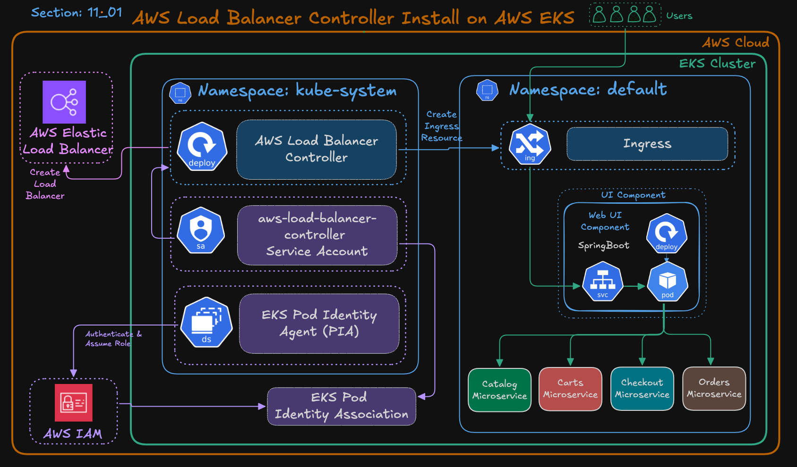

# **11-01: AWS Load Balancer Controller on EKS (with Pod Identity)**

---

## **Step-01 – Learning Objectives**

By the end of this section, you will be able to:

1. Create a **trust policy file** for the Load Balancer Controller IAM Role.
2. Create and attach the **AWSLoadBalancerControllerIAMPolicy** to that role.
3. Create an **EKS Pod Identity Association** between the IAM Role and ServiceAccount.
4. Install the **AWS Load Balancer Controller** using **Helm**.
5. Verify successful deployment.
---

### Architecture Overview


---

### Ingress and Retail Store Sample Application


---

## **Step-02 – IAM Role and Policy Setup**

### **Step-02-01: Export Environment Variables**

```bash
# Replace the placeholders below with your actual values
export AWS_REGION="us-east-1"
export EKS_CLUSTER_NAME="retail-dev-eksdemo1"
export AWS_ACCOUNT_ID=$(aws sts get-caller-identity --query Account --output text)

# Confirm values
echo $AWS_REGION
echo $EKS_CLUSTER_NAME
echo $AWS_ACCOUNT_ID
```

---

### **Step-02-02: Create IAM Policy for LBC**

```bash
mkdir -p iam-policy-json-files
cd iam-policy-json-files
```

Download the official IAM policy:

```bash
curl -o aws-load-balancer-controller-policy.json \
https://raw.githubusercontent.com/kubernetes-sigs/aws-load-balancer-controller/main/docs/install/iam_policy.json
```

Create the policy in IAM:

```bash
aws iam create-policy \
  --policy-name AWSLoadBalancerControllerIAMPolicy_${EKS_CLUSTER_NAME} \
  --policy-document file://aws-load-balancer-controller-policy.json
```

✅ This policy allows the Load Balancer Controller to manage AWS resources such as Elastic Load Balancers, Target Groups, and Security Groups.

---

### **Step-02-03: Create Trust Policy File**

```bash
cat <<EOF > aws-load-balancer-controller-trust-policy.json
{
  "Version": "2012-10-17",
  "Statement": [
    {
      "Effect": "Allow",
      "Principal": {
        "Service": "pods.eks.amazonaws.com"
      },
      "Action": [
        "sts:AssumeRole",
        "sts:TagSession"
      ]
    }
  ]
}
EOF
```

✅ This trust policy allows the **EKS Pod Identity Agent** to assume this role on behalf of the Load Balancer Controller Pod.

---

### **Step-02-04: Create IAM Role and Attach Policy**

```bash
# Create the IAM Role
aws iam create-role \
  --role-name AmazonEKS_LBC_Role_${EKS_CLUSTER_NAME} \
  --assume-role-policy-document file://aws-load-balancer-controller-trust-policy.json

# Attach the LBC IAM Policy
aws iam attach-role-policy \
  --role-name AmazonEKS_LBC_Role_${EKS_CLUSTER_NAME} \
  --policy-arn arn:aws:iam::${AWS_ACCOUNT_ID}:policy/AWSLoadBalancerControllerIAMPolicy_${EKS_CLUSTER_NAME}

# Verify attachment
aws iam list-attached-role-policies \
  --role-name AmazonEKS_LBC_Role_${EKS_CLUSTER_NAME}
```

---

### **Step-02-05: Create EKS Pod Identity Association**

```bash
aws eks create-pod-identity-association \
  --cluster-name ${EKS_CLUSTER_NAME} \
  --namespace kube-system \
  --service-account aws-load-balancer-controller \
  --role-arn arn:aws:iam::${AWS_ACCOUNT_ID}:role/AmazonEKS_LBC_Role_${EKS_CLUSTER_NAME}
```

✅ This securely links the `aws-load-balancer-controller` ServiceAccount to the IAM Role via **EKS Pod Identity**.

---

## **Step-03 – Install AWS Load Balancer Controller (Helm)**

### **Step-03-01: Add Helm Repo and Update**

```bash
helm repo add eks https://aws.github.io/eks-charts
helm repo update
```

---

### **Step-03-02: Install Load Balancer Controller**

```bash
# Get VPC ID
VPC_ID=$(aws eks describe-cluster \
  --name ${EKS_CLUSTER_NAME} \
  --query "cluster.resourcesVpcConfig.vpcId" \
  --output text)

# Verify VPC ID
echo $VPC_ID

# Install AWS Load Balancer Controller using HELM
helm install aws-load-balancer-controller eks/aws-load-balancer-controller \
  -n kube-system \
  --set clusterName=${EKS_CLUSTER_NAME} \
  --set region=${AWS_REGION} \
  --set vpcId=${VPC_ID} \
  --set serviceAccount.create=true \
  --set serviceAccount.name=aws-load-balancer-controller  
```

✅ **Explanation:**

* **`serviceAccount.create=true`** → Creates the ServiceAccount automatically during Helm installation.
* **`serviceAccount.name`** → Uses the same ServiceAccount name linked to your Pod Identity association.
* **`clusterName`** → Specifies the name of your EKS cluster.
* **`vpcId`** → Supplies the EKS cluster’s VPC ID manually (required when IMDS auto-detection is restricted).
* **`region`** → Explicitly sets the AWS Region to help the controller locate cluster and network resources when IMDS access is limited.

---

### **Step-03-03: Verify Helm Release**

List Helm releases:

```bash
helm list -n kube-system
```

✅ Example Output:

```
NAME                        NAMESPACE    REVISION  UPDATED        STATUS    CHART                           APP VERSION
aws-load-balancer-controller kube-system 1         2025-10-08...  deployed  aws-load-balancer-controller-1.13.0  v2.13.3
```

Check Helm status:

```bash
helm status aws-load-balancer-controller -n kube-system
```

✅ Confirm `STATUS: deployed` and review any resource notes.

---

## **Step-04 – Verify Controller Deployment**

```bash
# List Pods
kubectl get pods -n kube-system -l app.kubernetes.io/name=aws-load-balancer-controller

```

✅ Expected Output:

```
NAME                                           READY   STATUS    RESTARTS   AGE
aws-load-balancer-controller-b7d4fdf8c-9gxjz   1/1     Running   0          1m
```

Check deployment and logs:

```bash
kubectl get deployment -n kube-system aws-load-balancer-controller
kubectl logs -n kube-system -l app.kubernetes.io/name=aws-load-balancer-controller
```

✅ You should see:

* **Pod Running**
* **No permission or assume-role errors**

---

## **Step-05 – Summary**

| Component                    | Command                                         | Description                 |
| ---------------------------- | ----------------------------------------------- | --------------------------- |
| **IAM Policy**               | `aws iam create-policy`                         | Defines permissions for LBC |
| **IAM Role**                 | `aws iam create-role`                           | Grants EKS Pods IAM access  |
| **Pod Identity Association** | `aws eks create-pod-identity-association`       | Binds Role ↔ ServiceAccount |
| **Helm Install**             | `helm install aws-load-balancer-controller ...` | Deploys controller via Helm |
| **Helm Verification**        | `helm list`, `helm status`                      | Confirms release deployment |
| **K8s Verification**         | `kubectl get pods`, `kubectl logs`              | Confirms controller health  |

---

✅ **Final Result:**
You’ve successfully installed the **AWS Load Balancer Controller** using **EKS Pod Identity (no IRSA)**.
It’s now fully configured to provision and manage **Application Load Balancers (ALB)** and **Network Load Balancers (NLB)** in your EKS environment — production-ready, secure, and following the latest AWS best practices.

---
