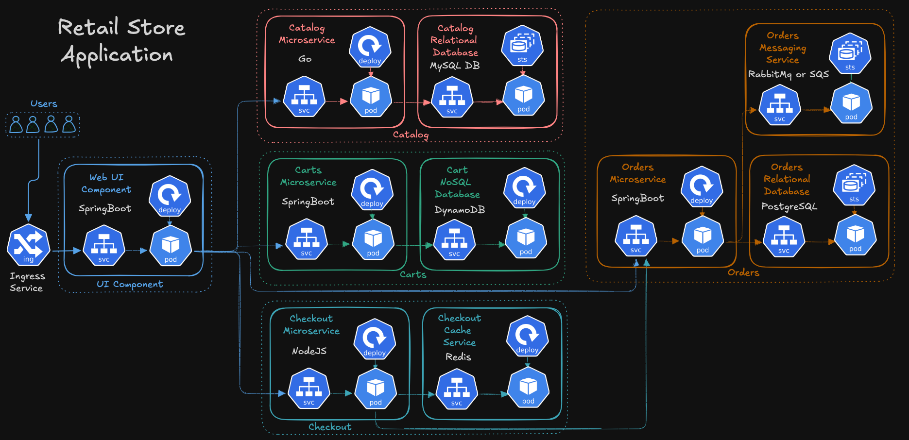
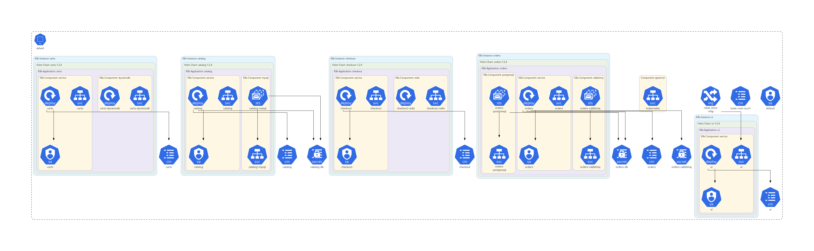

# Kubernetes Ingress - HTTP

## Step-01: What we’ll do
1. Deploy **HTTP Ingress**, test end-to-end.
2. **Undeploy** HTTP objects.


### Ingress and Retail Store Sample Application


---

## Step-02: Kubernetes Manifests (Ingress - HTTP)

Folder: `http_retail_store_k8s_manifests/`

* [01_catalog](./http_retail_store_k8s_manifests/01_catalog/)
* [02_cart](./http_retail_store_k8s_manifests/02_cart/)
* [03_checkout](./http_retail_store_k8s_manifests/03_checkout/)
* [04_orders](./http_retail_store_k8s_manifests/04_orders/)
* [05_ui](./http_retail_store_k8s_manifests/05_ui/)
* [06 Ingress Instance Mode: 06_ingress/01_ingress_http_instance_mode.yaml](./http_retail_store_k8s_manifests/06_ingress/01_ingress_http_instance_mode.yaml)

* [06 Ingress IP Mode: 06_ingress/02_ingress_http_ip_mode.yaml](./http_retail_store_k8s_manifests/06_ingress/02_ingress_http_ip_mode.yaml)



### Deploy Ingress HTTP

```bash
# Apply all HTTP manifests
kubectl apply -R -f http_retail_store_k8s_manifests/
```

### Verify Ingress HTTP

```bash
# Get Ingress and ALB address
kubectl get ingress -A

# Describe ingress to review rules/annotations
kubectl describe ingress retail-store-http-instance-mode
kubectl describe ingress retail-store-http-ip-mode

# Quick browser or curl test (replace with your ALB DNS)
curl -v http://<ALB-DNS-NAME>
```

> Expect the Retail Store UI over **HTTP**.

---

## Step-03: Undeploy Ingress HTTP (prep for HTTPS)

```bash
kubectl delete -R -f http_retail_store_k8s_manifests
```
