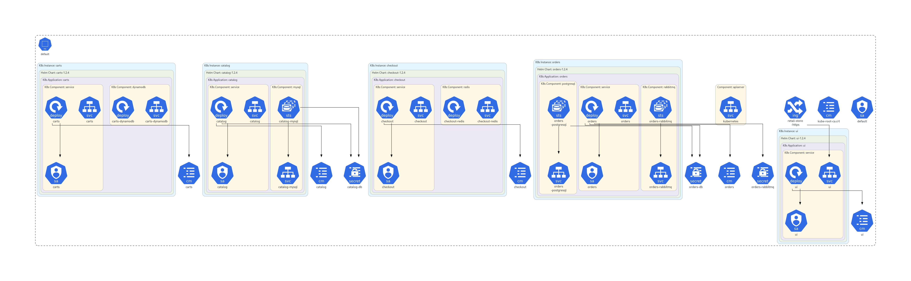

# Kubernetes Ingress - HTTPS (with ACM + Route53)

> **Pre-requisite Note**  
> To follow along with the HTTPS demo, you should already have a **registered domain name in AWS Route53**.  
> This is important because ACM (AWS Certificate Manager) requires a domain for SSL certificate validation.  
> For learning purposes, you don’t need to actually implement this step end-to-end. Just understand the flow.


## Step-01: What we’ll do
1. Create **ACM cert** + **Route53 DNS**.
2. Deploy **HTTPS Ingress**, test end-to-end.
3. Undeploy the resources after learning

---

## Step-02: SSL Certificate (ACM) + DNS (Route53)

1. **Request Public Certificate** in **AWS Certificate Manager (ACM)**:

   ```
   retailstore.stacksimplify.com
   ```
2. **Validate via DNS**: ACM will show CNAME records to create in **Route53 → Hosted Zone: stacksimplify.com**.
3. Wait for certificate **Status: Issued**.

> Keep the certificate in the same AWS region as your EKS/ALB.

---

## Step-03: Kubernetes Manifests (Ingress - HTTPS)

Folder: `https_retail_store_k8s_manifests/`

* [01_catalog](./https_retail_store_k8s_manifests/01_catalog/)
* [02_cart](./https_retail_store_k8s_manifests/02_cart/)
* [03_checkout](./https_retail_store_k8s_manifests/03_checkout/)
* [04_orders](./https_retail_store_k8s_manifests/04_orders/)
* [05_ui](./https_retail_store_k8s_manifests/05_ui/)
* [06 Ingress Instance Mode: 06_ingress/01_ingress_http_instance_mode.yaml](./https_retail_store_k8s_manifests/06_ingress/01_ingress_https_instance_mode.yaml)

* [06 Ingress IP Mode: 06_ingress/02_ingress_http_ip_mode.yaml](./https_retail_store_k8s_manifests/06_ingress/02_ingress_https_ip_mode.yaml)

### Update both Ingress Manifests with SSL Certificate ARN 
```yaml
    ## SSL Settings
    alb.ingress.kubernetes.io/certificate-arn: arn:aws:acm:us-east-1:180789647333:certificate/af739d1d-c527-4a44-a753-464f775dca25
```



### Deploy Kubernetes Ingress HTTPS

```bash
# Apply all HTTPS manifests (includes Ingress with TLS annotations)
kubectl apply -R -f https_retail_store_k8s_manifests/
```

### Create DNS record (Route53)

After ALB is provisioned (check ADDRESS column):

```bash
kubectl get ingress 
```

In **Route53 → stacksimplify.com**, create **CNAME**:

```
Name: retailstore.stacksimplify.com
Type: CNAME
Value: <ALB-DNS-NAME>
TTL: 60
```

---

## Step-04: Verify Kubernetes Ingress - HTTPS

```bash
# Ingress overall
kubectl get ingress -A

# Inspect annotations, rules, and TLS
kubectl describe ingress retail-store-https-instance-mode
kubectl describe ingress retail-store-https-ip-mode

# Test HTTPS with SNI
curl -vk https://retailstore.stacksimplify.com
```

> Expect a valid TLS handshake (issued by ACM) and Retail Store UI over **HTTPS**.

--- 

## Step-05: Undeploy Ingress HTTPS 

```bash
kubectl delete -R -f https_retail_store_k8s_manifests
```

---


