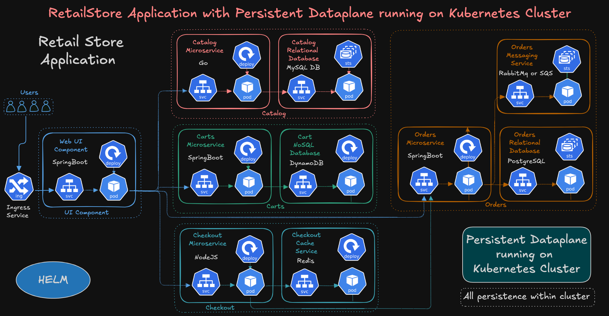
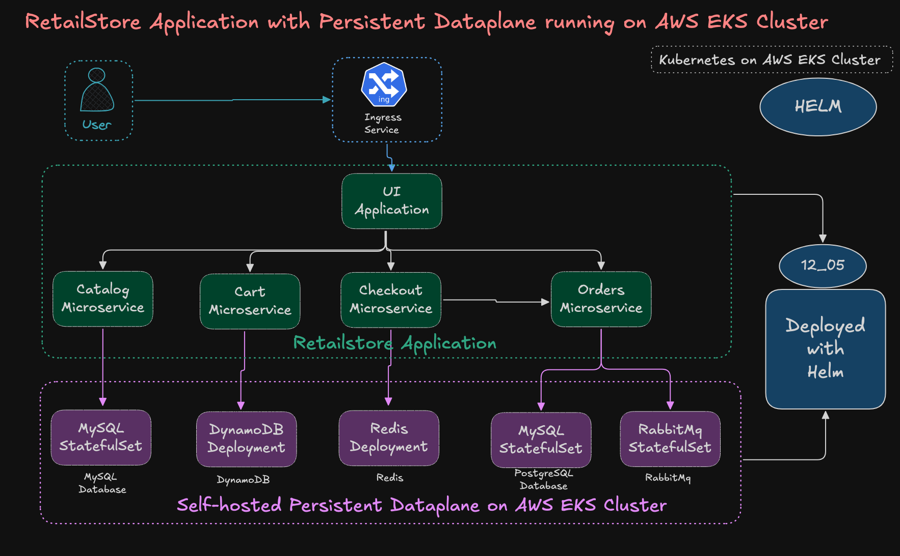

# 12_05 RetailStore Application with Persistent Dataplane running on AWS EKS using Helm

## Architecture Diagrams






## Step-00: Download and Review Helm Charts
```bash
# Download Charts
cd retailstore-charts
./download-and-untar-helm-charts.sh

# Review all charts code
├── retail-store-sample-cart-chart
│   ├── Chart.yaml
│   ├── templates
│   └── values.yaml
├── retail-store-sample-catalog-chart
│   ├── Chart.yaml
│   ├── templates
│   └── values.yaml
├── retail-store-sample-checkout-chart
│   ├── Chart.yaml
│   ├── templates
│   └── values.yaml
├── retail-store-sample-orders-chart
│   ├── Chart.yaml
│   ├── templates
│   └── values.yaml
└── retail-store-sample-ui-chart
    ├── Chart.yaml
    ├── README.md
    ├── templates
    └── values.yaml
```


## Step-01: Goals & Prerequisites
**Goals**
- Deploy **Catalog, Cart, Checkout, Orders, UI** via Helm.
- Use the provided **custom values** per service.
- Expose **UI** via **Ingress (ALB, HTTP)**.


**Prerequisites**
- EKS cluster + `kubectl` + **Helm v3.8+** (OCI support)
- **AWS Load Balancer Controller** installed (PIA set up)
- Files present in `12-05-Helm-Retail-Store/retailstore-apps/`:
  - `values-catalog.yaml`, 
  - `values-cart.yaml`, 
  - `values-checkout.yaml`, 
  - `values-orders.yaml`, 
  - `values-ui.yaml`,
  - `install-retail-apps.sh`, 
  - `uninstall-retail-apps.sh`

---

## Step-02: Install (Script — recommended)
```bash
cd 12-05-Helm-Retail-Store/retailstore-apps
chmod +x install-retail-apps.sh
./install-retail-apps.sh
```

> Script installs (in order): **catalog → cart → checkout → orders → ui**, all using **chart version 1.3.0** and your values files.

---

## Step-03 (Manual): Install Each Service

> Use this if you prefer to see each command plainly.

```bash
# Authenticate to Amazon Public ECR (token valid for 12 hours)
aws ecr-public get-login-password --region us-east-1 | \
helm registry login -u AWS --password-stdin public.ecr.aws

# Change Directory
cd retailstore-apps

# Catalog
helm install catalog oci://public.ecr.aws/aws-containers/retail-store-sample-catalog-chart \
  --version 1.3.0 -f values-catalog.yaml

# Cart
helm install cart oci://public.ecr.aws/aws-containers/retail-store-sample-cart-chart \
  --version 1.3.0 -f values-cart.yaml

# Checkout
helm install checkout oci://public.ecr.aws/aws-containers/retail-store-sample-checkout-chart \
  --version 1.3.0 -f values-checkout.yaml

# Orders
helm install orders oci://public.ecr.aws/aws-containers/retail-store-sample-orders-chart \
  --version 1.3.0 -f values-orders.yaml

# UI (Ingress enabled, HTTP — see values-ui.yaml)
helm install ui oci://public.ecr.aws/aws-containers/retail-store-sample-ui-chart \
  --version 1.3.0 -f values-ui.yaml
```

---

## Step-04: Verify Deployments & Resources

```bash
# Helm releases
helm list

# Pods / Services / Ingress
kubectl get pods
kubectl get svc
kubectl get ingress

# UI release details
helm status ui --show-resources
helm status catalog --show-resources
helm status cart --show-resources
helm status checkout --show-resources
helm status orders --show-resources

# Verify Ingress Load Balancer Controller Logs
kubectl logs -n kube-system -l app.kubernetes.io/name=aws-load-balancer-controller -f

```

> **ALB provisioning** can take **2–6 minutes** on first create.

---

## Step-05: Access the UI (ALB HTTP)

```bash
kubectl get ingress ui 
```

Open in your browser:

```
http://<ALB-DNS-NAME>
http://<ALB-DNS-NAME>/topology
```

---

## Step-06: Verify Application Logs
- These will help us see traffic flowing through these applications
```bash
# UI 
kubectl logs -f deploy/ui
kubectl logs -l app.kubernetes.io/instance=ui -f --tail=200

# Catalog 
kubectl logs -f deploy/catalog
kubectl logs -l app.kubernetes.io/instance=catalog -f --tail=200

# Cart
kubectl logs -f deploy/cart-carts
kubectl logs -l app.kubernetes.io/instance=cart -f --tail=200

# Checkout
kubectl logs -f deploy/checkout
kubectl logs -l app.kubernetes.io/instance=checkout -f --tail=200

# Orders
kubectl logs -f deploy/orders
kubectl logs -l app.kubernetes.io/instance=orders -f --tail=200
```

## Step-07: Enable Extensive Logging
- For other services, default logging generates some logs 
- For cart and ui dont see any basic logs when navigating through application in browser.
- We can enable debug logging for cart and UI just to see how the requests are flowing.

### For Cart Microservice: Increase / Decrease Logging (SpringBoot)
```bash
# Cart — increase logging (example)
kubectl set env deployment/cart-carts LOGGING_LEVEL_ROOT=DEBUG
kubectl rollout status deployment/cart-carts
kubectl logs -l app.kubernetes.io/instance=cart -f --tail=200

# Cart - Rollback logging
kubectl set env deployment/cart-carts LOGGING_LEVEL_ROOT=INFO
kubectl rollout status deployment/cart-carts
kubectl logs -l app.kubernetes.io/instance=cart -f --tail=200
```

### For UI Microservice: Increase / Decrease Logging (SpringBoot)
```bash
# UI — increase logging (example)
kubectl set env deployment/ui LOGGING_LEVEL_ROOT=DEBUG
kubectl rollout status deployment/ui
kubectl logs -l app.kubernetes.io/instance=ui -f --tail=200

# UI - Rollback logging
kubectl set env deployment/ui LOGGING_LEVEL_ROOT=INFO
kubectl rollout status deployment/ui
kubectl logs -l app.kubernetes.io/instance=ui -f --tail=200
```


---

## Step-08: Uninstall Retail Store Application

**Script:**

```bash
cd 12-05-Helm-Retail-Store/retailstore-apps
./uninstall-retail-apps.sh
```

**Manual:**

```bash
helm uninstall ui orders checkout cart-carts catalog
```

---

