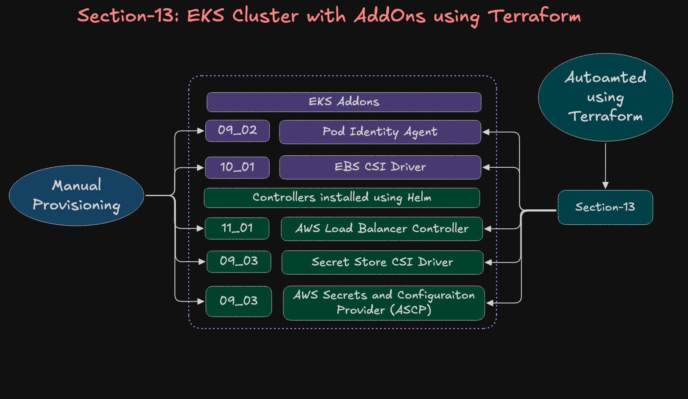

# 13: Terraform on AWS EKS Cluster with AddOns (LBC, EBS CSI, Secret Store CSI)

In this section, we build on top of our base EKS cluster from [Section-07](../../07_Terraform_EKS_Cluster/) and integrate official AWS and Kubernetes add-ons for networking, storage, identity, and secret management.

✅ **AWS Load Balancer Controller (LBC)**
✅ **Amazon EBS CSI Driver**
✅ **Secrets Store CSI Driver (with ASCP)**
✅ **EKS Pod Identity Agent**

## What we are going to implement ?




---

## **Step-01: Project Overview**

This project enhances our base EKS setup [from Section-07](../../07_Terraform_EKS_Cluster/) by integrating official AWS and Kubernetes add-ons that power modern workloads.

| AddOn                                  | Purpose                                                                      |
| -------------------------------------- | ---------------------------------------------------------------------------- |
| **Pod Identity Agent**                 | Enables Pods to assume IAM roles securely without storing credentials.       |
| **AWS Load Balancer Controller (LBC)** | Manages ALBs/NLBs for Ingress resources and Service type LoadBalancer.       |
| **EBS CSI Driver**                     | Enables dynamic provisioning of Amazon EBS volumes for Stateful workloads.   |
| **Secrets Store CSI Driver + ASCP**    | Mounts AWS Secrets Manager / SSM Parameter Store secrets directly into Pods. |

---

## **Step-02: Full Project Structure (In Order)**

```
13_Terraform_EKS_Cluster_with_AddOns/
│
├── 01_VPC_terraform-manifests/                # Stage 1 - Networking foundation
│   ├── c1-versions.tf                         # Terraform + provider versions
│   ├── c2-variables.tf                        # Input variables for VPC
│   ├── c3-vpc.tf                              # VPC, subnets, route tables, NAT gateways, etc.
│   ├── c4-outputs.tf                          # VPC outputs (IDs, subnet lists, etc.)
│   ├── terraform.tfvars                       # Environment-specific variable values
│   │
│   └── modules/
│       └── vpc/                               # Reusable VPC module
│           ├── datasources-and-locals.tf
│           ├── main.tf
│           ├── outputs.tf
│           ├── variables.tf
│           └── README.md
│
│
├── 02_EKS_terraform-manifests_with_addons/    # Stage 2 - EKS + AddOns deployment
│   ├── c1_versions.tf                         # Terraform and AWS provider versions
│   ├── c2_variables.tf                        # EKS input variables (cluster name, region)
│   ├── c3_remote-state.tf                     # Remote backend (S3 + DynamoDB)
│   ├── c4_datasources_and_locals.tf           # Data lookups (VPC, subnets, etc.)
│   ├── c5_eks_tags.tf                         # Common tagging for EKS resources
│   ├── c6_eks_cluster_iamrole.tf              # IAM Role for EKS Control Plane
│   ├── c7_eks_cluster.tf                      # Main EKS cluster resource
│   ├── c8_eks_nodegroup_iamrole.tf            # IAM role for EKS node group
│   ├── c9_eks_nodegroup_private.tf            # Private worker node group
│   ├── c10_eks_outputs.tf                     # Cluster outputs (kubeconfig, ARNs, etc.)
│
│   # --- Pod Identity Agent ---
│   ├── c11-podidentityagent-eksaddon.tf       # Installs EKS Pod Identity Agent addon
│   ├── c12-helm-and-kubernetes-providers.tf   # Helm & Kubernetes providers for subsequent addons
│   ├── c13-podidentity-assumerole.tf          # Common IAM assume-role policy for Pod Identity
│
│   # --- AWS Load Balancer Controller (LBC) ---
│   ├── c14-01-lbc-iam-policy-datasources.tf
│   ├── c14-02-lbc-iam-policy-and-role.tf
│   ├── c14-03-lbc-eks-pod-identity-association.tf
│   ├── c14-04-lbc-helm-install.tf
│
│   # --- Amazon EBS CSI Driver ---
│   ├── c15-01-ebscsi-iam-policy-and-role.tf
│   ├── c15-02-ebscsi-eks-pod-identity-association.tf
│   ├── c15-03-ebscsi-eksaddon.tf
│
│   # --- Secrets Store CSI Driver + AWS Provider (ASCP) ---
│   ├── c16-01-secretstorecsi-helm-install.tf
│   ├── c16-02-secretstorecsi-ascp-helm-install.tf
│
│   ├── terraform.tfvars                       # Default variables for EKS deployment
│   │
│   └── env/                                   # Environment overrides
│       ├── dev.tfvars
│       ├── staging.tfvars
│       └── prod.tfvars
│
│
├── create-cluster.sh                          # Wrapper to apply both VPC + EKS stages
├── destroy-cluster.sh                         # Wrapper to destroy EKS first, then VPC
└── README.md                                  # Documentation for the entire workflow

```


### **Execution Flow (In Order)**

1. **Stage-1 → VPC**

   * Run automatically via `create-cluster.sh`
   * Provisions VPC, subnets, NATs, and outputs network IDs

2. **Stage-2 → EKS Cluster + AddOns**

   * Uses VPC outputs from remote state
   * Builds EKS Cluster, NodeGroups, IAM roles
   * Installs:

     * `EKS Pod Identity Agent`
     * `AWS Load Balancer Controller`
     * `Amazon EBS CSI Driver`
     * `Secrets Store CSI Driver + ASCP`

3. **Post-Deploy**

   * Update kubeconfig
   * Verify add-on pods under `kube-system`
   * Confirm IAM Pod Identity associations

4. **Teardown**

   * Run `destroy-cluster.sh`
   * Destroys EKS first, then VPC


---

## **Step-03: Learn Each AddOn**

Before deploying, explore how each component works.

| AddOn                  | Description                                                          | Reference                                                    |
| ---------------------- | -------------------------------------------------------------------- | ------------------------------------------------------------ |
| **LBC**                | Creates and manages AWS ALBs/NLBs for Kubernetes Ingresses.          | [📘 `c14_*` files](./02_EKS_terraform-manifests_with_addons) |
| **EBS CSI**            | Handles dynamic EBS volume provisioning for StatefulSets.            | [📘 `c15_*` files](./02_EKS_terraform-manifests_with_addons) |
| **Secrets Store CSI**  | Integrates Secrets Manager with Kubernetes Secrets via ASCP.         | [📘 `c16_*` files](./02_EKS_terraform-manifests_with_addons) |
| **Pod Identity Agent** | Provides token service for Pods to assume IAM roles (replaces IRSA). | [📘 `c11_*` files](./02_EKS_terraform-manifests_with_addons) |

Each add-on’s `.tf` files include:

* IAM policy & role
* Pod Identity Association
* AddOn or Helm installation
* Outputs for verification

---

## **Step-04: Configure Remote Backend (Update Your S3 Bucket and Key)**

Before running any Terraform commands, make sure you update the **S3 backend configuration** in your `terraform` block.
Each stage (VPC and EKS) uses its own remote state path.
- **File-1:** [01_VPC_terraform-manifests/c1-versions.tf](./01_VPC_terraform-manifests/c1-versions.tf)
- **File-2:** [02_EKS_terraform-manifests_with_addons/c1-versions.tf](./02_EKS_terraform-manifests_with_addons/c1_versions.tf)

#### Example:

```hcl
terraform {
  required_version = ">= 1.0.0"

  required_providers {
    aws = {
      source  = "hashicorp/aws"
      version = ">= 6.0"
    }
  }

  # Remote Backend Configuration
  backend "s3" {
    bucket         = "tfstate-dev-us-east-1-jpjtof"     # 🔹 Update your S3 bucket name
    key            = "vpc/dev/terraform.tfstate"        # 🔹 Update key path (vpc/dev or eks/dev)
    region         = "us-east-1"                        # 🔹 Update region if required
    encrypt        = true
    use_lockfile   = true
  }
}

provider "aws" {
  region = var.aws_region
}
```

🧠 **Why:**
Terraform uses the S3 bucket to store and manage the remote state securely.
* Update the **`bucket`** name as per your environment
* Update the **`key`** path (e.g., `vpc/staging/terraform.tfstate` or `eks/prod/terraform.tfstate`)


---

## **Step-05: Provision the EKS Cluster**

### Step-05-01: Create VPC
```bash
# Change Directory 
cd 01_VPC_terraform-manifests

# Initialize Terraform
terraform init

# Validate syntax
terraform validate

# Preview the plan
terraform plan

# Apply configuration 
terraform apply -auto-approve
```


### Step-05-02: Create EKS Cluster
```bash
# Change Directory 
cd 02_EKS_terraform-manifests_with_addons

# Initialize Terraform
terraform init

# Validate syntax
terraform validate

# Preview the plan
terraform plan

# Apply configuration 
terraform apply -auto-approve
```

---

## **Step-06: Configure kubectl**
💡 **Tip:** It may take a few minutes for all add-on pods (especially ASCP and EBS CSI) to transition to `Running` state. Use `kubectl get pods -n kube-system -w` to watch in real time.

```bash
# Update kubeconfig
aws eks update-kubeconfig --name <cluster_name> --region <aws_region>
aws eks update-kubeconfig --name retail-dev-eksdemo1 --region us-east-1

# Verify nodes
kubectl get nodes

# Verify all AddOn pods
kubectl get pods -n kube-system
```

✅ Expected key pods:

```
NAME                                                       READY   STATUS    AGE
aws-load-balancer-controller-xxxxx                         1/1     Running   5m
ebs-csi-controller-xxxxx                                   1/1     Running   3m
csi-secrets-store-secrets-store-csi-driver-xxxxx           3/3     Running   2m
secrets-provider-aws-secrets-store-csi-driver-provider-aws 1/1     Running   2m
eks-pod-identity-agent-xxxxx                               1/1     Running   1m
```

---

## **Step-07: Review AddOns on AWS Console**

1. Navigate to **EKS → Add-ons**
2. You’ll see:
   * `eks-pod-identity-agent`
   * `aws-ebs-csi-driver`
3. Under **Workloads → Pods (kube-system)**, verify:

   * `aws-load-balancer-controller`
   * `csi-secrets-store-*`
   * `secrets-provider-aws-*`


---

## ✅ **Summary**

| AddOn                        | Install Type | Namespace   | Resource Type   |
| ---------------------------- | ------------ | ----------- | --------------- |
| **Pod Identity Agent**       | EKS AddOn    | kube-system | `aws_eks_addon` |
| **LBC**                      | Helm         | kube-system | `helm_release`  |
| **EBS CSI Driver**           | EKS AddOn    | kube-system | `aws_eks_addon` |
| **Secrets Store CSI + ASCP** | Helm         | kube-system | `helm_release`  |

This setup ensures your **EKS cluster is fully production-ready**, integrating storage, networking, identity, and secret management add-ons — all automated through Terraform.

---

🎯 **You have now successfully provisioned an enhanced EKS cluster with all essential AWS AddOns!**

---

