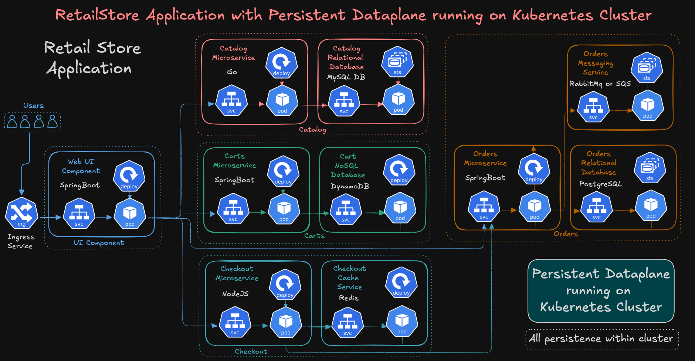
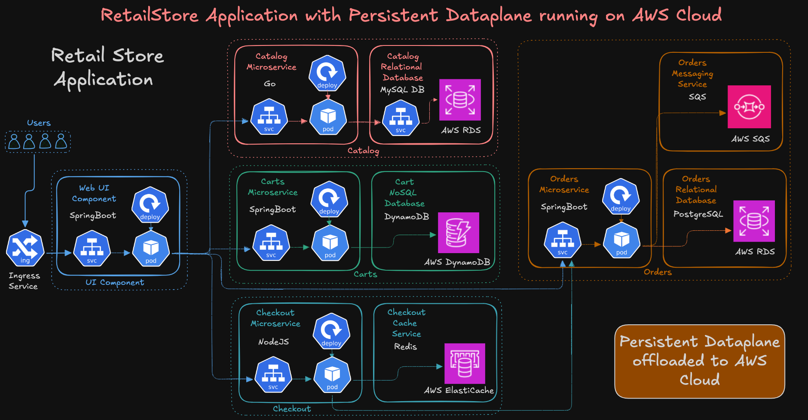
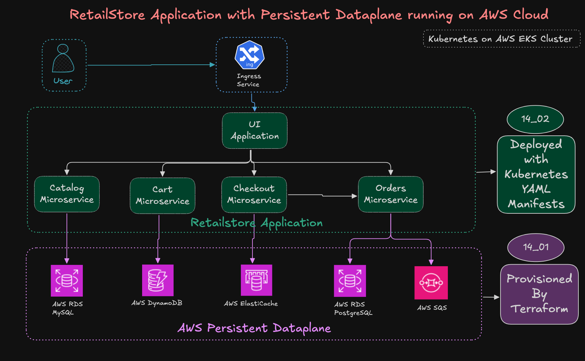

# 14_01: Retail Store AWS Data Plane (Terraform)

## Step-01: Introduction

In this section, we will **provision all AWS data-plane services** required by our **Retail Store Microservices** using **Terraform**.

These include:
- **Amazon RDS (MySQL + PostgreSQL)** for persistent databases  
- **Amazon DynamoDB** for serverless NoSQL persistence  
- **Amazon ElastiCache (Redis)** for caching  
- **Amazon SQS** for asynchronous messaging  
- All linked with **EKS Pod Identity Associations (PIA)** for secure IAM-based access — **no credentials inside Kubernetes!**

By the end of this section, you’ll have a complete **AWS Data Layer** powering all the microservices fully automated and production-ready.

---

### Retailstore Application with Persistent Dataplane running on Kubernetes Cluster


### Retailstore Application with Persistent Dataplane running on AWS Cloud


### Persistent Dataplane running on AWS Cloud - Automated using Terraform



---

## Step-02: Folder Structure

```
14_01_RetailStore_AWS_Data_Plane/
├── 03_AWS_Data_Plane_terraform-manifests
│   # ------------------------------------------------------------
│   # COMMON BASE FILES (VPC, EKS Remote States, Variables)
│   # ------------------------------------------------------------
│   ├── c1_versions.tf
│   ├── c2_variables.tf
│   ├── c3_01_vpc_remote_state.tf
│   ├── c3_02_eks_remote_state.tf
│   ├── c4_datasources_and_locals.tf
│
│   # ------------------------------------------------------------
│   # COMMON IAM & CSI INTEGRATION
│   # ------------------------------------------------------------
│   ├── c5_01_podidentity_assumerole.tf              # Generic assume role for Pod Identity
│   ├── c5_02_secretstorecsi_iam_policy.tf           # Policy for Secrets Store CSI Driver
│
│   # ------------------------------------------------------------
│   # CATALOG MICROSERVICE — Amazon RDS MySQL
│   # ------------------------------------------------------------
│   ├── c6_01_catalog_rds_mysql_security_group.tf     # SG for RDS MySQL
│   ├── c6_02_catalog_rds_mysql_dbsubnet_group.tf     # DB Subnet Group for RDS
│   ├── c6_03_catalog_rds_mysql_credentials.tf        # Store DB credentials in AWS Secrets Manager
│   ├── c6_04_catalog_rds_mysql_dbinstance.tf         # RDS MySQL instance creation
│   ├── c6_05_catalog_sa_iam_role.tf                  # IAM Role for Catalog SA (Pod Identity)
│   ├── c6_06_catalog_sa_eks_pod_identity_association.tf # Pod Identity Association
│
│   # ------------------------------------------------------------
│   # CART MICROSERVICE — Amazon DynamoDB
│   # ------------------------------------------------------------
│   ├── c7_01_cart_dynamoDB_iam_policy_and_role.tf    # IAM policy & role for Cart service
│   ├── c7_02_cart_eks_pod_identity_association.tf    # Pod Identity for Cart
│   ├── c7_03_cart_dynamodb_table.tf                  # DynamoDB Table (Items)
│
│   # ------------------------------------------------------------
│   # CHECKOUT MICROSERVICE — Amazon ElastiCache (Redis/Valkey)
│   # ------------------------------------------------------------
│   ├── c8_01_checkout_redis_security_group.tf        # SG for Redis cluster
│   ├── c8_02_checkout_redis_subnet_group.tf          # Subnet group for Redis
│   ├── c8_03_checkout_redis_cluster.tf               # Redis cluster definition
│
│   # ------------------------------------------------------------
│   # ORDERS MICROSERVICE — Amazon RDS PostgreSQL + Amazon SQS
│   # ------------------------------------------------------------
│   ├── c9_01_orders_postgresql_security_group.tf     # SG for PostgreSQL
│   ├── c9_02_orders_postgresql_db_subnet_group.tf    # Subnet group for RDS PostgreSQL
│   ├── c9_03_orders_postgresql_dbinstance.tf         # RDS PostgreSQL instance
│   ├── c9_04_orders_postgresql_sa_iam_role.tf        # IAM Role for Orders SA
│   ├── c9_05_orders_postgresql_sa_eks_pod_identity_association.tf  # Pod Identity Association
│   ├── c9_06_orders_aws_sqs_queue.tf                 # SQS queue for order events
│   ├── c9_07_orders_aws_sqs_iam_policy.tf            # IAM policy for Orders Pod to access SQS
│
├── create-aws-dataplane.sh                           # Shell script to deploy all AWS Data Plane resources
├── delete-aws-dataplane.sh                           # Shell script to clean up resources after demo
└── README.md                                         # Full step-by-step documentation for this section

```

---

## Step-03: Foundation Terraform Configs (c1 → c4)

| File | Purpose |
|------|----------|
| **c1_versions.tf** | Defines Terraform, AWS provider, and backend versions |
| **c2_variables.tf** | Centralized variables for region, environment, and naming |
| **c3_01_vpc_remote_state.tf** | Reads VPC outputs (subnets, VPC ID) from remote backend |
| **c3_02_eks_remote_state.tf** | Reads EKS cluster outputs (OIDC, cluster name, etc.) |
| **c4_datasources_and_locals.tf** | Fetches account info, and defines common locals like tags, names, ARNs |

These files act as the **base layer** for all downstream AWS resources.

---

## Step-04: Common IAM & Security (c5_01 → c5_02)

| File | Description |
|------|--------------|
| **c5_01_podidentity_assumerole.tf** | Creates IAM role trusted by the **EKS Pod Identity Agent**, enabling pods to assume AWS roles securely. |
| **c5_02_secretstorecsi_iam_policy.tf** | Creates IAM policy for **Secrets Store CSI Driver** to read secrets from **AWS Secrets Manager** and attach to pods. |

These are **shared IAM components** used by multiple services (Catalog, Orders, etc.).

---

## Step-06: Catalog → AWS RDS MySQL

| File | Description |
|------|--------------|
| **c6_01_catalog_rds_mysql_security_group.tf** | Security group for RDS MySQL allowing ingress from EKS nodes. |
| **c6_02_catalog_rds_mysql_dbsubnet_group.tf** | DB subnet group using private subnets from VPC. |
| **c6_03_catalog_rds_mysql_credentials.tf** | Creates AWS Secrets Manager secret for DB username/password. |
| **c6_04_catalog_rds_mysql_dbinstance.tf** | Provisions RDS MySQL instance for Catalog microservice. |
| **c6_05_catalog_sa_iam_role.tf** | IAM role allowing the Catalog service account to access DB credentials. |
| **c6_06_catalog_sa_eks_pod_identity_association.tf** | Associates the Catalog service account with its IAM role using Pod Identity. |

**Outcome:** Catalog microservice securely connects to **AWS RDS MySQL** using **Secrets Manager** + **Pod Identity**.

---

## Step-07: Cart → AWS DynamoDB

| File | Description |
|------|--------------|
| **c7_01_cart_dynamoDB_iam_policy_and_role.tf** | Defines IAM policy & role granting full access to DynamoDB table. |
| **c7_02_cart_eks_pod_identity_association.tf** | Associates Cart’s service account with its IAM role. |
| **c7_03_cart_dynamodb_table.tf** | Creates DynamoDB table named **Items** for Cart microservice persistence. |

**Outcome:** Cart microservice reads/writes data directly to **AWS DynamoDB** — fully serverless, no credentials in code.

---

## Step-08: Checkout → AWS ElastiCache (Redis)

| File | Description |
|------|--------------|
| **c8_01_checkout_redis_security_group.tf** | Creates SG allowing access from EKS worker nodes. |
| **c8_02_checkout_redis_subnet_group.tf** | Creates subnet group for Redis within private subnets. |
| **c8_03_checkout_redis_cluster.tf** | Provisions an ElastiCache Redis cluster for checkout caching. |

**Outcome:** Checkout microservice uses **AWS ElastiCache Redis** for session/state caching.

---

## Step-09: Orders → AWS RDS PostgreSQL

| File | Description |
|------|--------------|
| **c9_01_orders_postgresql_security_group.tf** | SG for RDS PostgreSQL allowing access from EKS. |
| **c9_02_orders_postgresql_db_subnet_group.tf** | Subnet group for PostgreSQL DB. |
| **c9_03_orders_postgresql_dbinstance.tf** | Creates RDS PostgreSQL instance. |
| **c9_04_orders_postgresql_sa_iam_role.tf** | IAM role for Orders service account to fetch DB credentials. |
| **c9_05_orders_postgresql_sa_eks_pod_identity_association.tf** | Pod Identity mapping for Orders. |

**Outcome:** Orders microservice connects to **AWS RDS PostgreSQL** using **Secrets Manager** + **Pod Identity**.

---

## Step-10: Orders → AWS SQS (Messaging)

| File | Description |
|------|--------------|
| **c9_06_orders_aws_sqs_queue.tf** | Creates SQS queue for order messages (`retail-dev-orders-queue`). |
| **c9_07_orders_aws_sqs_iam_policy.tf** | Grants required SQS permissions to Orders IAM role. |

**Outcome:** Orders service publishes messages to **SQS queue** for asynchronous order processing.

---

## Step-11: Execute Terraform Commands

```bash
cd 03_AWS_Data_Plane_terraform-manifests

# Initialize providers and remote backend
terraform init

# Validate syntax and plan changes
terraform plan

# Apply and provision all AWS data-plane resources
terraform apply -auto-approve
```

---

## Step-12: Verify Resources (AWS Console)

* **RDS → MySQL & PostgreSQL instances**
* **DynamoDB → Items table**
* **ElastiCache → Redis cluster**
* **SQS → retail-dev-orders-queue**
* **IAM → Roles & Pod Identity associations**
* **Secrets Manager → retailstore-db-secret-1**

Everything should align with your EKS microservices integration.

---

## Step-13: Clean-up

Once the demo  [14_02_Microservices_with_AWS_Data_Plane](../14_02_Microservices_with_AWS_Data_Plane/README.md] verification is complete we can destroy these resources

```bash
# Destroy all AWS data-plane resources
terraform destroy -auto-approve
```

Or simply run:

```bash
./delete-aws-dataplane.sh
```

---

✅ **Summary:**
You’ve successfully automated the **Retail Store AWS Data Plane** with Terraform. A complete foundation for microservices to securely interact with AWS services via **Pod Identity**.


