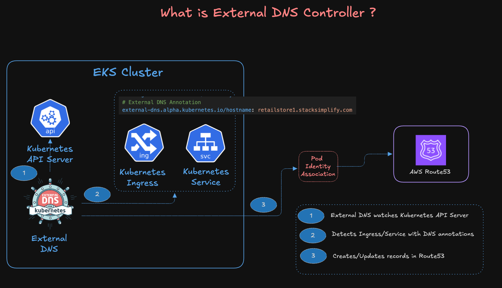
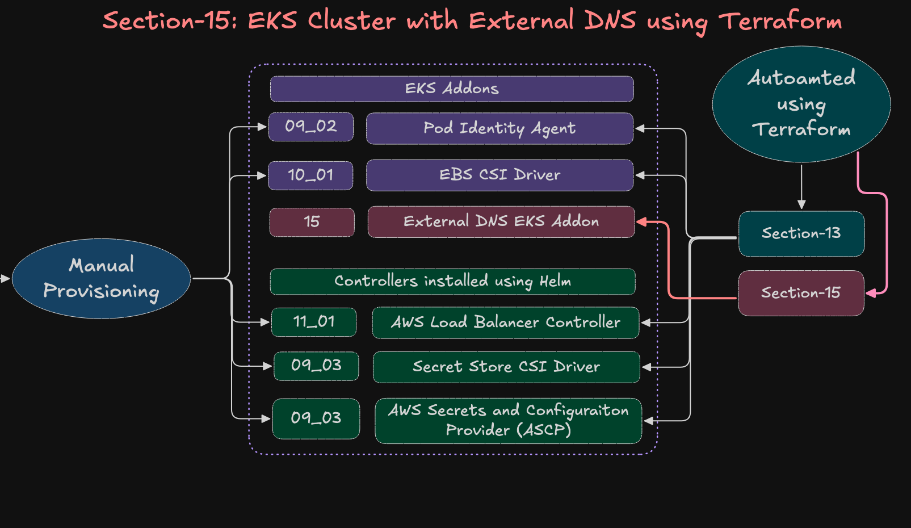
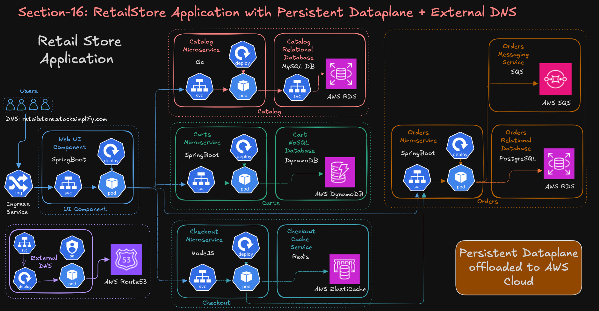
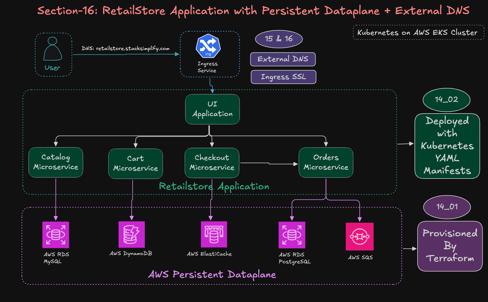

# **16 Use ExternalDNS for Ingress Service**

## **Step-01: Introduction**

In this section, we’re enabling **automatic DNS record management** for our RetailStore app running on EKS.
Using **ExternalDNS**, your cluster will *auto-create* and *auto-update* DNS records in Route53 based on Kubernetes Ingress annotations.

Pretty much:

> “Deploy Ingress → ExternalDNS detects → DNS record created for you.”

---

### Architecture - AWS EKS cluster with External DNS 



### **AWS EKS Cluster with External DNS**



### **RetailStore App with Ingress + ExternalDNS**







---

## **Step-02: Pre-requisite Checks**

Before running this demo, confirm these are done:

1. **AWS Secrets Manager secret exists**
   ✔ `retailstore-db-secret-1`

2. **AWS Dataplane for RetailStore is already provisioned**
   Created in **Section 14_01**
   → [RetailStore AWS Data Plane](../14_RetailStore_Microservices_with_AWS_Data_Plane/14_01_RetailStore_AWS_Data_Plane/README.md)

3. **All microservices are already updated with persistent AWS endpoints**

   * **Catalog:** `05_catalog_mysql_externalname_service.yaml`
   * **Cart:** `02_cart_configmap.yaml`
   * **Checkout:** `02_checkout_configmap.yaml`
   * **Orders:** `02_orders_configmap.yaml`

4. **You MUST own a domain**
   Super important — ExternalDNS can only work if:

   * You have a **hosted zone in Route53**, OR
   * Your domain is registered elsewhere (GoDaddy, Namecheap) *but delegated to Route53*

   👉 If students do not have a domain: **just watch the demo**.

---

## **Step-03: Update HTTP Ingress with ExternalDNS Annotation**

Edit the file:

`03_ingress/01_ingress_http_ip_mode.yaml`

Add:

```yaml
# External DNS Annotation
external-dns.alpha.kubernetes.io/hostname: retailstore1.stacksimplify.com
```

This tells ExternalDNS to create a Route53 record for this hostname.

---

## **Step-04: Enable HTTPS Using ACM Certificate**

### **Step-04-01: Create SSL Certificate (ACM)**

* Open **AWS Certificate Manager (ACM)**
* Request a certificate:
  **retailstore2.<YOURDOMAIN>**
* Validate the DNS entry
* Copy the **Certificate ARN**

### **Step-04-02: Update HTTPS Ingress with Certificate ARN**

Edit:

`03_ingress/02_ingress_https_ip_mode.yaml`

```yaml
## SSL Settings
alb.ingress.kubernetes.io/listen-ports: '[{"HTTPS":443}, {"HTTP":80}]'

# Replace below with YOUR ACM Certificate ARN
alb.ingress.kubernetes.io/certificate-arn: arn:aws:acm:us-east-1:180789647333:certificate/60a5bccd-5cb1-426a-b792-4d6d6c459edf

# Force HTTPS
alb.ingress.kubernetes.io/ssl-redirect: '443'

# External DNS Annotation
external-dns.alpha.kubernetes.io/hostname: retailstore2.stacksimplify.com
```

⚠️ Students must replace the certificate ARN with their own ACM ARN.

---

## **Step-05: Deploy RetailStore App**

```bash
# Go to manifests root
cd RetailStore_k8s_manifests_with_Data_Plane

# Deploy SecretProviderClass (MySQL + PostgreSQL secrets)
kubectl apply -f 01_secretproviderclass

# Deploy all microservices
kubectl apply -R -f 02_RetailStore_Microservices

# Deploy both Ingress resources
kubectl apply -f 03_ingress
```

---

## **Step-06: Verification**

```bash
# Watch ExternalDNS logs
kubectl -n external-dns logs -f -l app.kubernetes.io/name=external-dns

# Check Ingress resources
kubectl get ingress

# Check SecretProviderClass
kubectl get secretproviderclass

# Check RetailStore components
kubectl get pods
kubectl get deploy
kubectl get cm
kubectl get sa
kubectl get svc
```

### **Access the App**

```
http://retailstore1.stacksimplify.com
https://retailstore3.stacksimplify.com
```

### **Observation**

ExternalDNS constantly watches Kubernetes resources.
When an Ingress is created or updated:

1. ExternalDNS sees the hostname annotation
2. It checks Route53
3. Creates / updates / deletes DNS records automatically

This makes DNS mgmt **fully automated**.

---

## **Step-07: Clean-Up**

```bash
# Move to section folder 
cd 16_RetailStore_Microservices_ExternalDNS

# Delete everything
kubectl delete -R -f RetailStore_k8s_manifests_with_Data_Plane

# Watch logs again
kubectl -n external-dns logs -f -l app.kubernetes.io/name=external-dns
```

### **Observation**

When Ingress resources are deleted → ExternalDNS auto-removes the Route53 DNS records too.

---

## ** Summary — What Students Learn**

* How ExternalDNS integrates with EKS
* How DNS auto-management works using annotations
* How ALB + Ingress + Route53 + ExternalDNS form a production-grade setup
* How to enable HTTPS using ACM certificates
* How ExternalDNS manages record lifecycle (create/update/delete)
