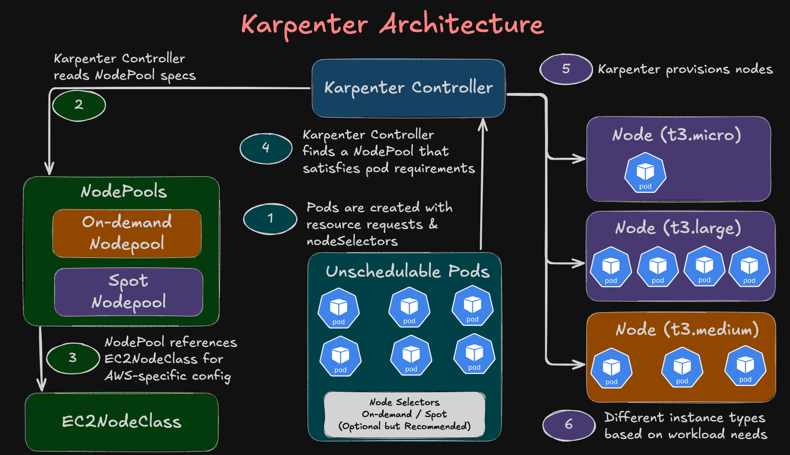
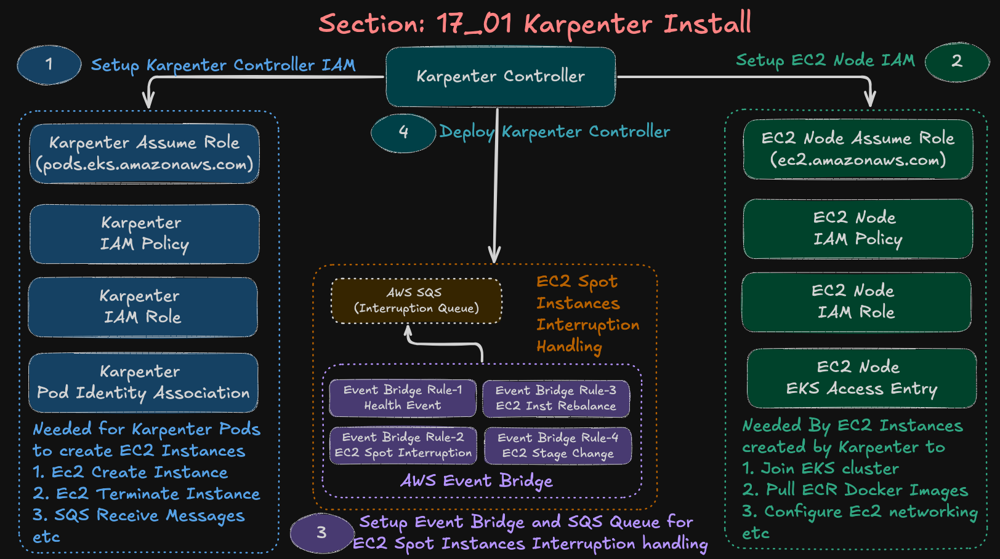

# Section 17_01: Karpenter Installation on AWS EKS

## Step-01: Overview
This section demonstrates how to install and configure **Karpenter**  a Kubernetes cluster autoscaler designed for AWS EKS. Karpenter automatically provisions and manages EC2 instances based on pod scheduling requirements, offering faster scaling, better bin-packing, and cost optimization compared to traditional Cluster Autoscaler.

### What is Karpenter?

Karpenter is an open-source, flexible, high-performance Kubernetes cluster autoscaler that:
- Provisions nodes in **seconds**, not minutes
- Automatically selects optimal instance types based on pod requirements
- Supports **Spot instances** with graceful interruption handling
- Consolidates nodes to reduce costs when capacity is underutilized
- Eliminates the need for managing Auto Scaling Groups (ASGs)

### Karpenter Architecture Diagram


### Karpenter Install Diagram


---

## Step-02: Architecture Overview

```
┌─────────────────────────────────────────────────────────────┐
│                         AWS Cloud                           │
│                                                             │
│  ┌──────────────────────────────────────────────────────┐  │
│  │                    VPC (10.0.0.0/16)                 │  │
│  │                                                      │  │
│  │  ┌────────────────────────────────────────────┐     │  │
│  │  │         EKS Cluster (retail-dev)           │     │  │
│  │  │                                            │     │  │
│  │  │  ┌──────────────────────────────────────┐ │     │  │
│  │  │  │    Karpenter Controller (Pods)       │ │     │  │
│  │  │  │  - Watches for unschedulable pods    │ │     │  │
│  │  │  │  - Provisions EC2 instances          │ │     │  │
│  │  │  │  - Handles spot interruptions        │ │     │  │
│  │  │  └──────────────────────────────────────┘ │     │  │
│  │  │                                            │     │  │
│  │  │  ┌──────────────────────────────────────┐ │     │  │
│  │  │  │    Managed Node Group (baseline)     │ │     │  │
│  │  │  │  - Hosts system pods                 │ │     │  │
│  │  │  │  - CoreDNS, kube-proxy, etc.         │ │     │  │
│  │  │  └──────────────────────────────────────┘ │     │  │
│  │  │                                            │     │  │
│  │  │  ┌──────────────────────────────────────┐ │     │  │
│  │  │  │    Karpenter Nodes (dynamic)         │ │     │  │
│  │  │  │  - On-Demand instances               │ │     │  │
│  │  │  │  - Spot instances                    │ │     │  │
│  │  │  │  - Auto-scaled based on demand       │ │     │  │
│  │  │  └──────────────────────────────────────┘ │     │  │
│  │  └────────────────────────────────────────────┘     │  │
│  └──────────────────────────────────────────────────────┘  │
│                                                             │
│  ┌──────────────────────────────────────────────────────┐  │
│  │              Supporting Resources                    │  │
│  │                                                      │  │
│  │  - SQS Queue (spot interruption events)             │  │
│  │  - EventBridge Rules (AWS events → SQS)             │  │
│  │  - IAM Roles (controller + node permissions)        │  │
│  │  - Pod Identity (IRSA alternative)                  │  │
│  └──────────────────────────────────────────────────────┘  │
└─────────────────────────────────────────────────────────────┘
```

---

## Step-03: Karpenter All Project Files

### Step-03-01: Project Structure
```
17_01_Karpenter_Install/
├── 01_VPC_terraform-manifests/          # Layer 1: Network Foundation
│   ├── c1-versions.tf                   # Terraform & provider versions
│   ├── c2-variables.tf                  # VPC configuration variables
│   ├── c3-vpc.tf                        # VPC module instantiation
│   ├── c4-outputs.tf                    # VPC outputs (subnet IDs, etc.)
│   └── terraform.tfvars                 # VPC variable values
│
├── 02_EKS_terraform-manifests_with_addons/  # Layer 2: EKS Cluster + Add-ons
│   ├── c1_versions.tf                   # Terraform versions & backend
│   ├── c2_variables.tf                  # EKS variables
│   ├── c3_remote-state.tf               # VPC remote state reference
│   ├── c4_datasources_and_locals.tf     # AWS account/region data
│   ├── c5_eks_tags.tf                   # ⚠️ CRITICAL: Subnet tags (owned)
│   ├── c6_eks_cluster_iamrole.tf        # EKS cluster IAM role
│   ├── c7_eks_cluster.tf                # EKS cluster resource
│   ├── c8_eks_nodegroup_iamrole.tf      # Node group IAM role
│   ├── c9_eks_nodegroup_private.tf      # Managed node group (baseline)
│   ├── c10_eks_outputs.tf               # EKS outputs
│   ├── c11-podidentityagent-eksaddon.tf # Pod Identity Agent add-on
│   ├── c12-helm-and-kubernetes-providers.tf  # Provider configs
│   ├── c14-xx-lbc-*.tf                  # AWS Load Balancer Controller
│   ├── c15-xx-ebscsi-*.tf               # EBS CSI Driver
│   ├── c16-xx-secretstorecsi-*.tf       # Secrets Store CSI Driver
│   ├── c17-xx-externaldns-*.tf          # External DNS
│   └── terraform.tfvars                 # EKS variable values
│
├── 03_KARPENTER_terraform-manifests/    # Layer 3: Karpenter Infrastructure
│   ├── c1_versions.tf                   # Terraform versions & S3 backend
│   ├── c2_variables.tf                  # Karpenter variables
│   ├── c3_01_vpc_remote_state.tf        # VPC remote state reference
│   ├── c3_02_eks_remote_state.tf        # EKS remote state reference
│   ├── c4_datasources_and_locals.tf     # AWS account/region/cluster name
│   ├── c5_helm_and_kubernetes_providers.tf  # K8s provider configs
│   ├── c6_01_karpenter_controller_iam_role.tf       # Controller IAM role
│   ├── c6_02_karpenter_controller_iam_policy.tf     # Controller permissions
│   ├── c6_03_karpenter_pod_identity_association.tf  # Pod Identity mapping
│   ├── c6_04_karpenter_node_iam_role.tf             # Node IAM role
│   ├── c6_05_karpenter_access_entry.tf              # Node cluster access
│   ├── c6_06_karpenter_helm_install.tf              # Karpenter Helm chart
│   ├── c6_07_karpenter_sqs_queue.tf                 # Interruption queue
│   ├── c6_08_karpenter_eventbridge_rules.tf         # Spot event rules
│   └── terraform.tfvars                 # Karpenter variable values
│
├── 04_KARPENTER_k8s-manifests/          # Layer 4: Karpenter Configuration
│   ├── 01_ec2nodeclass.yaml             # Node template (AMI, SG, subnets)
│   ├── 02_nodepool_ondemand.yaml        # On-Demand node pool
│   └── 03_nodepool_spot.yaml            # Spot instance node pool
│
├── create-cluster-with-karpenter.sh     # Automation: Deploy all layers
├── destroy-cluster-with-karpenter.sh    # Automation: Destroy all layers
└── README.md                            # README file
```

### Step-03-02: Copy VPC and EKS TF Projects from Section-15 and Update EKS Tags in EKS Terraform Project
- [Section-15](../../15_Terraform_EKS_Cluster_ExternalDNS/)
- [VPC Terraform Project](../../15_Terraform_EKS_Cluster_ExternalDNS/01_VPC_terraform-manifests/)
- [EKS Terraform Project](../../15_Terraform_EKS_Cluster_ExternalDNS/02_EKS_terraform-manifests_with_addons/)
- **File Name:** c5_eks_tags.tf
- **File Location:** 02_EKS_terraform-manifests_with_addons

---

## Step-04: Quick Start

### Step-04-01: Prerequisites

- ✅ AWS CLI configured with appropriate credentials
- ✅ Terraform >= 1.13.0 installed
- ✅ kubectl >= 1.34 installed
- ✅ Helm >= 3.0 installed
- ✅ S3 bucket for Terraform remote state (update bucket names in `c1_versions.tf` for each terraform project)

### Step-04-02: Deployment Steps

```bash
# Step 1: Deploy VPC
cd 01_VPC_terraform-manifests
terraform init
terraform apply -auto-approve

# Step 2: Deploy EKS Cluster + Add-ons
cd ../02_EKS_terraform-manifests_with_addons
terraform init
terraform apply -auto-approve

# Step 3: Deploy Karpenter Infrastructure
cd ../03_KARPENTER_terraform-manifests
terraform init
terraform apply -auto-approve

# Step 4: Configure kubectl
aws eks update-kubeconfig --name retail-dev-eksdemo1 --region us-east-1

# Step 5: Verify Karpenter is running
kubectl get pods -n kube-system -l app.kubernetes.io/name=karpenter

# Step 6: Apply Karpenter Configuration
cd ../04_KARPENTER_k8s-manifests
kubectl apply -f 01_ec2nodeclass.yaml
kubectl apply -f 02_nodepool_ondemand.yaml
kubectl apply -f 03_nodepool_spot.yaml

# Step 7: Verify NodePools and EC2Nodeclass
kubectl get nodepools
kubectl get ec2nodeclass
```
---

## Step-05: Key Component: VPC Configuration (Layer 1)

**Purpose:** Creates the network foundation for EKS

**Resources Created:**
- VPC with CIDR 10.0.0.0/16
- 3 Public subnets (10.0.0.0/24, 10.0.1.0/24, 10.0.2.0/24)
- 3 Private subnets (10.0.10.0/24, 10.0.11.0/24, 10.0.12.0/24)
- Internet Gateway
- NAT Gateways (1 in 1 AZ - Cost saving)
- Route tables

**Update c1-versions.tf:** with `YOUR-S3-BUCKET`

---

## Step-06: Key Component: EKS Cluster + Add-ons (Layer 2)

**Purpose:** Creates EKS cluster with essential add-ons

**Resources Created:**
- EKS cluster (v1.31+)
- Managed node group (2 nodes, t3.small)
- Pod Identity Agent add-on
- AWS Load Balancer Controller
- EBS CSI Driver
- Secrets Store CSI Driver
- External DNS

**⚠️ Critical Configuration:**

```hcl
# c5_eks_tags.tf - REQUIRED for Karpenter
resource "aws_ec2_tag" "eks_subnet_tag_private_cluster" {
  value = "owned"  # Must be "owned", not "shared"
}
```
**File Name and Location**
- **File Name:** c5_eks_tags.tf
- **File Location:** 02_EKS_terraform-manifests_with_addons

**Why "owned" matters:**
- `shared`: EKS control plane can use, but **Karpenter CANNOT launch nodes**
- `owned`: Full access for Karpenter, Managed Node Groups, and control plane

**Update c1-versions.tf:** with `YOUR-S3-BUCKET`

---

## Step-07: Key Component: Karpenter Infrastructure (Layer 3)
**Purpose:** Deploys Karpenter controller and supporting AWS resources

### Step-07-01: Review KARPENTER Terraform Configs
```
17_01_Karpenter_Install/
├── 03_KARPENTER_terraform-manifests/    # Layer 3: Karpenter Infrastructure
│   ├── c1_versions.tf                   # Terraform versions & S3 backend
│   ├── c2_variables.tf                  # Karpenter variables
│   ├── c3_01_vpc_remote_state.tf        # VPC remote state reference
│   ├── c3_02_eks_remote_state.tf        # EKS remote state reference
│   ├── c4_datasources_and_locals.tf     # AWS account/region/cluster name
│   ├── c5_helm_and_kubernetes_providers.tf  # K8s provider configs
│   ├── c6_01_karpenter_controller_iam_role.tf       # Controller IAM role
│   ├── c6_02_karpenter_controller_iam_policy.tf     # Controller permissions
│   ├── c6_03_karpenter_pod_identity_association.tf  # Pod Identity mapping
│   ├── c6_04_karpenter_node_iam_role.tf             # Node IAM role
│   ├── c6_05_karpenter_access_entry.tf              # Node cluster access
│   ├── c6_06_karpenter_helm_install.tf              # Karpenter Helm chart
│   ├── c6_07_karpenter_sqs_queue.tf                 # Interruption queue
│   ├── c6_08_karpenter_eventbridge_rules.tf         # Spot event rules
│   └── terraform.tfvars                 # Karpenter variable values
```

### Step-07-02: Execute Terraform Commands to Install Karpenter
```bash
# Change Directory
cd 03_KARPENTER_terraform-manifests

# Terraform Initialize
terraform init

# Terraform Validate
terraform validate

# Terraform Plan
terraform plan

# Terraform Apply
terraform apply -auto-approve
```


### Step-07-03: Verify Karpenter 
```bash
# List Helm Release
helm list -n kube-system

# Helm Status
helm status karpenter -n kube-system

# List Pods
kubectl get pods -n kube-system

# Verify Logs
kubectl -n kube-system logs -f <KARPENTER_POD_NAME> 
or
kubectl -n kube-system logs -f -l app.kubernetes.io/name=karpenter
```

---
## Step-08: Key Component: Karpenter Configuration (Layer 4)

**Purpose:** Define how Karpenter provisions nodes

### Step-08-01: EC2NodeClass (Node Template)

```yaml
# 01_ec2nodeclass.yaml
apiVersion: karpenter.k8s.aws/v1
kind: EC2NodeClass
metadata:
  name: default-ec2nodeclass
spec:
  # Recommended for EKS-managed Amazon Linux 2023 AMIs
  amiFamily: AL2023

  amiSelectorTerms:
    - alias: al2023@latest

  # Node IAM role created in Terraform
  role: "arn:aws:iam::180789647333:role/retail-dev-karpenter-node-role"

  # Auto-discover subnets (your cluster tags)
  subnetSelectorTerms:
    - tags:
        kubernetes.io/cluster/retail-dev-eksdemo1: owned
        kubernetes.io/role/internal-elb: "1"

  # Auto-discover security groups
  securityGroupSelectorTerms:
    - tags:
        kubernetes.io/cluster/retail-dev-eksdemo1: owned

  # Required for Karpenter auto-discovery of resources
  tags:
    karpenter.sh/discovery: retail-dev-eksdemo1

  # Recommended EBS configuration
  blockDeviceMappings:
    - deviceName: /dev/xvda
      ebs:
        volumeSize: 20Gi
        volumeType: gp3
        encrypted: true
        deleteOnTermination: true

  # Recommended IMDS Metadata options
  metadataOptions:
    httpTokens: required
    httpPutResponseHopLimit: 2


  # -------------------------------------------------------------------
  # NOTE ABOUT SUBNET SELECTION:
  #
  # By default, Karpenter discovers *all* subnets that contain the
  # cluster tag:
  #
  #   kubernetes.io/cluster/<cluster-name> = owned
  #
  # Since this tag exists on BOTH public and private subnets, Karpenter
  # may accidentally provision worker nodes in PUBLIC subnets, which
  # gives EC2 instances public IP addresses (NOT secure).
  #
  # To enforce a private-only Kubernetes data plane, we add an extra
  # filter:
  #
  #   kubernetes.io/role/internal-elb = "1"
  #
  # This tag exists ONLY on private subnets (created for internal load
  # balancers), so Karpenter will launch nodes **exclusively in private
  # subnets**, with NO public IPs — matching enterprise security
  # standards.
  # Use this filter ALWAYS in production clusters for node provisioning.
  # -------------------------------------------------------------------
```

### Step-08-02: Deploy EC2NodeClass and Verify
```bash
# Change Directory
04_KARPENTER_k8s-manifests

# Deploy EC2NodeClass
kubectl apply -f 01_ec2nodeclass.yaml

# List EC2Nodeclass
kubectl get ec2nodeclass

# Expected:
# NAME                   READY   AGE
# default-ec2nodeclass   True    5m

# Describe EC2Nodeclass
kubectl describe ec2nodeclass default-ec2nodeclass
```

### Step-08-03: On-Demand NodePool

```yaml
# 02_nodepool_ondemand.yaml
apiVersion: karpenter.sh/v1
kind: NodePool
metadata:
  name: ondemand-nodepool
spec:
  template:
    spec:
      nodeClassRef:
        group: karpenter.k8s.aws
        kind: EC2NodeClass
        name: default-ec2nodeclass

      # No taints for now (you can add later)
      taints: []
      startupTaints: []

      # Node selection logic
      requirements:
        - key: kubernetes.io/arch
          operator: In
          values: ["amd64"]

        - key: kubernetes.io/os
          operator: In
          values: ["linux"]
        
        # Cheaper, smaller instance families
        - key: karpenter.k8s.aws/instance-family
          operator: In
          values: ["t3", "t3a"]  # All burstable, budget-friendly

        # Limit to smaller sizes only
        - key: karpenter.k8s.aws/instance-size
          operator: In
          values: ["micro", "small", "medium"]  # Caps at t3.medium (2 vCPU, 4GB RAM)

        # Must match the AZs where your EKS cluster has subnets configured
        # Karpenter can only launch nodes in AZs with configured VPC subnets
        - key: topology.kubernetes.io/zone
          operator: In
          values: ["us-east-1a", "us-east-1b", "us-east-1c"]  

  # Cluster-wide max scaling limit
  limits:
    cpu: "50"

  # Recommended disruption settings
  disruption:
    consolidationPolicy: WhenEmptyOrUnderutilized
    consolidateAfter: 30s  # How long to wait before consolidating
```

### Step-08-04: Spot NodePool

```yaml
# 03_nodepool_spot.yaml
apiVersion: karpenter.sh/v1
kind: NodePool
metadata:
  name: spot-nodepool
spec:
  template:
    spec:
      nodeClassRef:
        group: karpenter.k8s.aws
        kind: EC2NodeClass
        name: default-ec2nodeclass

      taints: []
      startupTaints: []

      requirements:
        - key: kubernetes.io/arch
          operator: In
          values: ["amd64"]

        - key: kubernetes.io/os
          operator: In
          values: ["linux"]

        # Spot capacity (50-90% cheaper than on-demand)
        - key: karpenter.sh/capacity-type
          operator: In
          values: ["spot"]

        # Multiple instance families for better spot availability
        - key: karpenter.k8s.aws/instance-family
          operator: In
          values: ["t3", "t3a", "t2", "c5a", "c6a"]

        # Allow micro to large - flexibility helps find available spot capacity
        - key: karpenter.k8s.aws/instance-size
          operator: In
          values: ["micro", "small", "medium", "large"]

        # Must match the AZs where your EKS cluster has subnets configured
        # Karpenter can only launch nodes in AZs with configured VPC subnets
        - key: topology.kubernetes.io/zone
          operator: In
          values: ["us-east-1a", "us-east-1b", "us-east-1c"]

  limits:
    cpu: "50"

  disruption:
    consolidationPolicy: WhenEmptyOrUnderutilized
    consolidateAfter: 30s
```

### Step-08-05: Deploy and Verify Nodepools
```bash
# Change Directory
04_KARPENTER_k8s-manifests

# Deploy Nodepools
kubectl apply -f 02_nodepool_ondemand.yaml
kubectl apply -f 03_nodepool_spot.yaml

# List Nodepools
kubectl get nodepools

# Expected:
# NAME                READY   AGE
# ondemand-nodepool   True    5m
# spot-nodepool       True    5m


# Describe Nodepools
kubectl describe nodepool ondemand-nodepool
kubectl describe nodepool spot-nodepool
```

---

## Step-09: Additional Resources

### Step-09-01: Official Documentation
- [Karpenter Docs](https://karpenter.sh/)
- [Karpenter GitHub](https://github.com/aws/karpenter)
- [AWS EKS Best Practices - Karpenter](https://aws.github.io/aws-eks-best-practices/karpenter/)

### Step-09-02: Related Sections
- **17_02_Karpenter_On-Demand_Instances** - Testing on-demand autoscaling
- **17_03_Karpenter_Spot_Instances** - Testing spot interruption handling

### Step-09-03: Useful Commands
```bash
# Watch Karpenter in action
kubectl logs -n kube-system -l app.kubernetes.io/name=karpenter -f

# Check Karpenter controller version
kubectl get deployment -n kube-system karpenter -o jsonpath='{.spec.template.spec.containers[0].image}'

# See all Karpenter-managed nodes
kubectl get nodes -l karpenter.sh/nodepool

# See node provisioning details
kubectl get nodeclaims -o wide

# Check Karpenter metrics (Metrics server EKS Addon should be installed)
kubectl top pods -n kube-system -l app.kubernetes.io/name=karpenter

# Debug specific nodeclaim
kubectl describe nodeclaim <name>

# Check consolidation decisions
kubectl logs -n kube-system -l app.kubernetes.io/name=karpenter | grep consolidation
```

---

## Step-10: Maintenance

### Step-10-01: Upgrading Karpenter

```bash
cd 03_KARPENTER_terraform-manifests

# Edit c6_06_karpenter_helm_install.tf
# Update version: "1.8.2" → "1.9.0"

# Check migration guide first
# https://karpenter.sh/docs/upgrading/

terraform plan
terraform apply

# Verify upgrade
kubectl get pods -n kube-system -l app.kubernetes.io/name=karpenter
helm list -n kube-system | grep karpenter
```

**Note:** NodePools and EC2NodeClass are **not affected** by Helm upgrades.

---

### Step-10-02: Updating NodePool Configuration

```bash
# Change Directory
cd 04_KARPENTER_k8s-manifests

# Edit YAML files (e.g., change instance types)
vim 02_nodepool_ondemand.yaml

# Apply changes
kubectl apply -f 02_nodepool_ondemand.yaml

# Verify
kubectl describe nodepool ondemand-nodepool
```

**Note:** Existing nodes are **not affected**. New nodes use updated config.
To force immediate rollout of new configuration:
1. Cordon and drain existing nodes, OR
2. Delete the NodePool and recreate it (disruptive)

---

## Step-11: Key Takeaways

1. **Layered Architecture** - Separate Terraform projects for VPC, EKS, and Karpenter enable independent lifecycle management

2. **Subnet Tags Matter** - Use `owned` (not `shared`) for subnets where Karpenter provisions nodes

3. **Spot Interruption Handling** - SQS + EventBridge integration enables graceful spot node replacement

4. **Pod Identity** - Modern alternative to IRSA for secure AWS API access

5. **Cost Optimization** - Karpenter's diverse instance selection and consolidation significantly reduces compute costs

6. **Rapid Scaling** - Nodes provision in 30-60 seconds vs 3-5 minutes with Cluster Autoscaler

---
## Step-12: Cleanup

To destroy all resources in reverse order:

```bash
# Step 1: Delete Karpenter nodes first (optional but cleaner)
kubectl delete nodepools --all
kubectl wait --for=delete nodeclaims --all --timeout=300s

## Verify all Karpenter nodes are terminated
kubectl get nodes -l karpenter.sh/nodepool
# Should show: No resources found

# Step 2: Destroy Karpenter infrastructure
cd 03_KARPENTER_terraform-manifests
terraform destroy -auto-approve

# Step 3: Destroy EKS cluster
cd ../02_EKS_terraform-manifests_with_addons
terraform destroy -auto-approve

# Step 4: Destroy VPC
cd ../01_VPC_terraform-manifests
terraform destroy -auto-approve
```

**Cleanup Time:** ~15-20 minutes total

**Cost Alert:** Ensure all resources are destroyed to avoid ongoing charges!

---
