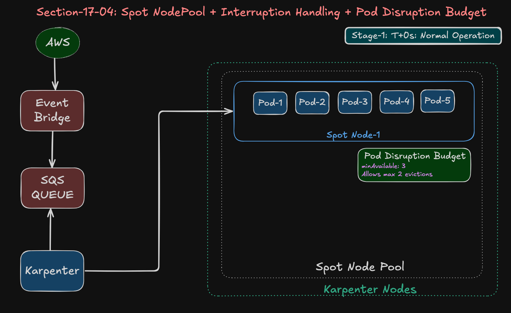
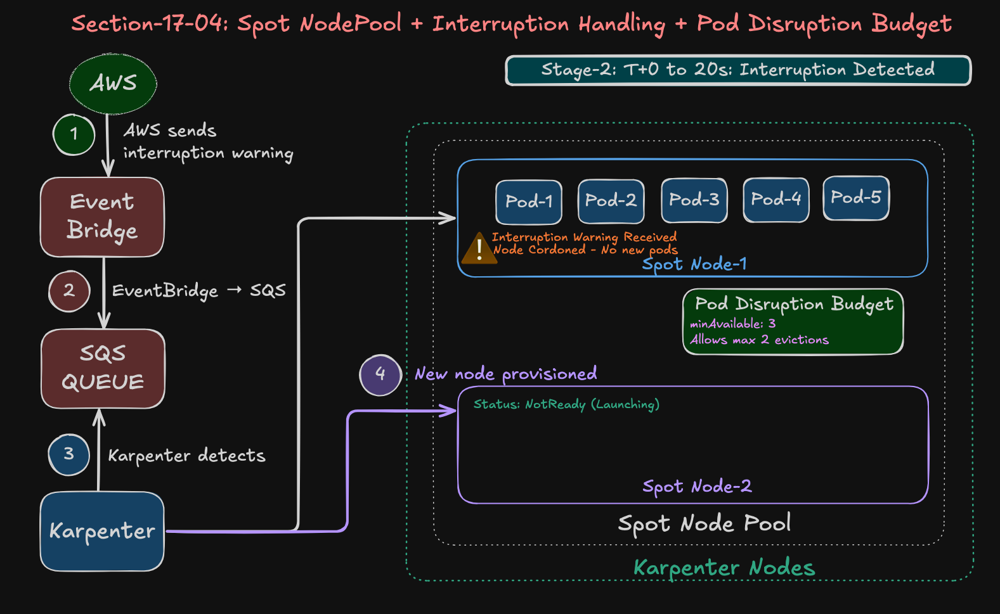
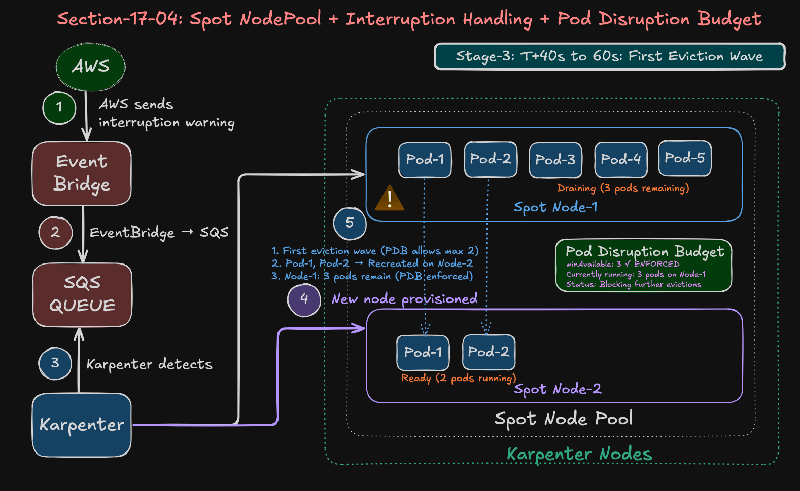
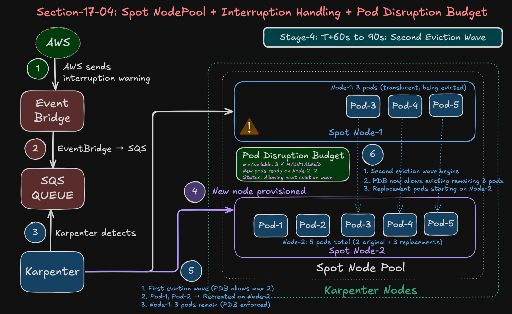
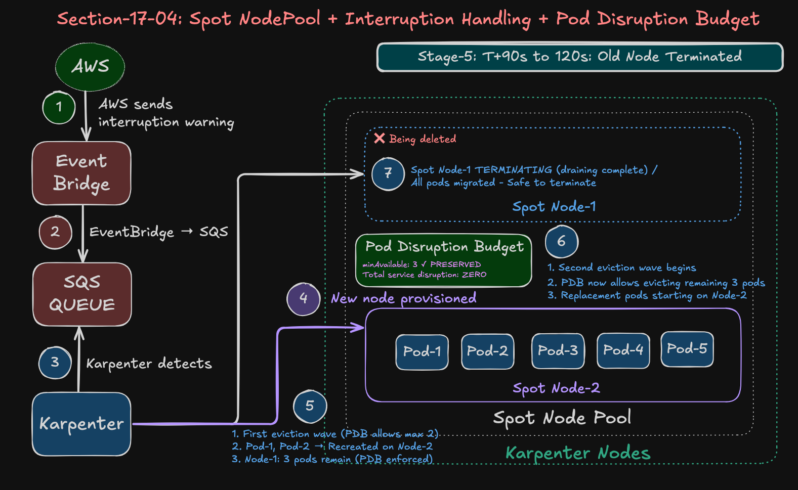
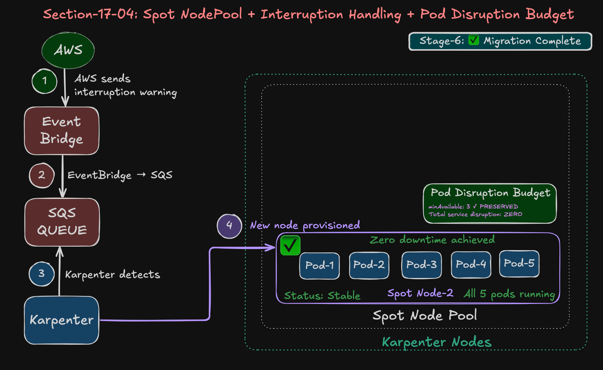

# 17_04: Karpenter Spot Interruption Handling

## Step-01: Introduction

In the previous demo (17_03), we learned how to provision Spot instances with Karpenter and achieve **70% cost savings**. But there's one critical question we didn't answer:

**"What happens when AWS reclaims your Spot instance?"**

In this demo, we'll see **Karpenter's interruption handling in action** - the mechanism that makes Spot instances production-ready by gracefully handling interruptions with **zero downtime**.

### What You'll Learn

- How Karpenter detects Spot interruptions via SQS queue
- Graceful pod eviction and rescheduling in real-time
- How PodDisruptionBudgets maintain availability during interruptions
- Simulating interruptions for testing
- Zero-downtime migration strategies


### Stage-1: Karpenter Spot Instances - Interruption Handling


### Stage-2: Karpenter Spot Instances - Interruption Handling



### Stage-3: Karpenter Spot Instances - Interruption Handling



### Stage-4: Karpenter Spot Instances - Interruption Handling



### Stage-5: Karpenter Spot Instances - Interruption Handling



### Stage-6: Karpenter Spot Instances - Interruption Handling



### Understanding Spot Interruptions

**The 2-Minute Warning:**
```
T = 0s:    AWS decides to reclaim instance
T = 0s:    Interruption warning sent (EventBridge → SQS)
T = 120s:  Instance terminates (no exceptions!)
```

**Without Karpenter:**
- ❌ Pods get hard-killed after 2 minutes
- ❌ Service disruption
- ❌ Failed requests

**With Karpenter:**
- ✅ Graceful pod termination
- ✅ Automatic rescheduling to healthy nodes
- ✅ Zero downtime

---

## Step-02: How Karpenter Handles Interruptions

**The Flow:**

```
1. AWS sends interruption warning → EventBridge → SQS Queue
2. Karpenter polls SQS (every 10 seconds), detects message
3. Karpenter cordons node (stops new pod scheduling)
4. Karpenter provisions replacement node (proactive!)
5. Karpenter drains node (respects PodDisruptionBudgets)
6. Kubernetes reschedules pods to new node
7. Old node terminates after pods are safe
```

**Key Point:** Karpenter starts provisioning the **new node BEFORE** draining the old one - this is why there's zero downtime!

---

## Step-03: Prerequisites

Ensure you have from previous demos:

✅ **Karpenter installed** with interruption queue (17_01)  
✅ **Spot NodePool** deployed (17_01)  
✅ **SQS queue** connected to EventBridge (17_01)

**Quick verification:**

```bash
# 1. Check Karpenter is running
kubectl get pods -n kube-system -l app.kubernetes.io/name=karpenter

# 2. Verify interruption queue configured
helm get values karpenter -n kube-system | grep interruptionQueue
# Expected: interruptionQueue: retail-dev-eksdemo1

# 3. Check SQS queue exists
aws sqs list-queues | grep -i retail-dev-eksdemo1
```

---

## Step-04: Review Test Application

We'll deploy a simple app with **5 replicas** and a **PodDisruptionBudget** to ensure availability during interruptions.

**Key configuration in `Spot_Interruption_Handling.yaml`:**

```yaml
apiVersion: apps/v1
kind: Deployment
metadata:
  name: spot-test-app
  namespace: default
spec:
  replicas: 5
  selector:
    matchLabels:
      app: spot-test
  template:
    metadata:
      labels:
        app: spot-test
    spec:
      nodeSelector:
        karpenter.sh/capacity-type: spot  # ← Force Spot nodes
      
      terminationGracePeriodSeconds: 30   # ← Allow graceful shutdown
      
      containers:
      - name: nginx
        image: nginx:alpine
        ports: 
          - containerPort: 80
        resources:
          requests:
            cpu: 100m
            memory: 128Mi
          limits:
            cpu: 200m
            memory: 256Mi

---
# PodDisruptionBudget - THE KEY TO ZERO DOWNTIME
apiVersion: policy/v1
kind: PodDisruptionBudget
metadata:
  name: spot-test-app-pdb
  namespace: default
spec:
  minAvailable: 3  # ← Keep at least 3 pods running during disruptions
  selector:
    matchLabels:
      app: spot-test
```

**Why PodDisruptionBudget (PDB) is critical:**
- Without PDB: All 5 pods could be evicted immediately → **service down!**
- With PDB (minAvailable: 3): Max 2 pods evicted at a time → **service stays up!**

---

## Step-05: Deploy Test Application

```bash
# Deploy the test app
cd 17_04_Karpenter_Spot_Interruption_Handling
kubectl apply -f kube-manifests-Spot-Interruption-Handling/Spot_Interruption_Handling.yaml

# Output
deployment.apps/spot-test-app created
poddisruptionbudget.policy/spot-test-app-pdb created
```

**Verify pods are running:**

```bash
# Watch pods get scheduled (takes ~1-2 minutes)
kubectl get pods -l app=spot-test -o wide

# Expected: All 5 pods Running on a Spot node
# NAME                  READY   STATUS    NODE
# spot-test-app-xxx     1/1     Running   ip-10-0-11-246.ec2.internal
# spot-test-app-yyy     1/1     Running   ip-10-0-11-246.ec2.internal
# ... (3 more)
```

**Checkpoint:** ✅ 5 pods running on Spot node

---

## Step-06: Prepare Monitoring (Open 4 Terminals)

Before triggering the interruption, open **4 terminal windows** to watch the magic:

### Terminal 1: Karpenter Logs (Filtered)

```bash
kubectl logs -n kube-system -l app.kubernetes.io/name=karpenter -f | \
  grep -E "interrupt|cordon|drain"
```

### Terminal 2: Node Status

```bash
kubectl get nodes -l karpenter.sh/capacity-type=spot -w
```

### Terminal 3: Pod Status

```bash
kubectl get pods -l app=spot-test -o wide -w
```

### Terminal 4: NodeClaims

```bash
kubectl get nodeclaims -w
```

---

## Step-07: Simulate Spot Interruption

**Open a 5th terminal** and send the interruption message:

```bash
# Get the Spot instance ID
SPOT_INSTANCE_ID=$(kubectl get nodes -l karpenter.sh/capacity-type=spot -o json | \
  jq -r '.items[0].spec.providerID' | cut -d'/' -f5)

echo "Target Instance: $SPOT_INSTANCE_ID"

# Get SQS queue URL
CLUSTER_NAME="retail-dev-eksdemo1"
QUEUE_URL=$(aws sqs get-queue-url --queue-name $CLUSTER_NAME --query QueueUrl --output text)

# Send interruption message
aws sqs send-message \
  --queue-url "$QUEUE_URL" \
  --message-body "{
    \"version\": \"0\",
    \"id\": \"test-interrupt-$(date +%s)\",
    \"detail-type\": \"EC2 Spot Instance Interruption Warning\",
    \"source\": \"aws.ec2\",
    \"account\": \"123456789012\",
    \"time\": \"$(date -u +%Y-%m-%dT%H:%M:%SZ)\",
    \"region\": \"us-east-1\",
    \"resources\": [
      \"arn:aws:ec2:us-east-1:123456789012:instance/$SPOT_INSTANCE_ID\"
    ],
    \"detail\": {
      \"instance-id\": \"$SPOT_INSTANCE_ID\",
      \"instance-action\": \"terminate\"
    }
  }"

echo "✅ Interruption message sent!"
echo "🔍 Watch your 4 monitoring terminals..."
```

---

## Step-08: Watch the Magic Happen ✨

**Now watch your 4 terminals!** Here's what you'll see:

### Terminal 1: Karpenter Logs

```json
{"level":"INFO","message":"initiating delete from interruption message",
 "queue":"retail-dev-eksdemo1","messageKind":"spot_interrupted",
 "NodeClaim":{"name":"spot-nodepool-xjqfh"},"action":"CordonAndDrain",
 "Node":{"name":"ip-10-0-11-246.ec2.internal"}}
```

**Key events:**
- ✅ Message detected within 10-20 seconds
- ✅ Node cordoned (no new pods)
- ✅ Drain initiated

### Terminal 2: Node Status

```bash
# T+0s: Original node running
ip-10-0-11-246.ec2.internal   Ready    34m

# T+40s: New replacement node appears!
ip-10-0-11-246.ec2.internal   Ready      41m
ip-10-0-12-253.ec2.internal   NotReady   0s   ← NEW NODE!

# T+60s: New node ready
ip-10-0-12-253.ec2.internal   Ready      19s

# T+2m30s: Old node draining
ip-10-0-11-246.ec2.internal   NotReady   43m

# T+3m: Old node deleted
ip-10-0-12-253.ec2.internal   Ready      4m44s  ← Only new node remains
```

**Key observation:** ✅ New node ready BEFORE old node fully drained = zero downtime!

### Terminal 3: Pod Status

```bash
# T+0s: All pods on old node
spot-test-app-xxx   1/1   Running   ip-10-0-11-246.ec2.internal
spot-test-app-yyy   1/1   Running   ip-10-0-11-246.ec2.internal
... (5 total)

# T+40s: First 2 pods evicted (PDB allows max 2 at a time)
spot-test-app-xxx   0/1   Completed     ip-10-0-11-246.ec2.internal
spot-test-app-yyy   1/1   Terminating   ip-10-0-11-246.ec2.internal
spot-test-app-aaa   0/1   Pending       <none>  ← Replacement pods!
spot-test-app-bbb   0/1   Pending       <none>

# T+60s: New pods scheduled to new node
spot-test-app-aaa   1/1   Running   ip-10-0-12-253.ec2.internal
spot-test-app-bbb   1/1   Running   ip-10-0-12-253.ec2.internal

# T+2m: Remaining 3 pods evicted and replaced
... (similar pattern)

# T+3m: All 5 pods running on new node ✅
spot-test-app-aaa   1/1   Running   ip-10-0-12-253.ec2.internal
spot-test-app-bbb   1/1   Running   ip-10-0-12-253.ec2.internal
... (5 total on NEW node)
```

**Key observation:** ✅ Always 3+ pods running (thanks to PDB) = zero downtime!

### Terminal 4: NodeClaims

```bash
# Old NodeClaim
spot-nodepool-xjqfh   t2.small   spot   ip-10-0-11-246.ec2.internal   True

# New NodeClaim appears
spot-nodepool-s68tk   t2.small   spot                                 Unknown
spot-nodepool-s68tk   t2.small   spot   ip-10-0-12-253.ec2.internal   True

# Old NodeClaim deleted
spot-nodepool-s68tk   t2.small   spot   ip-10-0-12-253.ec2.internal   True  ← Only new
```

---

## Step-09: Verify Success

**After ~2-3 minutes, verify everything worked:**

```bash
# Check all pods running
kubectl get pods -l app=spot-test -o wide

# Expected output:
# NAME                  READY   STATUS    RESTARTS   NODE
# spot-test-app-xxx     1/1     Running   0          ip-10-0-12-253.ec2.internal
# ... (5 pods total, all Running, RESTARTS=0)
```

**Success indicators:**
- ✅ All 5 pods Running
- ✅ RESTARTS: 0 (clean migration, no crashes)
- ✅ All on **new node** (different IP from original)
- ✅ Old node **deleted**

```bash
# Verify only new Spot node exists
kubectl get nodes -l karpenter.sh/capacity-type=spot

# Expected: Only 1 node (the new one)
# NAME                          STATUS   AGE
# ip-10-0-12-253.ec2.internal   Ready    4m44s
```

**Timeline summary:**
- ⚡ **Detection:** 10-20 seconds
- ⚡ **New node provisioned:** 30-40 seconds
- ⚡ **Full migration:** ~2-3 minutes
- ⚡ **Downtime:** ZERO (PDB kept 3 pods running throughout)

---

## Step-10: Why This Worked - The Secret Sauce

### The PodDisruptionBudget (PDB) - The Hero

```yaml
apiVersion: policy/v1
kind: PodDisruptionBudget
spec:
  minAvailable: 3  # ← This is what prevented downtime!
```

**What PDB does:**

**Without PDB:**
```
T+20s: Karpenter drains node
       → All 5 pods evicted immediately
       → 0/5 pods running ← SERVICE DOWN! ❌
T+60s: New node ready, pods rescheduled
       → 5/5 pods running ← 40 seconds of downtime!
```

**With PDB (minAvailable: 3):**
```
T+20s: Karpenter drains node
       → PDB blocks: "You can only evict 2 pods, must keep 3 running!"
       → 2 pods evicted, 3 stay running ← SERVICE UP! ✅
T+40s: New node ready
       → 2 replacement pods start
       → Now 5/5 pods running (3 old + 2 new)
T+60s: PDB allows evicting remaining 3 pods (replacements ready)
       → All 5 pods now on new node ← ZERO downtime! ✅
```

**The formula:**
```
Karpenter + PodDisruptionBudget + Proactive Provisioning = Zero Downtime
```

### Other Key Components

**1. terminationGracePeriodSeconds: 30**
- Gives pods 30 seconds to shut down gracefully
- Nginx handles this automatically (stops accepting new connections, completes in-flight requests)
- Must be < 120s (the Spot interruption window)

**2. Diverse instance types**
- Karpenter can pick from multiple instance families
- If t3 Spot is unavailable, tries t3a, t2, c5a, etc.
- Increases chance of finding replacement capacity quickly

---

## Step-11: Clean Up

```bash
# Delete the test deployment
kubectl delete -f kube-manifests-Spot-Interruption-Handling/Spot_Interruption_Handling.yaml

# Output
deployment.apps "spot-test-app" deleted
poddisruptionbudget.policy "spot-test-app-pdb" deleted
```

**Karpenter will automatically clean up the unused Spot node in ~30-60 seconds.**

```bash
# Watch automatic cleanup
kubectl get nodes -l karpenter.sh/capacity-type=spot -w

# After ~30s, the node will be deleted (consolidation)
```

**Verify complete cleanup:**

```bash
kubectl get nodes -l karpenter.sh/capacity-type=spot
# Expected: No resources found

kubectl get nodeclaims
# Expected: No resources found (or only on-demand nodes)
```

---

## Step-12: Production Best Practices

Now that you've seen it work, here's how to use this in production:

### 1. Always Use PodDisruptionBudgets

**For any production deployment:**

```yaml
apiVersion: policy/v1
kind: PodDisruptionBudget
metadata:
  name: my-app-pdb
spec:
  minAvailable: 2  # At least 2 pods for HA
  selector:
    matchLabels:
      app: my-app
```

**Or for StatefulSets:**

```yaml
spec:
  maxUnavailable: 1  # Only 1 pod down at a time
```

### 2. Set Appropriate Grace Periods

| Workload Type | Recommended |
|---------------|-------------|
| Stateless API | 30s |
| WebSocket server | 60s |
| Batch job | 90s |

**Never exceed 90s** - you need buffer before AWS force-terminates at 120s!

### 3. Set terminationGracePeriodSeconds Appropriately

**Your application needs time to shut down gracefully:**
- ✅ Stop accepting new connections
- ✅ Complete in-flight requests
- ✅ Close database connections
- ✅ Flush logs/metrics

**Most web servers (nginx, Apache) handle this automatically** - they respond to SIGTERM by gracefully shutting down.

For custom applications, ensure your code handles termination signals properly.

### 4. Mix Spot and On-Demand for Critical Apps

**Best practice for production:**

```yaml
# 60% on Spot (cost savings)
apiVersion: apps/v1
kind: Deployment
metadata:
  name: my-app-spot
spec:
  replicas: 3
  template:
    spec:
      nodeSelector:
        karpenter.sh/capacity-type: spot

---
# 40% on On-Demand (stability)
apiVersion: apps/v1
kind: Deployment
metadata:
  name: my-app-ondemand
spec:
  replicas: 2
  template:
    spec:
      nodeSelector:
        karpenter.sh/capacity-type: on-demand
```

**Result:**
- 60% cost savings from Spot
- 40% guaranteed capacity from On-Demand
- Even if all Spot nodes interrupted simultaneously, 2 pods stay up!

### 5. Use Diverse Instance Types

```yaml
# In your Spot NodePool
requirements:
  - key: karpenter.k8s.aws/instance-family
    operator: In
    values: ["t3", "t3a", "t2", "c5a", "c6a", "m5"]  # ← Multiple options
```

**Why:** If t3 Spot is unavailable, Karpenter tries t3a, then t2, etc. Increases replacement node availability.

---

## Summary

**You just proved Spot instances are production-ready with Karpenter!**

**What you demonstrated:**
- ✅ Karpenter detects interruptions in ~10-20 seconds (SQS polling)
- ✅ Proactively provisions replacement nodes
- ✅ Gracefully migrates pods with zero downtime
- ✅ PodDisruptionBudgets maintain service availability
- ✅ Complete in ~2-3 minutes from interruption to full recovery

**The magic formula:**
```
Karpenter + PodDisruptionBudget + terminationGracePeriod = 
70% Cost Savings + Zero Downtime!
```

**Key takeaway for production:**
> Spot instances with Karpenter are NOT risky - they're a smart, cost-effective choice when you use PodDisruptionBudgets and configure appropriate grace periods for your applications.

---

