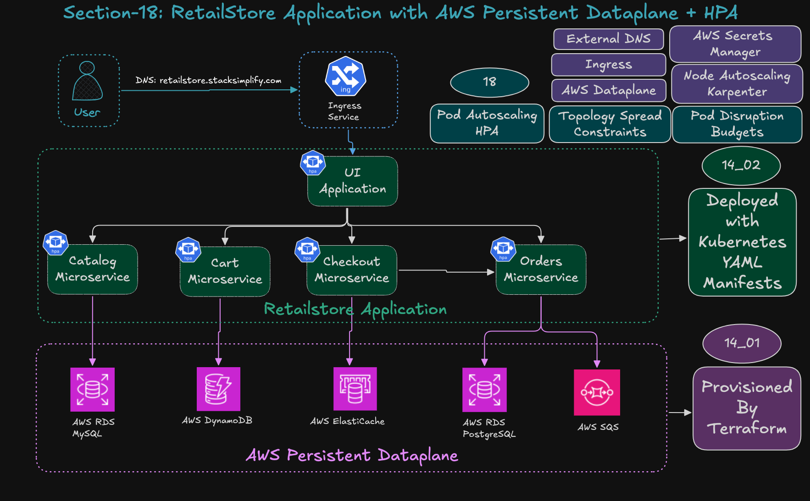
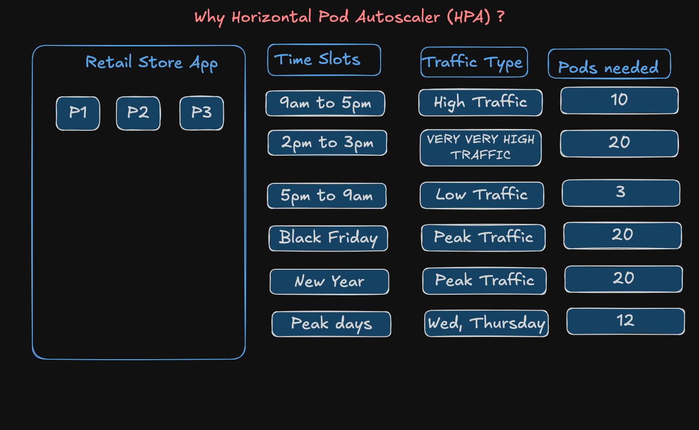
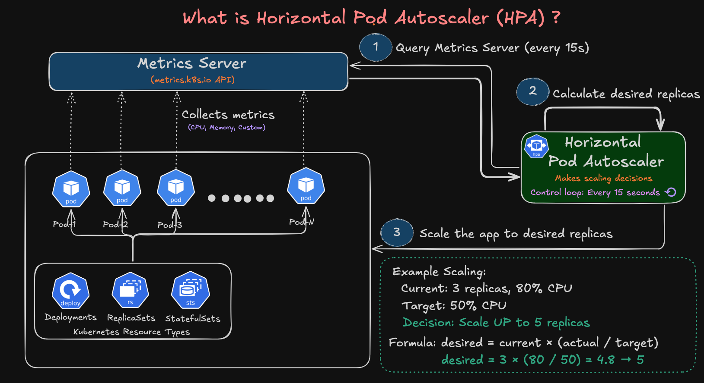

# **18: Horizontal Pod Autoscaling (HPA) for Retail Store Application**

## **Step-01: Introduction**

Horizontal Pod Autoscaling (HPA) automatically scales your application pods based on resource utilization.
When load increases, Kubernetes scales pods up. When load decreases, it scales them back down automatically.

In this section, we’re bringing autoscaling to our **full Retail Store microservices stack** running on:

* AWS RDS MySQL (Catalog)
* DynamoDB (Cart)
* Redis (Checkout)
* PostgreSQL + SQS (Orders)

Plus we’ll schedule everything on **Karpenter On-demand nodes** 

This section completes the *full real-world scaling story* of our cluster.

### What are we going to learn?

1. Pod Autoscaling: Horizontal Pod Autoscaler
2. Pod Disruption Budgets
3. Topology Spread Constraints


### Why Horizontal Pod Autoscaler?


### What is Horizontal Pod Autoscaler?


### Project Folder Structure
```
18_Autoscaling_HPA/
├── 01_Metrics_Server_terraform-manifests
│   ├── c1_versions.tf
│   ├── c2_variables.tf
│   ├── c3_eks_remote_state.tf
│   └── c4_eksaddon_metrics_server.tf
├── 02_AWS_Data_Plane_terraform-manifests
│   ├── c1_versions.tf
│   ├── c2_variables.tf
│   ├── c3_01_vpc_remote_state.tf
│   ├── c3_02_eks_remote_state.tf
│   ├── c4_datasources_and_locals.tf
│   ├── c5_01_podidentity_assumerole.tf
│   ├── c5_02_secretstorecsi_iam_policy.tf
│   ├── c6_01_catalog_rds_mysql_security_group.tf
│   ├── c6_02_catalog_rds_mysql_dbsubnet_group.tf
│   ├── c6_03_catalog_rds_mysql_credentials.tf
│   ├── c6_04_catalog_rds_mysql_dbinstance.tf
│   ├── c6_05_catalog_sa_iam_role.tf
│   ├── c6_06_catalog_sa_eks_pod_identity_association.tf
│   ├── c7_01_cart_dynamoDB_iam_policy_and_role.tf
│   ├── c7_02_cart_eks_pod_identity_association.tf
│   ├── c7_03_cart_dynamodb_table.tf
│   ├── c8_01_checkout_redis_security_group.tf
│   ├── c8_02_checkout_redis_subnet_group.tf
│   ├── c8_03_checkout_redis_cluster.tf
│   ├── c9_01_orders_postgresql_security_group.tf
│   ├── c9_02_orders_postgresql_db_subnet_group.tf
│   ├── c9_03_orders_postgresql_dbinstance.tf
│   ├── c9_04_orders_postgresql_sa_iam_role.tf
│   ├── c9_05_orders_postgresql_sa_eks_pod_identity_association.tf
│   ├── c9_06_orders_aws_sqs_queue.tf
│   └── c9_07_orders_aws_sqs_iam_policy.tf
├── 03_RetailStore_k8s_manifests_with_Data_Plane_ScheduleAnyway
│   ├── 01_secretproviderclass
│   │   ├── 01_catalog_db_secretproviderclass.yaml
│   │   └── 02_orders_db_secretproviderclass.yaml
│   ├── 02_RetailStore_Microservices
│   │   ├── 01_catalog
│   │   │   ├── 01_catalog_service_account.yaml
│   │   │   ├── 02_catalog_configmap.yaml
│   │   │   ├── 03_catalog_deployment.yaml
│   │   │   ├── 04_catalog_clusterip_service.yaml
│   │   │   └── 05_catalog_mysql_externalname_service.yaml
│   │   ├── 02_cart
│   │   │   ├── 01_cart_service_account.yaml
│   │   │   ├── 02_cart_configmap.yaml
│   │   │   ├── 03_cart_deployment.yaml
│   │   │   └── 04_cart_clusterip_service.yaml
│   │   ├── 03_checkout
│   │   │   ├── 01_checkout_service_account.yaml
│   │   │   ├── 02_checkout_configmap.yaml
│   │   │   ├── 03_checkout_deployment.yaml
│   │   │   └── 04_checkout_clusterip_service.yaml
│   │   ├── 04_orders
│   │   │   ├── 01_orders_service_account.yaml
│   │   │   ├── 02_orders_configmap.yaml
│   │   │   ├── 03_orders_deployment.yaml
│   │   │   └── 04_orders_clusterip_service.yaml
│   │   └── 05_ui
│   │       ├── 01_ui_service_account.yaml
│   │       ├── 02_ui_configmap.yaml
│   │       ├── 03_ui_deployment.yaml
│   │       └── 04_ui_clusterip_service.yaml
│   ├── 03_ingress
│   │   └── 01_ingress_http_ip_mode.yaml
│   ├── 04_HPA
│   │   ├── 01_catalog_hpa.yaml
│   │   ├── 02_carts_hpa.yaml
│   │   ├── 03_checkout_hpa.yaml
│   │   ├── 04_orders_hpa.yaml
│   │   └── 05_ui_hpa.yaml
│   └── 05_PDB
│       ├── 01_catalog_pdb.yaml
│       ├── 02_carts_pdb.yaml
│       ├── 03_checkout_pdb.yaml
│       ├── 04_orders_pdb.yaml
│       └── 05_ui_pdb.yaml
├── 04_RetailStore_k8s_manifests_with_Data_Plane_DoNotSchedule
│   ├── 01_secretproviderclass
│   │   ├── 01_catalog_db_secretproviderclass.yaml
│   │   └── 02_orders_db_secretproviderclass.yaml
│   ├── 02_RetailStore_Microservices
│   │   ├── 01_catalog
│   │   │   ├── 01_catalog_service_account.yaml
│   │   │   ├── 02_catalog_configmap.yaml
│   │   │   ├── 03_catalog_deployment.yaml
│   │   │   ├── 04_catalog_clusterip_service.yaml
│   │   │   └── 05_catalog_mysql_externalname_service.yaml
│   │   ├── 02_cart
│   │   │   ├── 01_cart_service_account.yaml
│   │   │   ├── 02_cart_configmap.yaml
│   │   │   ├── 03_cart_deployment.yaml
│   │   │   └── 04_cart_clusterip_service.yaml
│   │   ├── 03_checkout
│   │   │   ├── 01_checkout_service_account.yaml
│   │   │   ├── 02_checkout_configmap.yaml
│   │   │   ├── 03_checkout_deployment.yaml
│   │   │   └── 04_checkout_clusterip_service.yaml
│   │   ├── 04_orders
│   │   │   ├── 01_orders_service_account.yaml
│   │   │   ├── 02_orders_configmap.yaml
│   │   │   ├── 03_orders_deployment.yaml
│   │   │   └── 04_orders_clusterip_service.yaml
│   │   └── 05_ui
│   │       ├── 01_ui_service_account.yaml
│   │       ├── 02_ui_configmap.yaml
│   │       ├── 03_ui_deployment.yaml
│   │       └── 04_ui_clusterip_service.yaml
│   ├── 03_ingress
│   │   └── 01_ingress_http_ip_mode.yaml
│   ├── 04_HPA
│   │   ├── 01_catalog_hpa.yaml
│   │   ├── 02_carts_hpa.yaml
│   │   ├── 03_checkout_hpa.yaml
│   │   ├── 04_orders_hpa.yaml
│   │   └── 05_ui_hpa.yaml
│   └── 05_PDB
│       ├── 01_catalog_pdb.yaml
│       ├── 02_carts_pdb.yaml
│       ├── 03_checkout_pdb.yaml
│       ├── 04_orders_pdb.yaml
│       └── 05_ui_pdb.yaml
├── check-topology.sh
└── README.md
```


---

## **Step-02: Install Metrics Server (EKS Add-On)**

> 📝 *HPA literally can’t work without Metrics Server — it’s the component that feeds CPU/Memory metrics to the Kubernetes API.*

### **Step-02-01: Folder Structure**

```
18_Autoscaling_HPA/
├── 01_Metrics_Server_terraform-manifests
│   ├── c1_versions.tf
│   ├── c2_variables.tf
│   ├── c3_eks_remote_state.tf
│   └── c4_eksaddon_metrics_server.tf  # EKS Add-On install for Metrics Server
```

### **Step-02-02: Run Terraform**

```bash
terraform init
terraform validate
terraform plan
terraform apply -auto-approve
```

---

## **Step-03: Create AWS Data Plane**
> 📝 *We’re reusing the same AWS Data Plane setup from [Section-14-01](../14_RetailStore_Microservices_with_AWS_Data_Plane/14_01_RetailStore_AWS_Data_Plane/README.md).
> If it already exists, students can skip the apply. If not, they run this folder fresh.*

### **Step-03-01: Folder Structure**

```
18_Autoscaling_HPA/
├── 02_AWS_Data_Plane_terraform-manifests
│   ├── c1_versions.tf
│   ├── c2_variables.tf
│   ├── c3_01_vpc_remote_state.tf
│   ├── c3_02_eks_remote_state.tf
│   ├── c4_datasources_and_locals.tf
│   ├── c5_01_podidentity_assumerole.tf
│   ├── c5_02_secretstorecsi_iam_policy.tf
│   ├── c6_01_catalog_rds_mysql_security_group.tf
│   ├── c6_02_catalog_rds_mysql_dbsubnet_group.tf
│   ├── c6_03_catalog_rds_mysql_credentials.tf
│   ├── c6_04_catalog_rds_mysql_dbinstance.tf
│   ├── c6_05_catalog_sa_iam_role.tf
│   ├── c6_06_catalog_sa_eks_pod_identity_association.tf
│   ├── c7_01_cart_dynamoDB_iam_policy_and_role.tf
│   ├── c7_02_cart_eks_pod_identity_association.tf
│   ├── c7_03_cart_dynamodb_table.tf
│   ├── c8_01_checkout_redis_security_group.tf
│   ├── c8_02_checkout_redis_subnet_group.tf
│   ├── c8_03_checkout_redis_cluster.tf
│   ├── c9_01_orders_postgresql_security_group.tf
│   ├── c9_02_orders_postgresql_db_subnet_group.tf
│   ├── c9_03_orders_postgresql_dbinstance.tf
│   ├── c9_04_orders_postgresql_sa_iam_role.tf
│   ├── c9_05_orders_postgresql_sa_eks_pod_identity_association.tf
│   ├── c9_06_orders_aws_sqs_queue.tf
│   └── c9_07_orders_aws_sqs_iam_policy.tf
```


### Step-03-02: Update RetailStore Microservice AWS Dataplane Endpoints
1. Catalog -> AWS RDS Mysql: 05_catalog_mysql_externalname_service.yaml
2. Carts -> AWS DynamoDB: 02_cart_configmap.yaml
3. Checkout -> AWS ElastiCache: 02_checkout_configmap.yaml
4. Orders -> AWS RDS Postgresql: 02_orders_configmap.yaml
5. Orders -> AWS SQS Queue: 02_orders_configmap.yaml


### **Step-03-03: Apply Terraform**

```bash
terraform init
terraform validate
terraform plan
terraform apply -auto-approve
```

---

## **Step-04: Force Retail Store Workloads to Run on Karpenter On-demand Nodes**

Add this block to **all five microservice Deployments**:

```yaml
      # Forces Pods to run ONLY on On-demand nodes
      nodeSelector:
        karpenter.sh/capacity-type: on-demand
```

Affected files:

* catalog → `03_catalog_deployment.yaml`
* cart → `03_cart_deployment.yaml`
* checkout → `03_checkout_deployment.yaml`
* orders → `03_orders_deployment.yaml`
* ui → `03_ui_deployment.yaml`

---

## **Step-05: Review Horizontal Pod Autoscaler (HPA) YAMLs**

> 📝 *Each microservice gets its own HPA object.
> We’ll scale based on CPU/Memory thresholds defined per service.*

Folder:

```
│   ├── 04_HPA
│   │   ├── 01_catalog_hpa.yaml
│   │   ├── 02_carts_hpa.yaml
│   │   ├── 03_checkout_hpa.yaml
│   │   ├── 04_orders_hpa.yaml
│   │   └── 05_ui_hpa.yaml

```

---

## Step-06: Review TopologySpreadConstraints
- Review `topologySpreadConstraints` in all the Kubernetes Deployment files for all 5 Retail Store services

### Step-06-01: Files changed as part of `topologySpreadConstraints` 
```
├── 03_RetailStore_k8s_manifests_with_Data_Plane_ScheduleAnyway
│   ├── 02_RetailStore_Microservices
│   │   ├── 01_catalog
│   │   │   ├── 03_catalog_deployment.yaml
│   │   ├── 02_cart
│   │   │   ├── 03_cart_deployment.yaml
│   │   ├── 03_checkout
│   │   │   ├── 03_checkout_deployment.yaml
│   │   ├── 04_orders
│   │   │   ├── 03_orders_deployment.yaml
│   │   └── 05_ui
│   │       ├── 03_ui_deployment.yaml
```

### Step-06-02: Sample specifications `topologySpreadConstraints`

```yaml
# ..... deployment spec
    spec:
      # TOPOLOGY SPREAD CONSTRAINTS - Distribute pods across nodes AND availability zones
      topologySpreadConstraints:
        # Spread across nodes (within same AZ)
        - maxSkew: 1
          topologyKey: kubernetes.io/hostname
          whenUnsatisfiable: ScheduleAnyway
          labelSelector:
            matchLabels:
              app.kubernetes.io/name: ui
              app.kubernetes.io/component: service
        
        # Spread across availability zones
        - maxSkew: 1
          topologyKey: topology.kubernetes.io/zone
          whenUnsatisfiable: ScheduleAnyway
          labelSelector:
            matchLabels:
              app.kubernetes.io/name: ui
              app.kubernetes.io/component: service    

# ........... deployment spec continued              
```
---

## Step-07: Review Pod Disruption Budget files
### Step-07-01: Pod Disruption Budget Files
```
│   └── 05_PDB
│       ├── 01_catalog_pdb.yaml
│       ├── 02_carts_pdb.yaml
│       ├── 03_checkout_pdb.yaml
│       ├── 04_orders_pdb.yaml
│       └── 05_ui_pdb.yaml
```

### Step-07-02: Pod Disruption Budget YAML File 

```yaml
apiVersion: policy/v1
kind: PodDisruptionBudget
metadata:
  name: catalog-pdb
  namespace: default
  labels:
    app.kubernetes.io/name: catalog
    app.kubernetes.io/instance: catalog
    app.kubernetes.io/component: availability
    app.kubernetes.io/owner: retail-store-sample
spec:
  minAvailable: 2
  selector:
    matchLabels:
      app.kubernetes.io/name: catalog
      app.kubernetes.io/instance: catalog
      app.kubernetes.io/component: service
      app.kubernetes.io/owner: retail-store-sample
```

---

## **Step-08: Deploy Retail Store Application With HPA Enabled**
**Project Folder:** 03_RetailStore_k8s_manifests_with_Data_Plane_ScheduleAnyway

```bash
# Change Directory
cd 03_RetailStore_k8s_manifests_with_Data_Plane_ScheduleAnyway

# Deploy YAML Files
kubectl apply -f 01_secretproviderclass
kubectl apply -R -f 02_RetailStore_Microservices
kubectl apply -f 03_ingress
kubectl apply -f 04_HPA
kubectl apply -f 05_PDB

# Verify Kubernetes Resources
kubectl get pods
kubectl get deploy
kubectl get ingress
kubectl get hpa

# Describe HPA
kubectl describe hpa catalog-hpa

# Karpenter-related resources
kubectl get nodes -o wide
kubectl get nodeclaims -o wide

# Veriy   POD TOPOLOGY DISTRIBUTION REPORT 
./check-topology.sh 
```

---

## **Step-09: HPA Testing (Memory-Based Autoscaling)**

> 📝 *This is the fun part — we intentionally force a scale-out event by lowering memory requests.*

### **Step-09-01: Reduce Orders Deployment Memory (to trigger HPA)**

```yaml
# 03_orders_deployment.yaml
          resources:
            limits:
              memory: 512Mi
              cpu: 500m              
            requests:
              # memory: 356Mi   
              # Set low on purpose to hit 80% utilization fast
              memory: 256Mi
              cpu: 100m
```

### **Step-09-02: Apply and Verify**
```bash
# Change Directory
cd 03_RetailStore_k8s_manifests_with_Data_Plane_ScheduleAnyway

# Re-deploy Orders Application
kubectl apply -f 02_RetailStore_Microservices/04_orders/03_orders_deployment.yaml 

# Verify Kubernetes Resources
kubectl get pods | grep orders
kubectl get hpa
kubectl describe hpa orders-hpa
```

### **Step-09-03: Roll Back to Normal Values**

```yaml
requests:
  memory: 356Mi
  cpu: 100m
```

### **Step-09-04: Re-Apply and Validate**
```bash
# Change Directory
cd 03_RetailStore_k8s_manifests_with_Data_Plane_ScheduleAnyway

# Re-deploy Orders Application
kubectl apply -f 02_RetailStore_Microservices/04_orders/03_orders_deployment.yaml 

# Verify Kubernetes Resources
kubectl get pods | grep orders
kubectl get hpa
kubectl describe hpa orders-hpa
```

---

## Step-10: Undeploy Application from 03_RetailStore_k8s_XXXXX_ScheduleAnyway
```bash
# Change Directory
cd 18_Autoscaling_HPA

# Delete Kubernetes Manifests
kubectl -R -f 03_RetailStore_k8s_manifests_with_Data_Plane_ScheduleAnyway
```

## Step-11: Verify topologySpreadConstraints with DoNotSchedule option for Availability Zones
```bash
# Change Directory
cd 04_RetailStore_k8s_manifests_with_Data_Plane_DoNotSchedule

# Deploy YAML Files
kubectl apply -f 01_secretproviderclass
kubectl apply -R -f 02_RetailStore_Microservices
kubectl apply -f 03_ingress
kubectl apply -f 04_HPA
kubectl apply -f 05_PDB

# Verify Kubernetes Resources
kubectl get pods
kubectl get deploy
kubectl get ingress
kubectl get hpa

# Karpenter-related resources
kubectl get nodes -o wide
kubectl get nodeclaims -o wide

# Veriy   POD TOPOLOGY DISTRIBUTION REPORT 
./check-topology.sh 
```

### Sample Output: check-topology.sh 
```
Kalyans-Mac-mini:18_Autoscaling_HPA kalyanreddy$ ./check-topology.sh 
╔════════════════════════════════════════════════════════════════════════════╗
║              POD TOPOLOGY DISTRIBUTION REPORT                              ║
╚════════════════════════════════════════════════════════════════════════════╝

📍 NODES AND THEIR ZONES:
━━━━━━━━━━━━━━━━━━━━━━━━━━━━━━━━━━━━━━━━━━━━━━━━━━━━━━━━━━━━━━━━━━━━━━━━━━━━
NODE                                     ZONE
━━━━━━━━━━━━━━━━━━━━━━━━━━━━━━━━━━━━━━━━━━━━━━━━━━━━━━━━━━━━━━━━━━━━━━━━━━━━
ip-10-0-10-16.ec2.internal               us-east-1a
ip-10-0-10-189.ec2.internal              us-east-1a
ip-10-0-10-231.ec2.internal              us-east-1a
ip-10-0-10-232.ec2.internal              us-east-1a
ip-10-0-11-233.ec2.internal              us-east-1b
ip-10-0-11-243.ec2.internal              us-east-1b
ip-10-0-12-102.ec2.internal              us-east-1c
ip-10-0-12-191.ec2.internal              us-east-1c
ip-10-0-12-206.ec2.internal              us-east-1c

🚀 PODS DISTRIBUTION BY APPLICATION:
━━━━━━━━━━━━━━━━━━━━━━━━━━━━━━━━━━━━━━━━━━━━━━━━━━━━━━━━━━━━━━━━━━━━━━━━━━━━
APP          POD                                      NODE                                     ZONE
━━━━━━━━━━━━━━━━━━━━━━━━━━━━━━━━━━━━━━━━━━━━━━━━━━━━━━━━━━━━━━━━━━━━━━━━━━━━
carts        carts-6d78bdf8f8-dtnjn                   ip-10-0-11-243.ec2.internal              us-east-1b
carts        carts-6d78bdf8f8-lnhpx                   ip-10-0-12-102.ec2.internal              us-east-1c
carts        carts-6d78bdf8f8-r2882                   ip-10-0-10-232.ec2.internal              us-east-1a
catalog      catalog-77675cf55c-6lrlk                 ip-10-0-10-231.ec2.internal              us-east-1a
catalog      catalog-77675cf55c-kvnrw                 ip-10-0-12-102.ec2.internal              us-east-1c
catalog      catalog-77675cf55c-pfr4r                 ip-10-0-11-243.ec2.internal              us-east-1b
checkout     checkout-877577d8f-gwqsb                 ip-10-0-12-191.ec2.internal              us-east-1c
checkout     checkout-877577d8f-qfw6j                 ip-10-0-11-243.ec2.internal              us-east-1b
checkout     checkout-877577d8f-wknkm                 ip-10-0-10-232.ec2.internal              us-east-1a
orders       orders-655774cbfd-mkr9g                  ip-10-0-11-243.ec2.internal              us-east-1b
orders       orders-655774cbfd-sg4qx                  ip-10-0-10-16.ec2.internal               us-east-1a
orders       orders-655774cbfd-zhddz                  ip-10-0-12-191.ec2.internal              us-east-1c
ui           ui-6ddcbdc6fd-mccns                      ip-10-0-11-243.ec2.internal              us-east-1b
ui           ui-6ddcbdc6fd-nfnxk                      ip-10-0-12-191.ec2.internal              us-east-1c
ui           ui-6ddcbdc6fd-tgqw9                      ip-10-0-10-16.ec2.internal               us-east-1a

📊 ZONE DISTRIBUTION SUMMARY:
━━━━━━━━━━━━━━━━━━━━━━━━━━━━━━━━━━━━━━━━━━━━━━━━━━━━━━━━━━━━━━━━━━━━━━━━━━━━

📦 carts:
  us-east-1a:     1  pods ✅
  us-east-1b:     1  pods ✅
  us-east-1c:     1  pods ✅

📦 catalog:
  us-east-1a:     1  pods ✅
  us-east-1b:     1  pods ✅
  us-east-1c:     1  pods ✅

📦 checkout:
  us-east-1a:     1  pods ✅
  us-east-1b:     1  pods ✅
  us-east-1c:     1  pods ✅

📦 orders:
  us-east-1a:     1  pods ✅
  us-east-1b:     1  pods ✅
  us-east-1c:     1  pods ✅

📦 ui:
  us-east-1a:     1  pods ✅
  us-east-1b:     1  pods ✅
  us-east-1c:     1  pods ✅

━━━━━━━━━━━━━━━━━━━━━━━━━━━━━━━━━━━━━━━━━━━━━━━━━━━━━━━━━━━━━━━━━━━━━━━━━━━━
✅ Topology spread analysis complete!

💡 INTERPRETATION GUIDE:
  ✅ = Pods present in this zone (good for HA)
  ⚠️  = No pods in this zone (may want to investigate)

Kalyans-Mac-mini:18_Autoscaling_HPA kalyanreddy$ 

```

---

## **Step-12: Clean-Up**

> 📝 *Important for students who don’t want AWS bills hitting them later.*

```bash
cd 18_Autoscaling_HPA

# Remove RetailStore app
kubectl delete -R -f 04_RetailStore_k8s_manifests_with_Data_Plane_DoNotSchedule

# Delete AWS Dataplane
cd 02_AWS_Data_Plane_terraform-manifests
terraform destroy -auto-approve

# Delete Metrics Server
cd ../01_Metrics_Server_terraform-manifests
terraform destroy -auto-approve
```

---

## **Step-13: Clean-Up Karpenter, EKS Cluster and VPC**
- This script `destroy-cluster-with-karpenter.sh` will remove projects in reverse order
  1. 04_KARPENTER_k8s-manifests
  2. 03_KARPENTER_terraform-manifests
  3. 02_EKS_terraform-manifests_with_addons
  4. 01_VPC_terraform-manifests
```bash
# Change Directory
cd 17_Autoscaling_Karpenter/17_01_Karpenter_Install

# Run Destroy Cluster with karpenter Script
./destroy-cluster-with-karpenter.sh
```

---

