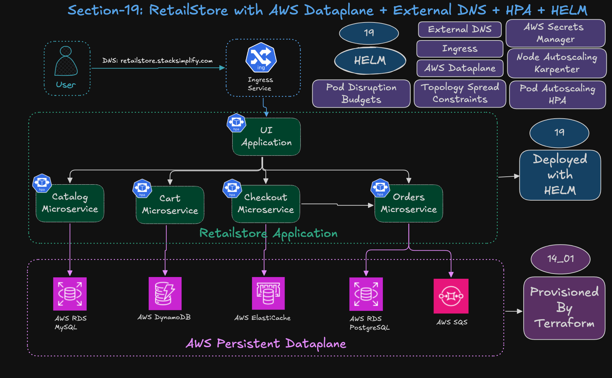
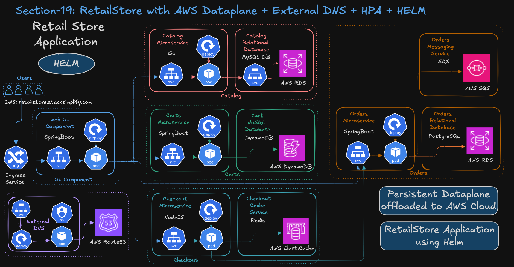
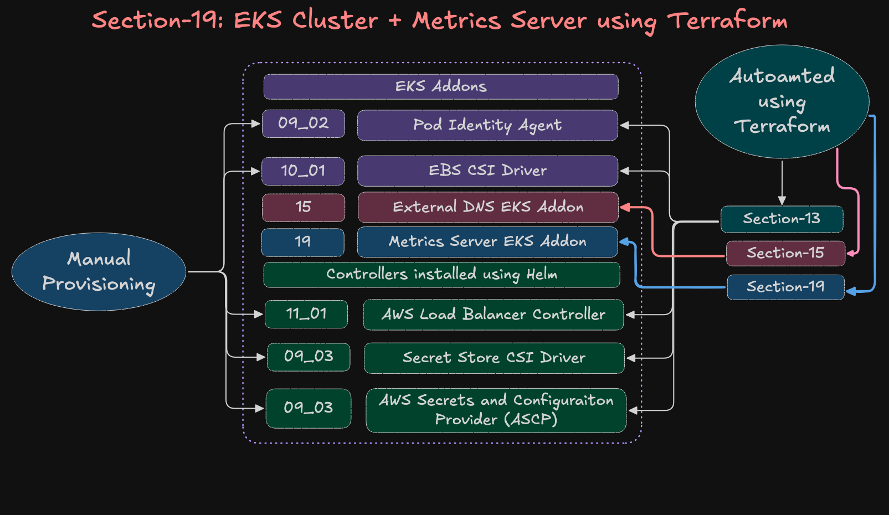

# 19 RetailStore Helm Charts with AWS Persistent Dataplane 

## Step-01: Goals & Prerequisites

### Architecture Diagram - 1


### Architecture Diagram - 2


### Metrics Server added part of EKS Cluster Terraform Project



## Step-02: Environment Setup
### Step-02-01: Folder Structure
```bash
19_Helm_RetailStore_AWS_Dataplane/
├── 01_EKS_Cluster_Environment
│   ├── 01_VPC_terraform-manifests
│   ├── 02_EKS_terraform-manifests_with_addons
│   ├── 03_KARPENTER_terraform-manifests
│   ├── 04_KARPENTER_k8s-manifests
│   ├── create-cluster-with-karpenter.sh
│   └── destroy-cluster-with-karpenter.sh
├── 02_RetailStore_AWS_Dataplane
│   ├── 01_AWS_Data_Plane_terraform-manifests
│   ├── create-aws-dataplane.sh
│   └── delete-aws-dataplane.sh
├── 03_RetailStore_Helm_with_Data_Plane
│   ├── 01_retailstore_charts_updates
│   └── 02_retailstore_values_HELM_aws_dataplane
├── check-topology.sh
└── README.md
```
### Step-02-02: Create VPC, EKS Cluster, Karpenter
```bash
# Change Directory
cd 19_Helm_RetailStore_AWS_Dataplane/01_EKS_Cluster_Environment

# Create VPC, EKS Cluster, Karpenter
./create-cluster-with-karpenter.sh
```
### Step-02-03: Create AWS Dataplane
```bash
# Change Directory
cd 19_Helm_RetailStore_AWS_Dataplane/02_RetailStore_AWS_Dataplane

# Create AWS Dataplane
./create-aws-dataplane.sh
```

## Step-03: Helm Charts - V1.0.0 
- Create **Retail Store Application Helm custom values** pointing to AWS Persistent Dataplane
- Deploy **Catalog, Cart, Checkout, Orders, UI** via Helm.
- Expose **UI** via **Ingress (ALB, HTTP)**.
- Verify Application end to end
- Uninstall **Retail Store Application**

### Step-03-01: Folder Structure
```
03_RetailStore_Helm_with_Data_Plane/
└── 02_retailstore_values_HELM_aws_dataplane
    ├── 01-uninstall-retail-apps.sh
    ├── 02-v1.0.0-install-local-helm-charts.sh
    ├── 03-v1.0.0-install-remote-helm-charts.sh
    ├── 04-v2.0.0-install-local-helm-charts.sh
    ├── 05-v2.0.0-install-remote-helm-charts.sh
    ├── values-cart.yaml
    ├── values-catalog-v2.0.0.yaml
    ├── values-catalog.yaml
    ├── values-checkout.yaml
    ├── values-orders-v2.0.0.yaml
    ├── values-orders.yaml
    └── values-ui.yaml
```

### Step-03-02: Review the files
**Folder Structure: 03_RetailStore_Helm_with_Data_Plane/02_retailstore_values_HELM_aws_dataplane**
1. values-catalog.yaml
2. values-cart.yaml
3. values-checkout.yaml
4. values-orders.yaml
5. values-ui.yaml

### Step-03-03: Review Deployment Scripts
**Folder Structure: 03_RetailStore_Helm_with_Data_Plane/02_retailstore_values_HELM_aws_dataplane**
1. 01-uninstall-retail-apps.sh
2. 02-v1.0.0-install-local-helm-charts.sh
3. 03-v1.0.0-install-remote-helm-charts.sh
4. 04-v2.0.0-install-local-helm-charts.sh
5. 05-v2.0.0-install-remote-helm-charts.sh


### Step-03-04: Deploy V1.0.0 Charts and Verify
```bash
# Change Directory
03_RetailStore_Helm_with_Data_Plane/02_retailstore_values_HELM_aws_dataplane

# Deploy V1.0.0 charts and verify
./03-v1.0.0-install-remote-helm-charts.sh

# Verify
# Helm releases
helm list

# Pods / Services / Ingress/ deploy / cm / sa / secrets
kubectl get pods
kubectl get svc
kubectl get ingress
kubectl get deploy
kubectl get cm
kubectl get sa
kubectl get secrets

# Helm Release details (Helm CLI 3.x)
helm status ui --show-resources
helm status catalog --show-resources
helm status cart --show-resources
helm status checkout --show-resources
helm status orders --show-resources

# Helm Release details (Helm CLI 4.x)
helm status ui 
helm status catalog 
helm status cart 
helm status checkout 
helm status orders 

# Verify Logs
kubectl logs -f -l app.kubernetes.io/instance=catalog --tail=200
kubectl logs -f -l app.kubernetes.io/instance=carts --tail=200
kubectl logs -f -l app.kubernetes.io/instance=checkout --tail=200
kubectl logs -f -l app.kubernetes.io/instance=orders --tail=200
kubectl logs -f -l app.kubernetes.io/instance=ui --tail=200

# List Ingress (To get ALB-DNS-NAME)
kubectl get ingress 

# Access Application
http://ALB-DNS-NAME
```

### Step-03-05: Uninstall V1.0.0 Charts and Verify
```bash
# Uninstall Helm Releases
./01-uninstall-retail-apps.sh
```


## Step-04: Helm Charts - V2.0.0 
- Build Capability for **Catalog, Orders** Helm Charts to support Kubernetes Secrets via **AWS Secrets Manager**
  - Catalog - V2.0.0
  - Orders - V2.0.0
- Create **custom values** pointing to AWS Persistent Dataplane
- Deploy **Catalog, Cart, Checkout, Orders, UI** via Helm.
- Expose **UI** via **Ingress (ALB, HTTP)**.
- Verify Application end to end
- Uninstall Application

### Step-04-01: Folder Structure
```
03_RetailStore_Helm_with_Data_Plane/
└── 02_retailstore_values_HELM_aws_dataplane
    ├── 01-uninstall-retail-apps.sh
    ├── 02-v1.0.0-install-local-helm-charts.sh
    ├── 03-v1.0.0-install-remote-helm-charts.sh
    ├── 04-v2.0.0-install-local-helm-charts.sh
    ├── 05-v2.0.0-install-remote-helm-charts.sh
    ├── values-cart.yaml
    ├── values-catalog-v2.0.0.yaml
    ├── values-catalog.yaml
    ├── values-checkout.yaml
    ├── values-orders-v2.0.0.yaml
    ├── values-orders.yaml
    └── values-ui.yaml
```

### Step-04-02: Review the files
**Folder Structure: 03_RetailStore_Helm_with_Data_Plane/02_retailstore_values_HELM_aws_dataplane**
1. values-catalog-v2.0.0.yaml
2. values-orders-v2.0.0.yaml


### Step-04-03: Review Deployment Scripts
**Folder Structure: 03_RetailStore_Helm_with_Data_Plane/02_retailstore_values_HELM_aws_dataplane**
1. 01-uninstall-retail-apps.sh
2. 02-v1.0.0-install-local-helm-charts.sh
3. 03-v1.0.0-install-remote-helm-charts.sh
4. 04-v2.0.0-install-local-helm-charts.sh
5. 05-v2.0.0-install-remote-helm-charts.sh


### Step-04-04: Deploy V2.0.0 Charts and Verify
```bash
# Change Directory
03_RetailStore_Helm_with_Data_Plane/02_retailstore_values_HELM_aws_dataplane

# Pre-requisites
1. AWS Secrets Manager Secret is created
2. Secret Store CSI Driver installed on AWS EKS Cluster
3. Secret Store AWS ASCP installed on AWS EKS Cluster

# Deploy V1.0.0 charts and verify
./05-v2.0.0-install-remote-helm-charts.sh

# Verify
# Helm releases
helm list

# Pods / Services / Ingress/ deploy / cm / sa / secrets
kubectl get pods
kubectl get svc
kubectl get ingress
kubectl get deploy
kubectl get cm
kubectl get sa
kubectl get secrets


# Helm Release details (Helm CLI 3.x)
helm status ui --show-resources
helm status catalog --show-resources
helm status cart --show-resources
helm status checkout --show-resources
helm status orders --show-resources

# Helm Release details (Helm CLI 4.x)
helm status ui 
helm status catalog 
helm status cart 
helm status checkout 
helm status orders 

# Verify Logs
kubectl logs -f -l app.kubernetes.io/instance=catalog --tail=200
kubectl logs -f -l app.kubernetes.io/instance=carts --tail=200
kubectl logs -f -l app.kubernetes.io/instance=checkout --tail=200
kubectl logs -f -l app.kubernetes.io/instance=orders --tail=200
kubectl logs -f -l app.kubernetes.io/instance=ui --tail=200


# List Ingress (To get ALB-DNS-NAME)
kubectl get ingress 

# Access Application
http://ALB-DNS-NAME
```

### Step-04-04: Check Topology - Pod Distribution across Availability Zones
```bash
# Change Directory
cd 19_Helm_RetailStore_AWS_Dataplane

# Check Topology
check-topology.sh
```

### Step-04-05: Uninstall V2.0.0 Charts and Verify
```bash
# Uninstall Helm Releases
./01-uninstall-retail-apps.sh

# List Pods
kubectl get pods

# List Deployments
kubectl get deploy
```

## Step-05: Clean-Up
### Step-05-01: Delete AWS Dataplane
```bash
# Change Directory
cd 19_Helm_RetailStore_AWS_Dataplane/02_RetailStore_AWS_Dataplane

# Delete AWS Dataplane
./delete-aws-dataplane.sh
```
### Step-05-02: Delete VPC, EKS Cluster, Karpenter
```bash
# Change Directory
cd 19_Helm_RetailStore_AWS_Dataplane/01_EKS_Cluster_Environment

# Delete VPC, EKS Cluster, Karpenter
./destroy-cluster-with-karpenter.sh
```


