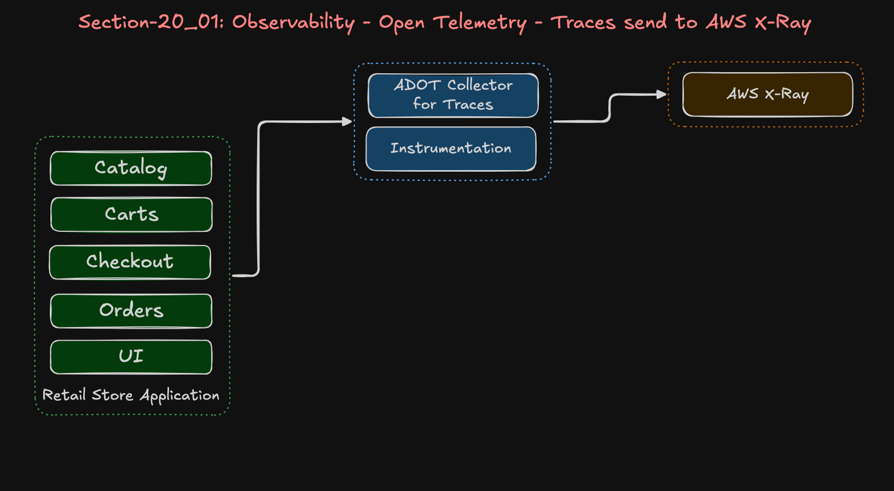
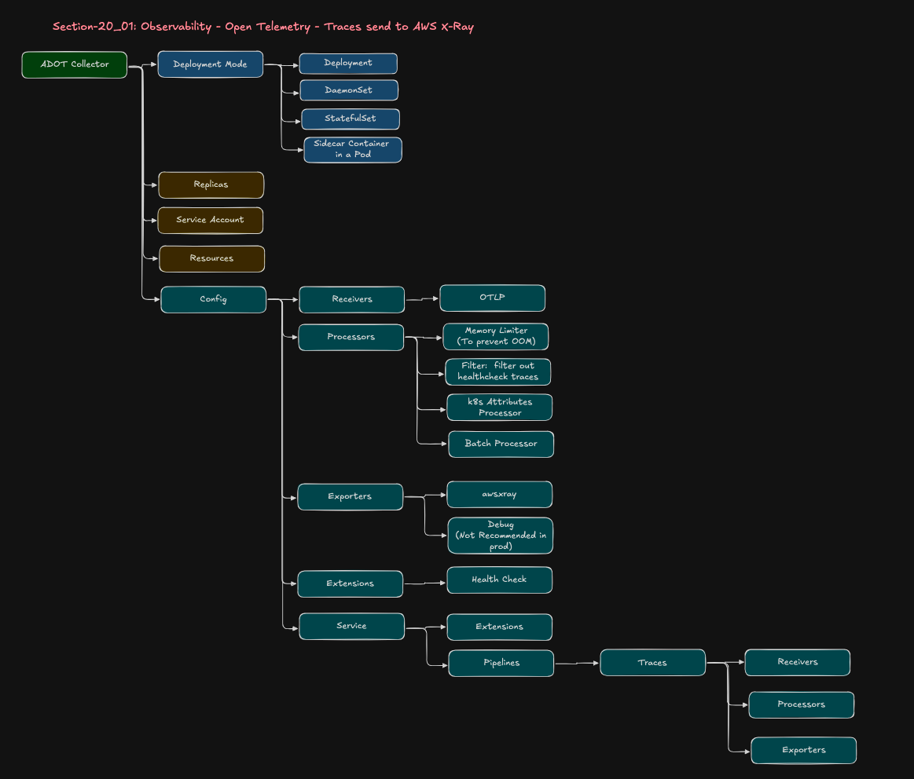

# 20_02: End-to-End Tracing on EKS using AWS ADOT (OpenTelemetry)

## Step-00: Introduction
- Implement OpenTelemetry ADOT Traces for Retail Store Application
- Traces are sent to **AWS X-Ray** via ADOT Collector
- View traces in **AWS CloudWatch Application Signals conolse**
- Includes health check filtering to reduce costs and noise

### Trace Flow
```
Retail Apps → ADOT Collector → AWS X-Ray → CloudWatch Application Signals
```

### ADOT Collector Traces Architecture


### ADOT Collector YAML Structure



### Sample Trace Map


## Step-01: Pre-requisites
1. AWS VPC, EKS Cluster, Karpenter everything created as part of [Section:20_01_EKS_Environment_with_ADOT - EKS Cluster](../20_01_EKS_Environment_with_ADOT/01_EKS_Cluster_Environment/)

2. Open Telemetry Configurations (ADOT EKS Addon, other required EKS Addons, RBAC, Services Accounts, IAM Policy and Roles) created as part of [Section:20_01_EKS_Environment_with_ADOT - 05_OPENTELEMTRY_terraform-manifests](../20_01_EKS_Environment_with_ADOT/01_EKS_Cluster_Environment/05_OPENTELEMTRY_terraform-manifests/)

3. Retail Store Application Data Plane created [Section:20_01_EKS_Environment_with_ADOT - 01_RetailStore_AWS_Dataplane](../20_01_EKS_Environment_with_ADOT/02_RetailStore_App_Environment/01_RetailStore_AWS_Dataplane/)

4. Retail Store Application deployed with Open Telemetry settings enabled in custom values yaml files [Section:20_01_EKS_Environment_with_ADOT - 02_RetailStore_App_Helm_AWS_Data_Plane](../20_01_EKS_Environment_with_ADOT/02_RetailStore_App_Environment/02_RetailStore_App_Helm_AWS_Data_Plane/)


## Step-02: Review 01_adot_collector_traces.yaml
- This defines **how traces are received, processed, filtered, and exported**
to AWS X-Ray using ADOT.
- [01_adot_collector_traces.yaml](./01_OpenTelemetry_Traces/01_adot_collector_traces.yaml)

## Step-03: Review 02_adot_instrumentation_traces.yaml
- This defines **how application pods get OTEL SDK configuration**
without changing application code.
- [02_adot_instrumentation_traces.yaml](./01_OpenTelemetry_Traces/02_adot_instrumentation_traces.yaml)

**Important:**
- We are NOT using auto-instrumentation agents (Java agent, Node agent, etc.)
- We are ONLY injecting OTEL SDK runtime configuration
- Application code already contains manual instrumentation


## Step-04: Deploy Traces ADOT Collector and Instrumentation
```bash
# Change Directory 
cd 20_02_OpenTelemetry_Traces

# Deploy ADOT Collector and Review Logs
kubectl apply -f 01_OpenTelemetry_Traces/01_adot_collector_traces.yaml

# Verify ADOT Collector and Deployment
kubectl get opentelemetrycollector
kubectl get deploy
kubectl describe deployment adot-traces

# Verify if this collector is part of ADOT Operator installed via EKS Addon
kubectl describe deployment adot-traces | grep operator

# Review ADOT Collector Logs
kubectl get pods
kubectl logs -f <POD-NAME>
or 
kubectl logs -f -l  app.kubernetes.io/name=adot-traces-collector

# Deploy ADOT Instrumentation 
kubectl apply -f 01_OpenTelemetry_Traces/02_adot_instrumentation_traces.yaml

# Verify ADOT Instrumentation
kubectl get instrumentation
```

## Step-05: Review restart-retailapp.sh and run the script. 
**Note:** The retail store applications are **pre-built with OpenTelemetry SDK** (manual instrumentation). We only need to inject the SDK runtime, not auto-instrumentation agents.

**What this does:**
- Injects OpenTelemetry SDK libraries into all pods in the namespace
- Provides OTLP exporter configuration from the `Instrumentation` resource
- Applications use their existing manual instrumentation code
- SDK gets configured to send traces to `adot-traces-collector:4318`

### Verify Instrumentation Injection
- [restart-retailapp.sh](./restart-retailapp.sh)
```bash
# Restart Retail Apps
./restart-retailapp.sh

# Verify ADOT Collector Logs
kubectl logs -f -l app.kubernetes.io/name=adot-traces-collector

# Verify Retail App Logs
kubectl logs -f -l app.kubernetes.io/name=catalog
kubectl logs -f -l app.kubernetes.io/name=carts
kubectl logs -f -l app.kubernetes.io/name=checkout
kubectl logs -f -l app.kubernetes.io/name=orders
kubectl logs -f -l app.kubernetes.io/name=ui
```

## Step-06: Review the CloudWatch Traces
- Go to **AWS Cloud Watch*** -> Application Signals -> **Traces**
**What you'll see:**
- Complete end-to-end request flow (UI → Carts → Checkout → Orders)
- Database queries with sanitized SQL
- HTTP calls with status codes and latencies
- Kubernetes metadata (pod name, namespace, deployment, node)

## Step-07: Clean-Up
```bash
# Delete Instrumentation
kubectl delete -f 01_OpenTelemetry_Traces/02_adot_instrumentation_traces.yaml

# Delete Traces Collector
kubectl delete -f 01_OpenTelemetry_Traces/01_adot_collector_traces.yaml
```