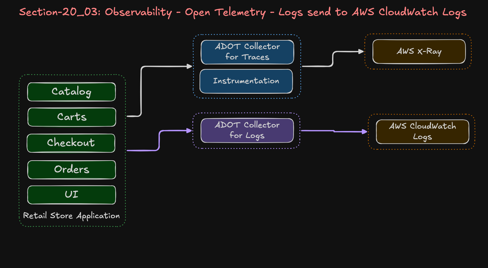
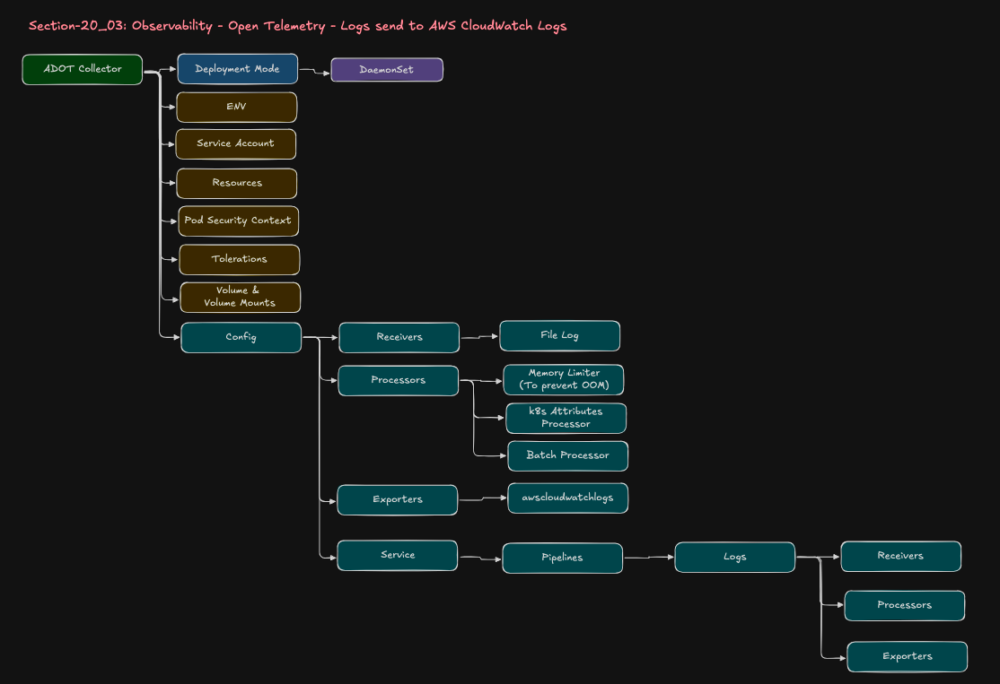

# 20_03: Send Retail Store Application Logging on EKS using AWS ADOT (OpenTelemetry) to AWS CloudWatch Logs

## Step-00: Introduction
- Send Retail Store Applications logs using OpenTelemetry ADOT Collector to AWS CloudWatch Logs
- Logs are sent to **AWS CloudWatch** via ADOT Collector
- View Logs in **AWS CloudWatch Log Management**

### Flow
```
Retail Apps → ADOT Collector → AWS Cloud Watch Logs
```

### Open Telemetry Logs - Architectural Flow


### Open Telemetry Collector - Components


## Step-01: Pre-requisites
1. AWS VPC, EKS Cluster, Karpenter everything created as part of [Section:20_01_EKS_Environment_with_ADOT - EKS Cluster](../20_01_EKS_Environment_with_ADOT/01_EKS_Cluster_Environment/)

2. Open Telemetry Configurations (ADOT EKS Addon, other required EKS Addons, RBAC, Services Accounts, IAM Policy and Roles) created as part of [Section:20_01_EKS_Environment_with_ADOT - 05_OPENTELEMTRY_terraform-manifests](../20_01_EKS_Environment_with_ADOT/01_EKS_Cluster_Environment/05_OPENTELEMTRY_terraform-manifests/)

3. Retail Store Application Data Plane created [Section:20_01_EKS_Environment_with_ADOT - 01_RetailStore_AWS_Dataplane](../20_01_EKS_Environment_with_ADOT/02_RetailStore_App_Environment/01_RetailStore_AWS_Dataplane/)

4. Retail Store Application deployed [Section:20_01_EKS_Environment_with_ADOT - 02_RetailStore_App_Helm_AWS_Data_Plane](../20_01_EKS_Environment_with_ADOT/02_RetailStore_App_Environment/02_RetailStore_App_Helm_AWS_Data_Plane/)

## Step-02: Review Logs ADOT Collector
- [ADOT Logs Collector](./01_OpenTelemetry_Logs/01_adot_collector_logs.yaml)

## Step-03: Deploy Logs ADOT Collector
```bash
# Change Directory 
cd 20_03_OpenTelemetry_Logs

# Deploy Logs ADOT Collector and Review Logs
kubectl apply -f 01_OpenTelemetry_Logs/01_adot_collector_logs.yaml

# Verify ADOT Collector and Daemonset
kubectl get opentelemetrycollector
kubectl get ds
kubectl describe ds adot-logs-collector
kubectl get pods

# Verify if this collector is part of ADOT Operator installed via EKS Addon
kubectl describe ds adot-logs-collector | grep operator

# Restart Retail Apps
./restart-retailapp.sh

# Review ADOT Collector Logs
kubectl get pods
kubectl logs -f <POD-NAME>
or 
kubectl logs -f -l  app.kubernetes.io/name=adot-logs-collector --max-log-requests 10
```

## Step-04: Verify Logs in CloudWatch
- Go to AWS CloudWatch -> Logs -> Log Management

## Step-05: Run Queries in Log Insights
- Go to AWS CloudWatch -> Logs -> Log Insights
```bash
# Query-1: Show All Logs (Latest First)
fields @timestamp, @log, @message
| sort @timestamp desc

# Query-2: Checkout HTTP requests only
fields @timestamp, @log, @message
| filter @message like /checkout/ and @message like /GET|POST|PUT|DELETE/
| sort @timestamp desc

# Query-3: Catalog HTTP requests only
fields @timestamp, @log, @message
| filter @message like /catalog/ and @message like /GET|POST|PUT|DELETE/
| sort @timestamp desc
```

## Step-06: Clean-up
```bash
# Change Directory 
cd 20_03_OpenTelemetry_Logs

# Deploy Logs ADOT Collector and Review Logs
kubectl delete -f 01_OpenTelemetry_Logs/01_adot_collector_logs.yaml

# Verify 
kubectl get pods
kubectl get ds
```
