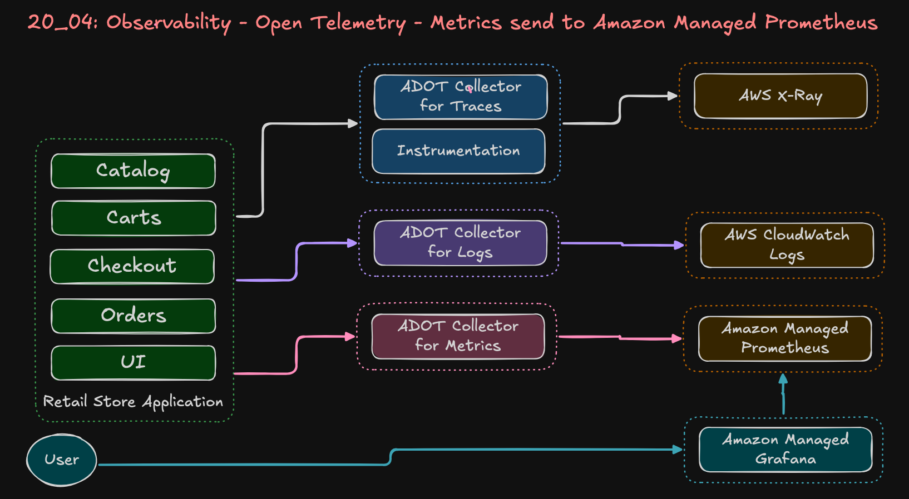
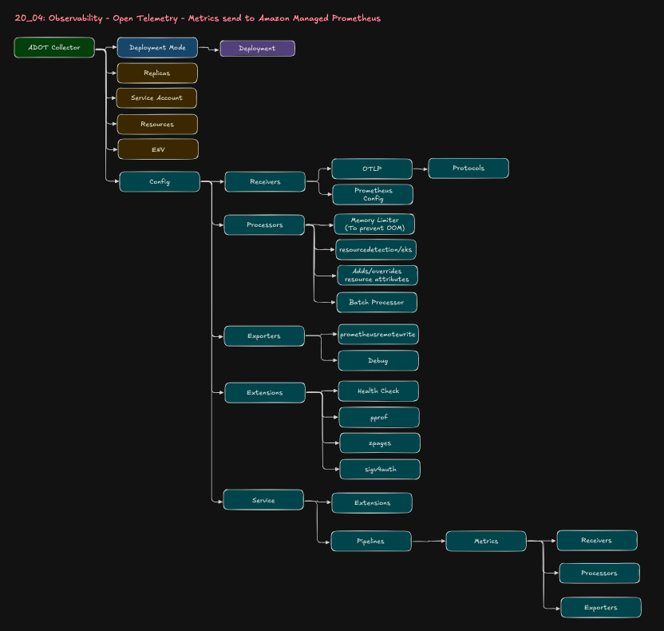

# 20_04: Send AWS EKS Metrics to Prometheus using ADOT Collector

## Step-00: Introduction
- Send AWS EKS Metrics to AWS Managed Prometheus using ADOT Collector
- Integrate AWS Managed Grafana with AWS Managed Prometheus to viewing the Metrics

### Flow
```
AWS EKS Metrics → ADOT Collector → AWS Managed Prometheus -> AWS Managed Grafana
```

### ADOT Metrics Collector - Architectural Flow


### ADOT Metrics Collector - YAML File



## Step-01: Pre-requisites
1. Enable AWS IAM Identity Center in your AWS Cloud Account

2. AWS VPC, EKS Cluster, Karpenter everything created as part of [Section:20_01_EKS_Environment_with_ADOT - EKS Cluster](../20_01_EKS_Environment_with_ADOT/01_EKS_Cluster_Environment/)

3. Open Telemetry Configurations (ADOT EKS Addon, other required EKS Addons, RBAC, Services Accounts, IAM Policy and Roles) created as part of [Section:20_01_EKS_Environment_with_ADOT - 05_OPENTELEMTRY_terraform-manifests](../20_01_EKS_Environment_with_ADOT/01_EKS_Cluster_Environment/05_OPENTELEMTRY_terraform-manifests/)

4. Retail Store Application Data Plane created [Section:20_01_EKS_Environment_with_ADOT - 01_RetailStore_AWS_Dataplane](../20_01_EKS_Environment_with_ADOT/02_RetailStore_App_Environment/01_RetailStore_AWS_Dataplane/)

5. Retail Store Application deployed [Section:20_01_EKS_Environment_with_ADOT - 02_RetailStore_App_Helm_AWS_Data_Plane](../20_01_EKS_Environment_with_ADOT/02_RetailStore_App_Environment/02_RetailStore_App_Helm_AWS_Data_Plane/)


## Step-02: Review Metrics ADOT Collector
- [Metrics ADOT Collector](./01_OpenTelemetry_Metrics/01_adot_collector_prometheus_full_k8s_cluster.yaml)


## Step-03: Update Prometheus Endpoint
- Go to Amazon Prometheus -> Workspaces -> 
retail-dev-eksdemo1-amp
- Get the `https://aps-workspaces.us-east-1.amazonaws.com/workspaces/ws-17f701c7-cbec-4115-a25e-1c74e34ced66/api/v1/remote_write`
- Update in `01_adot_collector_prometheus_full_k8s_cluster.yaml`
```yaml

    # ====================
    # EXPORTERS
    # ====================
    exporters:
      prometheusremotewrite:
        endpoint: "https://aps-workspaces.us-east-1.amazonaws.com/workspaces/ws-17f701c7-cbec-4115-a25e-1c74e34ced66/api/v1/remote_write"
        auth:
          authenticator: sigv4auth
```

## Step-04: Deploy Logs ADOT Metrics Collector
```bash
# Change Directory 
cd 20_04_OpenTelemetry_AMP_AMG

# Deploy Metrics ADOT Collector and Review Logs
kubectl apply -f 01_OpenTelemetry_Metrics/01_adot_collector_prometheus_full_k8s_cluster.yaml

# Verify ADOT Collector and Daemonset
kubectl get opentelemetrycollector
kubectl get deploy
kubectl describe deploy adot-metrics-prometheus-collector 
kubectl get pods

# Verify if this collector is part of ADOT Operator installed via EKS Addon
kubectl describe deploy adot-metrics-prometheus-collector  | grep operator


# Review Metrics ADOT Collector Logs
kubectl get pods
kubectl logs -f <POD-NAME>
or 
kubectl logs -f -l  app.kubernetes.io/name=adot-metrics-prometheus-collector 
```

## Step-05: Vefify AMP Connectivity 
```bash
# Update AMP Workspace ID in "verify_amp_metrics.sh
AMP_WORKSPACE_ID="ws-17f701c7-cbec-4115-a25e-1c74e34ced66"

# Verify AMP Connectivity
./verify_amp_metrics.sh
```


## Step-06: AMG - COST ALERT
- When we add a user in Identity Center and Associate that user with Grafana it costs $9 per user.


## Step-07: Verify - Amazon Managed Grafana  (AMG)
- This is created as part of [05_OPENTELEMTRY_terraform-manifests](../20_01_EKS_Environment_with_ADOT/01_EKS_Cluster_Environment/05_OPENTELEMTRY_terraform-manifests/) 
- Go to AWS Managed Grafana -> Workspaces -> retail-dev-eksdemo1-amg

## Step-08: Create User in Identity Service
- Go to AWS IAM Identity Center -> Create User -> Two factor Authentication

## Step-09: Amazon Managed Grafana - Associate User
- Go to AMG -> Workspaces -> retail-dev-eksdemo1-amg
- Authentication -> Assign new user or Group

## Step-10: Login to AMG and Add prometheus Endpoint 
1. Login to AMG using AWS IAM Identity Center User
2. Add AWS Prometheus as Datasource


## Step-11: Import Kubernetes Dashboard to Amazon Managed Grafana
- In Grafana -> Go to Dashboards → Import
- Use dashboard ID: 15661 (Kubernetes cluster monitoring)

## Step-12: Review Metrics in AMG
- Go to Grafana Dashboards


## Step-13: Clean-Up - Metrics ADOT Collector
```bash
# Change Directory 
cd 20_04_OpenTelemetry_AMP_AMG

# Delete Metrics ADOT Collector and Review Logs
kubectl delete -f 01_OpenTelemetry_Metrics/01_adot_collector_prometheus_full_k8s_cluster.yaml
```

## Step-14: Clean-Up: All
```bash
# Remove Retail App
cd devops-real-world-project-implementation-on-aws/20_Observability_OpenTelemetry/20_01_EKS_Environment_with_ADOT/02_RetailStore_App_Environment/02_RetailStore_App_Helm_AWS_Data_Plane/02_LOW_COST_retailstore_HELM
./01-uninstall-retail-apps.sh

# Remote AWS Dataplane
cd devops-real-world-project-implementation-on-aws/20_Observability_OpenTelemetry/20_01_EKS_Environment_with_ADOT/02_RetailStore_App_Environment/01_RetailStore_AWS_Dataplane
./delete-aws-dataplane.sh

# Delete AWS EKS Cluster
cd devops-real-world-project-implementation-on-aws/20_Observability_OpenTelemetry/20_01_EKS_Environment_with_ADOT/01_EKS_Cluster_Environment
./destroy-cluster-with-karpenter-and-opentelemetry.sh
```