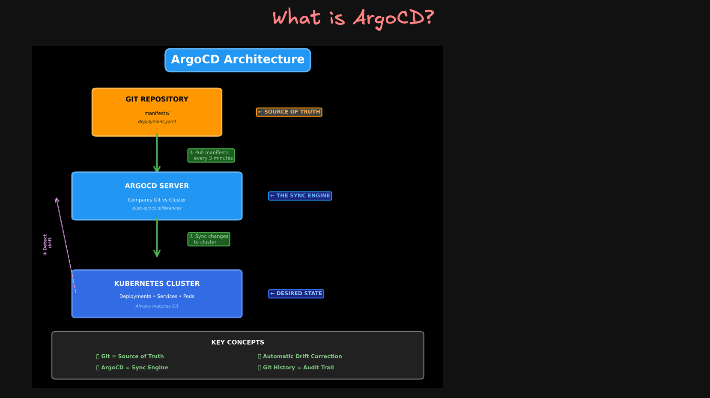
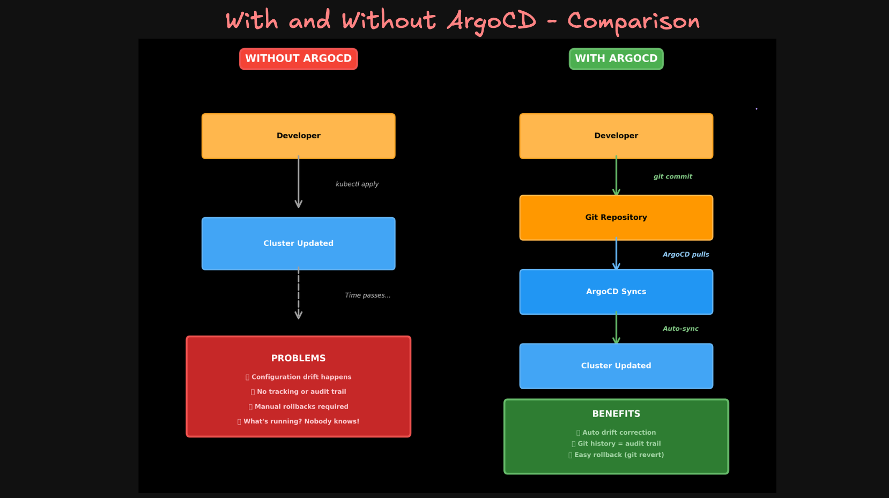

# ArgoCD Installation on EKS (Production-Ready)

This guide walks you through installing **ArgoCD** in a production-grade EKS cluster setup. You’ll get the UI, CLI, and controller running in an isolated namespace, ready to deploy Helm or Kustomize applications.

---

## Prerequisites

* EKS cluster already created and kubeconfig configured:

  ```bash
  aws eks update-kubeconfig --name <your-cluster-name> --region <your-region>
  ```
* `kubectl` and `argocd` CLI installed on your local machine
---

## What is Argo CD?


---

## With and Without ArgoCD Comparison


---

## Step-01: Create Namespace for ArgoCD

```bash
kubectl create namespace argocd
```

---

## Step-02: Install ArgoCD Core Components

```bash
kubectl apply -n argocd -f https://raw.githubusercontent.com/argoproj/argo-cd/stable/manifests/install.yaml
```

This installs:

* ArgoCD UI Server
* Repository Server
* Application Controller
* All ArgoCD CRDs

---

## Step-03: Access ArgoCD UI Locally (Port Forward)

```bash
kubectl port-forward svc/argocd-server -n argocd 8080:443
```

Then open your browser:

```
https://localhost:8080
```

---

## Step-04: Get ArgoCD Admin Password

```bash
# Get ArgoCD Admin Password
kubectl get secret argocd-initial-admin-secret -n argocd \
  -o jsonpath="{.data.password}" | base64 --decode && echo
```

Use username `admin` and the above password to log in to the web UI.

---

## Step-05: Login via `argocd` CLI (Optional but Recommended)
- [Install Argo CD CLI](https://argo-cd.readthedocs.io/en/stable/cli_installation/)
```bash
argocd login localhost:8080 --username admin --password <copied-password> --insecure
```

---

## Step-06: Change the Admin Password

```bash
argocd account update-password
```

> You must be logged in (`argocd login`) before running this.

---

## ✅ You’re Ready!

* ArgoCD is installed in `argocd` namespace
* You can access the UI at `https://localhost:8080`
* CLI is connected and ready

---

