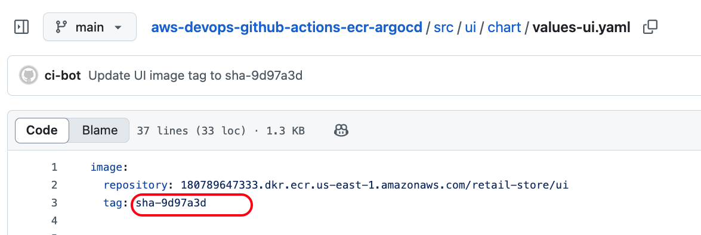

# CI/CD Full Flow — UI App with GitHub Actions → ECR → ArgoCD

This section demonstrates an **end-to-end Continuous Integration and Continuous Delivery (CI/CD)** pipeline using **GitHub Actions**, **Amazon ECR**, and **ArgoCD**. The focus is on the `UI` service, while the supporting microservices (`catalog`, `carts`, `checkout`, `orders`) are deployed via Helm.

---

## Step-01: Introduction to the Demo

In this hands-on demo, we:

* Use **GitHub Actions** to build, tag, and push the `UI` Docker image to **ECR**.
* Automatically update the `values-ui.yaml` Helm file with the latest image tag.
* ArgoCD detects the changes and triggers **automated deployment** to EKS.

> ✅ This setup simulates a real-world CI/CD pipeline with GitOps flow for containerized microservices.

---

## Step-02: Deploy Supporting Apps (Non-UI) via Helm

We will deploy the supporting services (catalog, carts, checkout, orders) using Helm.

```bash
# Navigate to helper directory
cd LOW_COST_retailstore_HELM_Values

# Deploy dependent services (Without AWS Secrets Manager)
./03-v1.0.0-install-remote-helm-charts.sh

# [OR]

# Deploy dependent services (With AWS Secrets Manager Secrets)
./05-v2.0.0-install-remote-helm-charts.sh
```


> This installs the backend services your UI depends on.

---

## Step-03: Make a UI Change

Change a version number to simulate a code update.

```bash
# Go to project root
cd aws-devops-github-actions-ecr-argocd3

# Git Pull (Pull and Merge changes from )
./git-pull.sh

# Update UI home.html
./update-ui-home-html.sh V904

# Git Push
./git-push.sh V904
```

### Sample Snippet that will be Edited by `update-ui-home-html.sh `

```html
<h1 class="text-4xl sm:text-5xl font-bold text-white mb-6">
  The most public <span class="text-primary-400">Secret Shop - Version: V904</span>
</h1>
```

Updates the version string to `V903`, `V904`, etc.

---

## Step-04: CI: Observe GitHub Actions Workflow

* Monitor pipeline status:

👉 [GitHub Actions for this Repo](https://github.com/stacksimplify/aws-devops-github-actions-ecr-argocd3/actions)


> CI flow will build Docker image → push to ECR → update `values-ui.yaml`

---

## Step-05: Validate CI Outputs

### ECR Image

* Go to **Amazon ECR Console** and verify a new image is pushed:


### Updated Helm Values File

* Visit [`values-ui.yaml`](https://github.com/stacksimplify/aws-devops-github-actions-ecr-argocd3/blob/main/src/ui/chart/values-ui.yaml)

* You should see:

```yaml
image:
  repository: 180789647333.dkr.ecr.us-east-1.amazonaws.com/retail-store/ui
  tag: sha-abcdef1  # newly pushed tag
```



---

## Step-06: CD: Verify ArgoCD Sync + UI Deployment

* ArgoCD will auto-sync (every \~2 minutes by default)

```bash
# Find UI ingress address
kubectl get ingress

# Example:
http://k8s-default-ui-b67f0083aa-497064173.us-east-1.elb.amazonaws.com
```

* Open the URL → Confirm the updated version in the UI

> Note: ArgoCD sync interval is \~2 minutes by default.

---

## Step-07: Repeat with New Version (e.g., V906)

* Update version in UI code → Commit & push → Verify new CI/CD flow works end-to-end

---

## Step-08: Rollback via ArgoCD

* Go to ArgoCD UI → Application → History → Select Previous Revision → Rollback

---

## Step-09: Clean-Up

```bash
# Delete Application from ArgoCD
Go to ArgoCD UI -> Delete UI Application

# Delete backend services
cd LOW_COST_retailstore_HELM_Values
./01-uninstall-retail-apps.sh

# Delete ArgoCD
kubectl delete ns argocd
```

---

✅ You now have a complete CI/CD pipeline from **Git commit → Docker build → ECR push → Helm update → ArgoCD sync → UI deployment on EKS**.
